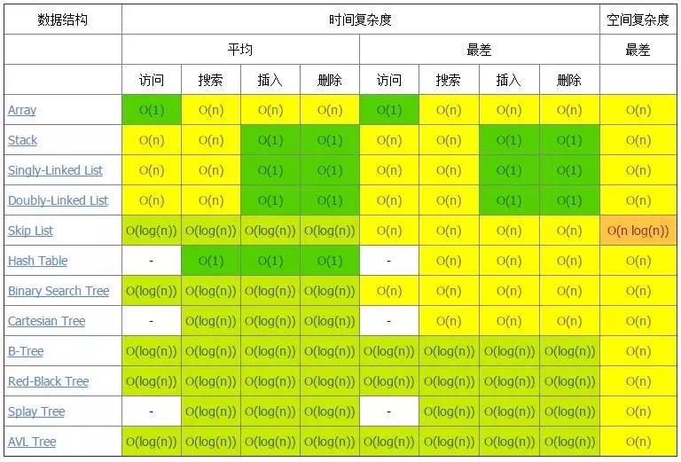
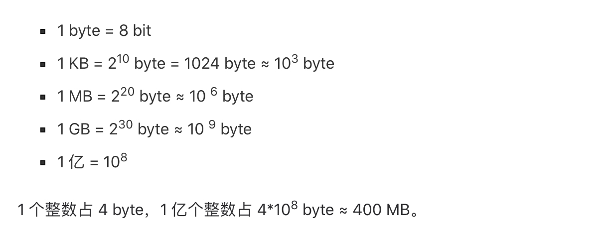
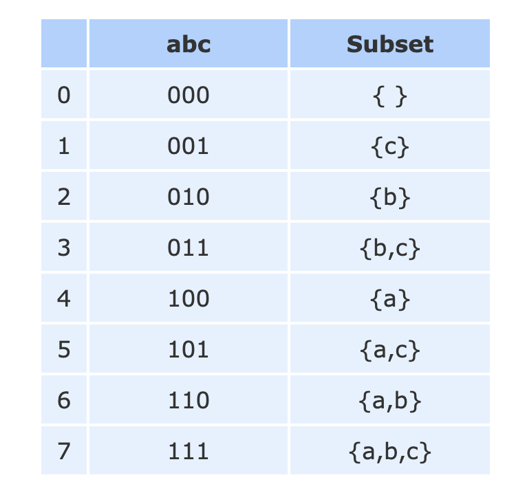
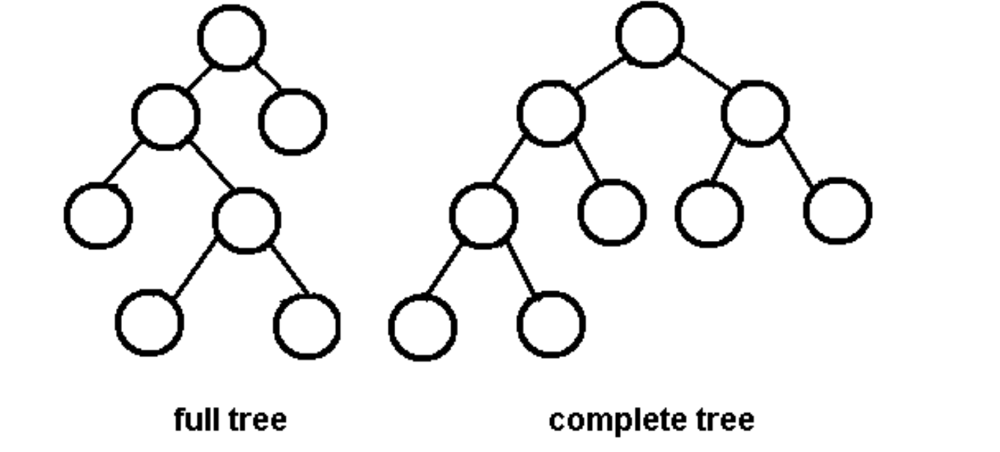
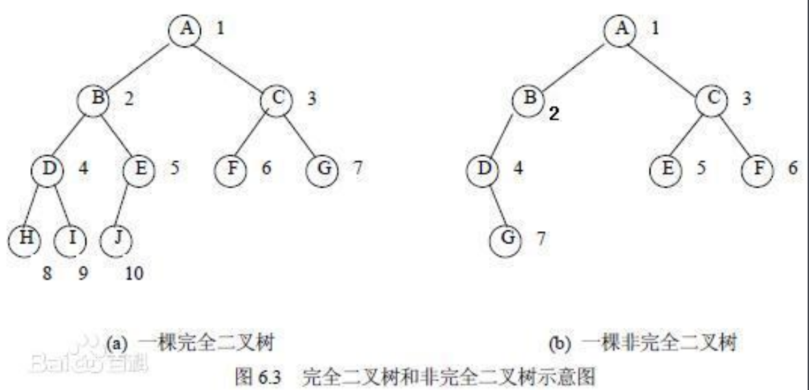
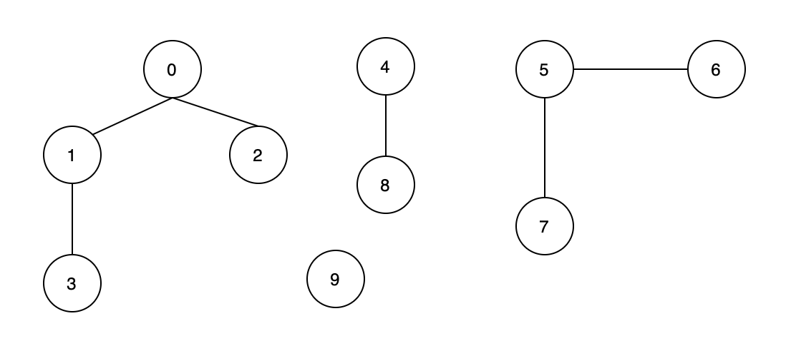

# Data Structure and Algorithms
做题不是目的，目的是通过做题锻炼思维、掌握常用的算法。
不要做过了就忘了，要变成自己的

Palindrom aba, abba
Anagram

Topological Sorting

## 算法面试
45min面试
10min聊天
25min coding
10min debug

解决问题的思维
clarification
找规律
逻辑解释清楚
detail

CAST
CA, clarification. assumption.
1. Listen to the problem carefully.
2. Confirm what you understood.
3. Problem may be underspecified so ask questions or fill in the details by making assumptions and state them.
4. Don't remain silent, think out loudly.
5. Explain your solution in words first.
6. Don't begin coding immediately.
7. Validate your solution on sample input first to make sure it is correct.
8. State the running time and space complexity of solution before coding.
9. If you can describe multiple solutions and discuss trade-offs that's even better.
10. Propose the best solution and seek permission to begin coding.
11. Write clean code.
12. Abstract details in helper functions.
13. Implement most important functions first.
14. If time is short, you can ask them which functions to implement.
15. Test your final code with dry run.
16. Do not ask the interviewer if your solution is correct. Test edge cases to be sure. 
17. If they give a hint, take it.
18. If solution is too long, it is likely incorrect. Most problems have few lines of solution.
19. It's fine to ask for hints.
20. If you can't come up with a solution, then code the brute force first and then try to optimize.
21. Be collaborative and friendly throughout.
22. Don't interrupt the interviewer.

分析对问题的理解，是否和面试官所Define的是一回事
Size的大小，Duplication，升降序排列等等
解释自己打算如何处理这个问题
在Code里面加Comments
分析时间复杂+空间复杂，记住分析清楚为什么
如果动用额外内存，问自己可不可以

### What 讨论问题
要做什么. input, output，例子. Complexity requirement. 
Can I destroy the original array/graph/data structure?
What assumptions do you need to solve the problem?

If you are given a dictionary of words, is it a list of strings or a Trie?
### How. 先解释思路， (数据结构, 方法. In-place, pointer) + (logic(Iteration/Recursion)) 和Complexity分析，看面试官反应. high level to detail 

for iteration, while iteration, dfs, bfs 

int-binary, char, boolean 
float

String (alpha, num). string.split(), list(string)
List. (int, char, String). ‘’.join(list) 
Matrix. (List) 

Dic

Linked List

Tree
Graph

```python
Input
Data Structure
Algorithm
	模版
	for/while            
		if
		
Output: returns None, F/T, Num, Str, List, Dic, Set
```

互联网软件
数据结构-数据库 (增删查改）

Class. Attribute (data structure) and functions. Only function. (Parameters and new data structure and objects. 

*举例子走例子，不同例子铸造更好的codes.* 
特殊例子
正常例子

**Int**
边界 range (32-bit signed integer range: [−2^31,  2^31 − 1](#)
特殊例子: Null, Negative, Floating
正常例子

**String**
特殊例子: Null. 字符串里面是否包含非数字字符，对于非数字字符怎么处理。
正常例子

**List**
特殊例子：Null, 1, 2
正常例子：5, 4 * sorted? duplicates?(if nums i == nums i - 1: continue) negative?*
  7 for bs if necessary 

**Linked List**
特殊例子: Null, 1, 2 
正常例子: 5, 4 *时刻考虑None*

**Tree**
特殊例子: Null, 1, 3
正常例子: 7 negative？*时刻考虑None*
left and right
left not right
not left right
not left not right 

**Graph**

Scalability , find optimal solution

### Debug, 主动给Test Case
在碰到一个问题时，企业最怕的是没有搞清楚问题就动手的人，因为这会企业带来很多不必要的损失。所以有些面试官最开始会故意问一个很模棱两可的问题，设下陷阱，看你是否会在没搞清楚问题的时候就开始回答。例如刚才说的数组相关的编码题，如果面试官没有明确说明数组元素是否重复，你就应该问清楚。特别是在某些问题下，可能涉及到海量数据，这时候你就应该问清楚，然后针对海量数据提出可行的解决方法

1.检测空(字符串,集合….)
检测下标越不越界, 凡是返回下标的,都要检查越界不,万一返回-1呢?会不会返回大于n呢?
3.要有缩进
1. Document your assumptions
2. Explain your approach and how you intend to solve the problem 
3. Provide code comments where applicable
4. Explain the big-o run time complexity of your solution 
5. Justify your answer Identify any additional data structures you used and justify why you used them 
6. Only provide your best answer to each part of the question

*Write more space in whiteboard*
记录思想

---- 
Since Google operates at a large scale, be prepared to answer lots of follow up questions on how to scale the algorithm you wrote for multiple machines.
If your interviewer is happy with the solution, the interview usually ends here. It is also not uncommon that the interviewer asks you extension questions, such as how you would handle the problem if the whole input is too large to fit into memory, or if the input arrives as a stream. This is a common follow-up question at Google where they care a lot about scale. The answer is usually a divide-and-conquer approach — perform distributed processing of the data and only read certain chunks of the input from disk into memory, write the output back to disk, and combine them later on.

## Complexity Analysis
Udacity

**微信收藏**
一个算法的时间复杂度反映了程序运行从开始到结束所需要的时间。把算法中基本操作重复执行的次数（频度）作为算法的时间复杂度
一个程序执行时除了需要存储空间和存储本身所使用的指令、常数、变量和输入数据外，还需要一些对数据进行操作的工作单元和存储一些为现实计算所需信息的辅助空间。




O(1):Constant Complexity. 没有循环语句. 极少
O(log n): Logarithmic Complexity. 几乎都是二分法
O(√n) 几乎是分解质因数
O(n): Linear Complexity. 只有一重循环. 高频
O(nlogn). 一般都可能要排序
O(n^2): N square Complexity. 数组，枚举，动态规划
O(n^3): N square Complexity. 数组，枚举，动态规划
O(2^n): Exponential Growth. 与组合有关的搜索 combination
O(n!): Factorial. 与排列有关的搜索 

比O(n)更优的时间复杂度，几乎只能是O(logn)的二分法
经验之谈：根据时间复杂度倒推算法是面试中的常用策略
“由上面“方法调用栈”的出入栈过程可以看出，执行递归操作所需要的内存空间和递归的深度成正比。纯粹的递归操作的空间复杂度也是线性的，如果递归的深度是n，那么空间复杂度就是O(n)。”
“在绝大多数时候，时间复杂度更为重要一些，我们宁可多分配一些内存空间，也要提升程序的执行速度。”

for, while. n x operation
Change in place: Space Complexity O(1)
Python sort(): O(NlogN)
Space complexity is defined as how much additional space the algorithm needs in terms of the N elements. And even though according to the docs, the sort method sorts a list in place, it does use some additional space
Therefore the worst case space complexity is O(N) and best case O(1)

例如经常说32位的操作系统最多支持4GB的内存空间，也就是说CPU只能寻址2的32次方（4GB），注意这里的4GB是以Byte为单位的，不是bit。也就是说有`4G=4*1024M（Byte）=4*1024*1024Kb(Byte)=4*1024*1024*1024bit(Byte)`，即2的32次方个8bit单位。



sum of 0 to n: n x (n+1) / 2
2^0 + 2^1 + 2^n = 2^(n+1)-1
num of tree nodes = 2^depth - 1, 2是分支数
see books 

---- 
数据结构的存储方式只有两种：数组（顺序存储）和链表（链式存储）。
数组的特点是：寻址容易，插入和删除困难；而链表的特点是：寻址困难，插入和删除容易。

String. 从后先前
int. overflow

对于 ASCII 码的字符而言，总共只有 256 个字符，因此只需要 1KB 的辅助内存。这点内存消耗对于绝大多数硬件来说是完全可以接受的。但如果是 16 位的 Unicode 的字符，创建这样一个长度为 2^16 的整型数组需要 4x2^16 也就是 256KB 的内存。这对于个人计算机来说也是可以接受的，但对于一些嵌入式的开发就要慎重了。

A: 65
a: 97
---- 
coding 种类与应对策略
大致上， 面试官在‍‌‌‌‌‌‌‍‌‌‍‌‍‌‌‌‌‌‌‌开始面试前， 会收到一封email, 里面回大致说明每个人需要侧重于考察面试者的哪个方面。 对于coding来说， 一般有三类问题， 每个面试官会被分配到一类问题。
**1.solid coding**
这类问题说白了， 谁都知道怎么做， 纯粹就是考察coding是不是扎实， 平时自己写code多不多， 能不能快速的把自己的idea转化为code。 对于面试者来说属于必考种类， new grad 一般会有两轮甚至三轮这样的题目, 有很多工作经验的人可能就只有1轮了。  这类题目不过关， 很可能电面死掉或者前几轮突然死亡。
solid coding又一般可以分成两个小类：
1.1  考察你对算法的基本理解以及边界条件的运用， 比如findkth largest integer, search in rotate array, bit manipulation 等等。
1.2 考察你对基本数据结构以及复杂度的理解。 比如binary search tree, linkedlist vs array, stack, tree dfs, tree bfs 等等。

按难度来分， easy的比如3 sum, tree level order iterator.  medium 难度的比如 reverse linked list from index m to index n, course schedule，string multiplication, hard 难度的比如*valid number (Facebook 15)*, 复杂的calculator等。

应对策略：
1.1 类型， 如果是简单和medium的没得说了， 就是希望你又快又好， 除了勤奋和熟练， 没有什么好策略。 对于像merge sort, partition这类的算法， 如果7-8分钟还写不出bug free我估计就没戏了。easy问题请多多注意边界条件， int 溢出， nullpointer, 负数， 非法输入等。  
hard 1.1的请参考1.3
1.2 类型， 简单和medium请在写代码前多阐明复杂度， 这类数据结构的问题往往也可以在coding前画图来表示运行状态， 图画的清楚也是个重要的加分项。 hard请参考1.3
1.3 hard类型的coding题目. 这往往是考察你的solid coding的能力， 即我在前文中提到的， 你做事的方式和你思考问题的方法。 即给你一个coding任务， 你如何从白板开始， 一步步的做出bug free的程序。 这类问题的过程重于结果。 比如valid number, 你能确保每实现一个模块， 都没有regressgion, 都没有bug, 比你一下子实现所有的feature但是有很多bug 要好很多。  一般来说面试官看你是否能够一步步的分隔出小的coding模块（method）, 你如何设计test case, 你如何能够确保这些test case能cover所有的scenario, 你是不是和面试官提前做了足够的沟通并且限定了coding范围。从这个角度来说， valid number其实是个很不错的solid coding面试题。  限于篇幅， 我就不展开来说了。

**2.problem resolving**
这类问题对于new grad是关键， 也是能帮你differentiate的关键。 说白了， 计算机并不是只有算法，我们还需要数据库， 操作系统， 网络， 安全等方面的知识。  new grad这些方面要弱一些， 所以面试者希望new grad能展现出思维敏捷， 多思考， 快速反应的能力。 problem resolving就为了考察这个能力而诞生的。
problem resolving也可以分成四个小类型。
*2.1  API design.  这类问题是为了更深入的考察你对数据结构的理解与运用。 例如LRU cache,  insert delete getRandom ALL O(1) ， design twitter等等。*
2.2  Abstraction.  这类问题是考察你能不能把一个相对抽象的问题规约到你熟悉的问题上面。 比如skyline problem, int stream find median， cleaning robot等等。
2.3 计算机小程序， 例如thread pool, 爬虫，日志merge等， random generator等。
2.4 dynamic programming问题。 这类问题有点像solid problem resolving.  主要考察你是不是有systemmatic的方法来降低一个brute force程序的复杂度**

这类问题一般都不是很easy的问题， 根据面试官心情， 可能走的很深很难。 也可能最后演变成bar raiser.

应对策略:
2.1  主要考察你对数据结构的深层次认识。  首先请同时确保你理解了题目的意思， 最好能问清点条件 例如immutable array max subarray sum, 那数组将来会变吗？问清这类的问题有助于你写代码前做好重构和测试的准备。*** 其次， 如果你能证明你选择的算法的复杂度， 甚至证明这就是最佳复杂度， 那是一个大大的加分项， 如果不能， 至少你也问问面试官是不是已经满意了再开始写代码。***
2.2  这个我自己也头疼， 说实话如果第一次遇见了skyline, 我也不知道能不能搞定。  大家有好办法请回复有什么好办法能系统化的解决这类的问题， 我个人觉得很多时候靠灵光一闪。
2.3  这类问题主要看你平时积累， 也是一大类不能通过leetcode练习的问题。临时抱佛脚的话， 我个人推荐java concurrency in practice这本书。
2.4  动态规划， 我不知道为什么很多人害怕动态规划。 面试中的动态规划大致分为单向递归（首或者尾）， O（n2）或者O(n3) 距离递归,  O(mn)递归，有限定条件的NP (背包）。 每种类型听几节课， 懂了基本原理即可。 至于贪心和带状态的dp(走道铺砖）一类的dp, 至少我没在面试中遇到过， 因为很难临时造出一道这样的题目， 面试官一般也没这个能力和时间来思考题目是不是严谨。 贪心准备下加油站， 迪杰斯特拉， 最小生成树就足够了。

**3.bar raiser**
这类的问题只有当onsite应聘者的数量远远大于head count的时候， 或者你前几轮明显超出了电面时对你的定位才会发生。 其目的是帮助公司选择最优秀的人。 对应聘者来说， 坏消息是要度过痛苦一小时， 好消息是你能充分了解这公司厉害的人有多厉害， 能充分展示你的能力， 甚至被越级录取也不是不可能。
bar raiser也是三小类

## 1. (41) Math (Algo), String, List, Matrix (input)
int, char 
String (alpha, num). string.split(), list(string)
List. (int, char, String). ‘’.join(list) 
Matrix. (int, char) 

methods to convert

String. List. Matrix
int, list, 方法. logic(Iteration-for)
In-place, 方法. logic(Iteration-for)

**Int (input)**: O(N), O(1)
**String (input)**: O(N), O(1)
sort. reverse. split()
**(String) List (input)** O(N) O(N)
**(String) Matrix (input). tuple. zip(), In-place** O(N^2) O(N^2)

```python
# 1
Data Structure
for n in num:
for n in num[::-1]:
for i in range(len(num)):
for i in range(len(num)-1, -1, -1):

# In Place

```

```python
while 
```

### 题目
**For**. While
* 顺时针打印矩阵
* 数组中出现次数超过数组长度一半的数字
* 连续子数组的最大和
* 扑克牌顺子

**没做的**

**没理解不熟的**
768 max chunks (microsoft
68 Text Justification (Google 8, Microsoft 3, Amazon 2)
722 remove comment (Microsoft 5, Google 3)
1055 Shortest Way to Form String
57 insert intervals
163 missing ranges (Google
158 Read N Characters Given Read4 II - Call multiple times (Google
**复习**
43 multiply string 415 add string (Microsoft
31 next permutation (Facebook 23, Google 7, Amazon 6)
496 next greater elements I (amazon
**503 next greater element II (amazon**
843 Guess the Word (Google 13)
890 Find and Replace Pattern (Google 3)
402 remove k digits (Amazon 4, Microsoft)
stack **224 basic calculator  227** 772 (Microsoft
844 backspace (Google 9)
165 compare version number (Amazon 9)
937 reorder data in log files (Amazon 165)
482 license key formatting (Google 16)

238 product of array except itself (Facebook 45, Amazon 13, Microsoft 5)

## 2. (28) [List[int]](#)(input). 
## BS/Pointers/Sliding Window
搜索
除了二分查找，还有很多种查找数据结构的方法，总之，我们不要拘泥于二分查找。比如说，你可以利用二叉树或使用散列表来查找某节点。尽情开拓思路吧！

### List, Matrix (input). Binary Search-2 Pointers. O(logN) O(1). Must be sorted 
```python
def binary_search(arr, target):
    l , r = 0, len(arr) - 1  
    while l <= r:            
        mid = (l + r) // 2 # mid = l + ((r - l) >> 1)
        if arr[mid] == target:
            return mid
        if arr[mid] < target:
            l = mid + 1
        else:
            r = mid - 1
    return -1
```
某些情况先排除第一和最后

```python
def binary_search(arr, l, r, target):
	if l > r:
		return -1
	mid = l + (r-l) >> 1
	if arr[mid] == target:
		return mid

	if arr[mid] < target:
		return binary_search(arr, mid+1, r, target)
	else:
		return binary_search(arr, l, mid-1, target)
```

搜索，操作 (swap 
### String, List (input). Pointers. O(N) O(1). Must bee sorted 
```python
def function():
	l = 0
	r = len(num) - 1
	while l < r: # Rarely l <= r
		l += 1
		r -= 1
	
	for
```
  
1 array: -\> \<-, -\> -\>, \<- \<-
2 array while i \< len(A) and j \< len(B)

两端
一段：同起点，相邻

双指针
上面链表中提到的一类题目，主要是利用两个或多个不同位置的指针，通过速度和方向的变换解决问题。注意这种技巧经常在排序数组中使用。

labuladong
while(left \<= right)的终止条件是 left == right + 1，写成区间的形式就是 `[right + 1, right]`，或者带个具体的数字进去 [3, 2](#)，可见这时候搜索区间为空，因为没有数字既大于等于 3 又小于等于 2 的吧。所以这时候 while 循环终止是正确的，直接返回 -1 即可。

while(left \< right)的终止条件是 left == right，写成区间的形式就是 `[right, right]`，或者带个具体的数字进去 `[2, 2]`，这时候搜索区间非空，还有一个数 2，但此时 while 循环终止了。也就是说这区间 `[2, 2]` 被漏掉了，索引 2 没有被搜索，如果这时候直接返回 -1 就可能出现错误。

### Sort
**O(N)**
Cyclic Sort:
Bucket Sort:
Radix Sort:

Bubble Sort
Selection Sort
Insertion Sort
**Merge Sort**
**Quick Sort** is divide and conquer, recursion O(NlogN)
“根据计算机科学的标准，它们同样好，不过在工程上，快速排序算法一般情况下比归并排序快三倍”
“我在今天一开始讲，快速排序是通常情况下最好的算法，但是，在极端的情况下，它的复杂度是N平方，和冒泡排序一样糟糕。而归并排序，即使在最坏的情况下，也能保证N乘以log（N）的复杂度，当然工程师们会想一些方法防止这种糟糕情况的发生。从这个例子可以看出，世界上没有绝对的好，常常有一得便有一失”
那你应该能看出来了，在 swap 的时候，已经破坏了元素之间的相对顺序，所以快排并不具有稳定性。
这也回答了我们开头提出的问题，就是
为什么对于 primitive type 使用快排，
因为它速度最快；
为什么对于 object 使用归并，
因为它具有稳定性且快。

Merge collection
merge sort (merge 1 array)
88 merge sorted array (merge two arrays)
merge n arrays
148 sort list (merge 1 list)
21  (merge two lists)
23 (merge n lists)

### Other Pointers
```python
while
for
```

### Sliding Window—Counter, Pointer. O(N) O(N) 

```java
int left = 0, right = 0;

while (right < s.size()) {
    window.add(s[right]);
    right++;
    
    while (valid) {
        window.remove(s[left]);
        left++;
    }
}
```

```python
from collections import Counter
class Solution:
    def lengthOfLongestSubstring(self, s):
        """
        :type s: str
        :rtype: int
        """
        
        dic = Counter()
        l = 0
        r = 0
        counter = 0 # counter 为当前子串中重复字符的数量
        res = 0
        
        while r <= len(s) - 1:
            if dic[s[r]] > 0:
                counter += 1
                
            dic[s[r]] += 1
            r += 1
            
            while counter:
                if dic[s[l]] > 1:
                    counter -= 1
                    
                dic[s[l]] -= 1
                l += 1
                
            res = max(res, r - l)
        return res
```

### 题目
**没做的**
1329
**没理解的**
*410 split array largest sum (Google 32)*
4 median of two sorted arrays (Amazon 15, Google 13, Microsoft 5)

**复习**

34 Find First and Last Position of Element in Sorted Array (Facebook 23, Google 8, Amazon 4, Microsoft 2)
209 Minimum Size Subarray Sum (Google 7, Facebook 3, Amazon 3)
33 search in rotated array(Amazon 14, Microsoft 12, Facebook 11, Google 8)


**两个指针**-前向型指针 - Two Pointer Problem

**Sliding Window**
**没做的**
438 Find All Anagrams in a String (Facebook 29, Microsoft 4, Google 4, Amazon 3)
567 Permutation in String
727 Minimum Window Subsequence (Google 9, Microsoft 2)
632 最小区间
**没懂的**
30 Substring with Concatenation of All Words (Amazon 6, Microsoft 5)
**复习**
Chinese leetcode 3 solution page
340 Longest Substring with At Most K Distinct Characters(Facebook 15, Amazon 8, Google 4)
3 Longest Substring Without Repeating Characters (Amazon 27, Microsoft 14, Google 11, Facebook 9)
76 Minimum Window Substring (Facebook 20, Amazon 13, Linkedin 9, Google 11, Microsoft 6)
239 sliding window maximum (Amazon 15, Facebook 4)

## 3. (36) `List[int, str] (input).`
## Stack. Heap Sort/Dict/Set (DS)
List (input). Counter-heap sort (DS). O(Nlogk) O(1)
List (input). Counter/defaultdict/Dict/Set/Bit (DS). O(N) O(N)
itertools

### String (input). Stack (DS)
```python
pop() when not empty
```
1. if else
2. while 

Queue


微信读书

```python
list = [1,2,3]
list.sort(key = lambda x: x*x, reverse = True)

list[::-1]
list.reverse()
for i in reversed(list) #iterator
```

```python
class Solution:
    def topKFrequent(self, words, k):
        count = collections.Counter(words)
        candidates = count.keys()
        candidates.sort(key = lambda w: (-count[w], w))
        return candidates[:k]
```

```python
class new_str(str):
    def __lt__(self, other):
        return self > other
####################################################
class MyString:
    def __init__(self, word: str):
        self.word = word

    def __lt__(self, other: MyString):
        return self.word > other.word

	def __eq__():
	def __gt__():
```

```python
# python2 only
def compare(x, y):
	if x + y > y + x:
    	return -1
   	elif x + y == y + x:
        return 0
           
    else:
       	return 1
        
formated = sorted(map(str, nums), cmp=compare)

# python 3
import functools
formated = sorted(map(str, nums), key=functools.cmp_to_key(compare))

######################################################
class LargerNumKey(str):
    def __lt__(x, y):
        return x+y > y+x
        
class Solution:
    def largestNumber(self, nums):
        largest_num = ''.join(sorted(map(str, nums), key=LargerNumKey))
        return '0' if largest_num[0] == '0' else largest_num
```

```python
@cache # lru_cache
def factorial(n):
	return n * factorial(n-1) if n else 1
```

### Heap Sort (DS). Top K O(Nlogk)
```python
import heapq #模块提供了如下几个函数：
heapq.heappush(heap, item) # O(logn), 把item添加到heap中（heap是一个列表）
heapq.heappop(heap) # O(logn),把堆顶元素弹出，返回的就是堆顶
heapq.heappushpop(heap, item) #先把item加入到堆中，然后再pop，比heappush()再heappop()要快多
heapq.heapreplace(heap, item) #先pop，然后再把item加入到堆中，比heappop()再heappush()要快多
heapq.heapify(list) #O(n), 将列表进行堆调整 
heapq._heapify_max(list) # O(n), 
heapq._heappop_max(heap) # not exist?
heapq.merge(*iterables) #将多个列表合并，并进行堆调整，返回的是合并后的列表的迭代器
heapq.nlargest(k, iterable, key=None) # O(nlogk),返回最大的k个元素（Top-K问题）
sorted(iterable, key =None, reverse = True)[:k]
heapq.nsmallest(k, iterable, key=None) # O)(nlogk), 返回最小的k个元素（Top-K问题）
sorted(iterable, key=None)[:k]
```
二叉堆就是一种完全二叉树，所以适合存储在数组中，而且二叉堆拥有一些特殊性质。
The heap in python is a min heap, and each value of nodes is less than or equal to the value of child nodes. We call this condition the heap property. A complete binary tree
Heap: 在堆中存储数据时必须遵守这样一条规则：子结点必定大于父结点。堆中最顶端的数据始终最小，所以无论数据量有多少，取出最小值的时间复杂度都为O(1)。添加数据也一样。在堆的最后添加数据后，数据会一边比较它与父结点数据的大小，一边往上移动，直到满足堆的条件为止，所以添加数据需要的运行时间与树的高度成正比，也是O(logn)

The naive solution would be to sort an array first and then return kth element from the end, something like `sorted(nums)[-k]` on Python. That would be an algorithm of O(NlogN) time complexity and O(1) space complexity. This time complexity is not really exciting so let's check how to improve it by using some additional space.

The idea is to init a heap "the smallest element first", and add all elements from the array into this heap one by one keeping the size of the heap always less or equal to k. That would results in a heap containing k largest elements of the array.
The head of this heap is the answer, i.e. the kth largest element of the array.
The time complexity of adding an element in a heap of size k is O(logk), and we do it N times that means O(Nlogk) time complexity for the algorithm.
In Python there is a method nlargest in heapq library which has the same O(Nlogk) time complexity and reduces the code to one line.
This algorithm improves time complexity, but one pays with O(k) space complexity.

### bisect (DS)
Bisect is the python module that defines a number of functions to keep the array in a sorted fashion. It automatically inserts the element at the correct position without having to sort the array again every time.  This can be much more efficient than repeatedly sorting a list, or explicitly sorting a large list after the construction. The bisect module implements a binary search. Therefore, **O(log n)** is its estimated complexity [link](https://www.codespeedy.com/bisect-module-array-bisecting-algorithms-in-python/)

```python
import bisect
l=[1,4,5,6,7] # Must be sorted 
bisect.bisect(l,3) #return 1

l=[12,16,23,23,23,23,45,60]
bisect.bisect_left(l,23) #return 2
bisect.bisect_right(l,23) #return 6

bisect.bisect_left(list, item ,(low,high)) # This function returns the leftmost index position if more than one similar item occurs in the list.

bisect.bisect_right(list, item, (low,high)) # This function is the same as bisect function. It returns the rightmost position in the list.

bisect.insort(list,item, (low,high)) # This is the useful function. It inserts the item in the list at the rightmost index such that the list stays sorted.

bisect.insort_left(list, item, (low,high)) # This function inserts the element at the leftmost position in the list.

bisect.insort_right(list, item, (low,high)) # This function is similar to insort() function.
```

Note: insort() functions are analogous to the bisect functions. The difference lies in the fact that bisect() return the index while insort() returns the sorted list. 

### Counter, defaultdict, dict, set

微信五分钟学算法. 编程之法

海量数据处理
事实上对于时间问题可以采用巧妙数据结构（如布隆过滤器、散列、位图、堆、数据库、倒排索引、Trie 树）来解决；对于空间问题，可以采取分而治之的方法（如利用散列映射），把规模大的数据转化为规模小的，最终各个击破。
处理海量数据问题有很多种方法，本章介绍 10 种典型方法：散列分治、多层划分、MapReduce、、外排序、位图、布隆过滤器、Trie 树、数据库、倒排索引和 simhash 算法。
### 散列分治. Top K

### Map Reduce
See Big Data
Top K
Merge Sort. 外部排序
海量数据不能一次性读入内存，在对海量数据进行排序时，首先需要将海量数据拆分到多台机器或者多个文件，这些机器或文件称为拆分节点；然后在每个拆分节点上将数据全部读入内存并使用快速排序等方法进行排序；最后在合并节点使用多路归并方法将所有拆分节点的部分排序结果整合成最终的排序结果。外部排序也可以被称为外部归并排序。
如果不进行额外处理，合并节点仍然无法将所有数据读入内存中。可以使用小顶堆来解决这个问题：
假设有 k 个拆分节点，从这 k 个拆分节点分别读取一个最小的数据到小顶堆中。
将堆顶数据移出堆并写入合并节点的最终结果文件中。
确定刚才从堆中移除的数据属于哪个拆分节点，并从该拆分节点再读入一个数据。
例如以下有三个拆分节点，分别从这三个拆分节点读入 1,2,3 数据之后构建小顶堆，将堆顶数据 1 移出堆，因为数据 1 属于第一个拆分元素，因此再从第一个拆分节点读取一个数据到堆中。
但是上面的做法需要频繁地读写磁盘，可以设置输入缓存和输出缓存来解决这个问题。为每个拆分节点都设置一个输入缓存，每次将一部分数据读入输入缓存中，只有当输入缓存数据为空时才再从磁盘读入数据。并设置一个输出缓存，只有输出缓存满时才将数据写出磁盘中。
[CyC2018](https://xiaozhuanlan.com/topic/4198326075)

### BitMap. Replacement of Hashmap
因此这里可以使用一个存储了状态的数组来处理。这个数组特点是大小为 1 亿，并且数据类型为布尔类型（ True 或者 False ）。然后将这 1 千万个整数作为数组下标，将对应的数组值设置成 True，比如，整数 233 对应下标为 233 的数组值设置为 True，也就是 `array[233]` = True。

这种操作就是位图法：就是用每一位来存放某种状态，适用于大规模数据，但数据状态又不是很多的情况。

另外，位图法有一个优势就是空间不随集合内元素个数的增加而增加。它的存储空间计算方式是找到所有元素里面最大的元素（假设为 N ），所占空间为：S = N/8 Byte

因此，当 N 为 1 亿的时候需要 12MB 的存储空间。当 N 为 10 亿的时候需要 120MB 的存储空间了。也就是说：位图法的所占空间随集合内最大元素的增大而增大。这就会带来一个问题，如果查找的元素数量少但其中某个元素的值很大，比如数字范围是 1 到 1000 亿，那消耗的空间不容乐观。

因此，出于性能和内存占用的考虑，在这里使用布隆过滤器才是最好的解决方案：布隆过滤器是对位图的一种改进。

**排序**
如果待排序的数据是整数，或者是其它范围比较小的数据，可以使用 BitMap 对其进行排序。BitMap 相当于一个比特数组，如果某个数据存在时就将对应的比特数组位置设置为 1，最后从头遍历比特数组就能得到一个排序的整数序列。
例如要对 2,1,5 进行排序，可以设置一个范围为 0-7 的比特数组，读入数据之后将比特数组第 1、2、5 位置设置为 1。最后从头遍历比特数组，将比特数组值为 1 的数据读出得到 1,2,5 这个已排序的数据。

这种方法只能处理数据不重复的情况，如果数据重复，就要将比特数组转换成整数数组用于计数，这种排序方法叫做计数排序。可以把整数数组看成 32 个比特数组，32 比特可以存放的计数最大值为 2^32 ，在某些场景下数据的重复量不会这么大，只需要几个比特数组就能完成计数操作。

32 位整数的需要的比特数组空间为 2^32 bit≈ 4.2 x 10^9 bit≈5 x 10^8 byte≈500Mb，一台机器就可以放得下。因此对无重复的海量整数数据进行排序时，只需要设置一个比特数组就能完成该排序操作。

### Bloom Filter (Filter=Cache)
它可以用来判断一个元素是否在一个集合中。它的优势是只需要占用很小的内存空间以及有着高效的查询效率。
对于布隆过滤器而言，它的本质是一个位数组：位数组就是数组的每个元素都只占用 1 bit ，并且每个元素只能是 0 或者 1。
布隆过滤器除了一个位数组，还有 K 个哈希函数。当一个元素加入布隆过滤器中的时候，会进行如下操作：

使用  K 个哈希函数对元素值进行 K 次计算，得到 K 个哈希值。
根据得到的哈希值，在位数组中把对应下标的值置为 1。
举个例子，假设布隆过滤器有 3 个哈希函数：f1, f2, f3 和一个位数组 arr。现在要把 2333 插入布隆过滤器中：

对值进行三次哈希计算，得到三个值 n1, n2, n3。
把位数组中三个元素 `arr[n1]`, `arr[n2]`, `arr[3]` 都置为 1。
当要判断一个值是否在布隆过滤器中，对元素进行三次哈希计算，得到值之后判断位数组中的每个元素是否都为 1，如果值都为 1，那么说明这个值在布隆过滤器中，如果存在一个值不为 1，说明该元素不在布隆过滤器中。
布隆过滤器说某个元素在，可能会被误判
布隆过滤器说某个元素不在，那么一定不在
布隆过滤通过极少的误判换取了存储空间极大节省.

在实际的项目应用中，布隆过滤器经常会被用在一些大规模去重，但又允许有小概率误差的场景中，是一种海量数据的过滤算法，核心思想是通过多个hash函数计算之后来进行数据去重。例如说我们对一组爬虫网页地址的去重操作，或者说垃圾邮件过滤器，又或者是统计某些大型网站每天的用户访问数量（需要对相同用户的多次访问进行去重），等等
---- 
散列表（Hash table，也叫哈希表），是根据键（Key）而直接访问在内存存储位置的数据结构。也就是说，它通过计算一个关于键值的函数，将所需查询的数据映射到表中一个位置来访问记录，这加快了查找速度。这个映射函数称做散列函数，存放记录的数组称做散列表。

### 题目
stack and queue
* 栈的压入弹出序列
* 滑动窗口最大值

**没做的**
703 Kth Largest Element in a Stream (Amazon 7)
**没理解的**
**复习**
315 Count of Smaller Numbers After Self (Google 12, Amazon 3)
253 meeting room II (Facebook 31, Amazon 18, Uber 10, Microsoft 9, Google 7)
819 most common word (Amazon 35)
560 subarray sum equals k (Facebook 40, Amazon 14, Microsoft 8, Google 4)

The complexity of **Counter** method is O(N), O(N)

### itertools (DS)
```python
import itertools
itertools.groupby(array) # key: [keys]
itertools.combinations
```

243/244/245 shortest word distance (Linkedin)

## 4. (30) List, Matrix (input)
## Greedy (Algo). DP-Iteration. DP-DFS-Recursion
### List. Greedy
```python
max(), min()
```
贪心算法：对问题求解的时候，总是做出在当前看来是最好的做法。
适用贪心算法的场景：问题能够分解成子问题来解决，子问题的最优解能递推到最终问题的最优解。这种子问题最优解成为最优子结构

贪心算法与动态规划的不同在于它对每个子问题的解决方案都作出选择，不能回退，动态规划则会保存以前的运算结果，并根据以前的结果对当前进行选择，有回退功能，而回溯算法就是大量的重复计算来获得最优解。

A greedy algorithm, as the name suggests, always makes the choice that seems to be the best at that moment. This means that it makes a locally-optimal choice in the hope that this choice will lead to a globally-optimal solution.
A Greedy algorithm makes greedy choices at each step to ensure that the objective function is optimized. The Greedy algorithm has only one shot to compute the optimal solution so that it never goes back and reverses the decision


动态规划问题的一般形式就是求最值（bfs也可以）。动态规划其实是运筹学的一种最优化方法，只不过在计算机问题上应用比较多，比如说让你求最长递增子序列呀，最小编辑距离呀等等。
对于动态规划题目，我们只需要处理以大化小的过程和边界条件即可。这个以大化小的过程，专业术语叫”状态转移“。状态转移的条件被称作“状态转移方程”，本题中，状态转移方程就是：f(n) = f(n-2) + f(n-1)。只要找出了”状态转移方程”，就可以很轻松的解决动态规划问题，这就是动态规划算法的套路。

动态规划其实和分治策略是类似的，也是将一个原问题分解为若干个规模较小的子问题，递归的求解这些子问题，然后合并子问题的解得到原问题的解。  
区别在于这些子问题会有重叠，一个子问题在求解后，可能会再次求解，于是我们想到将这些子问题的解存储起来，当下次再次求解这个子问题时，直接拿过来就是。  
其实就是说，动态规划所解决的问题是分治策略所解决问题的一个子集，只是这个子集更适合用动态规划来解决从而得到更小的运行时间。  
即用动态规划能解决的问题分治策略肯定能解决，只是运行时间长了。因此，分治策略一般用来解决子问题相互对立的问题，称为标准分治，而动态规划用来解决子问题重叠的问题。

定义 dp 数组/函数的含义 -\> 明确 base case -\> 明确「选择, 明确「状态」
*画table*

### List (input). DP-Iteration. O(N) O(N), O(N^2) O(N^2)
```python
# 1 for
# 2 for
-> <-

for r in range(1, len(nums)):
	for l in range(r):
```

### [Matrix[int]](#) (input). DP-Iteration. O(N^2) O(N^2)
```python
def function(list):
    特殊条件
    
	# dp[i][j]表示什么
	# 0, 1, False。启始条件
    dp = [[1] * n for i in range(m)]

	# Optional 第一行第一列处理好

    for i in range(1, m):
        for j in range(1, n):
			dp[i][j] = dp[i-1][j] + dp[i][j-1]

    return dp[]
```

**String**
### Matrix (input). DP-Iteration 
```python
# 1 string
for r in range(1, len(s)):
	for l in range(r):

for r in range(len(s)):
	dp[r][r] = 1
    for l in range(r-1, -1, -1):

# 2 strings
# Optional 第一行第一列处理好
for i, c1 in enumerate(s1):
	for j, c2 in enumerate(s2):

```

copy pointer

### DP, DFS-Recursion. O(N^2) O(N^2)

*画树*
最后一个利用结束条件

```python
def function():
   	cache = {}
	# Dic
	# dp() returns T/F, num. Variable/No Variable
	# Post-order
    def dp(i, j):
        if (i, j) in dic:
            return dic[(i, j)]
            
        if 边界条件
        
        dic[(i, j)] = dp()
        
        return dic[(i, j)]
    return dp(i, j)
```

相邻
https://awjin.me/algos-js/dp/tab-memo.html
这样写这道题目就 AC 了。这道题很好的体现了动态规划算法题目的特点：问题能够以大化小，化到最小时有边界条件。

Dynamic programming is mostly applied to recursive algorithms. This is not a coincidence, most optimization problems require recursion and dynamic programming is used for optimization.

But not all problems that use recursion can use Dynamic Programming. Unless there is a presence of overlapping subproblems like in the fibonacci sequence problem.

### 题目
**没做的**
935 Knight Dialer (Facebook 5, Microsoft 5)
1055 Shortest Way to Form String (Google 14)
943 Find the Shortest Superstring (Google 3, Microsoft 3) 
115 Distinct Subsequences
920 Number of Music Playlists
**没理解的**
**复习**
32 longest valid parenthesis (Amazon 10, Facebook 9, Microsoft 5)
698 Partition to K Equal Sum Subsets (LinkedIn 6, Amazon 3)
140 word break II (Amazon 13, Google 3)
63 Unique Paths II (Amazon 4)
**10 regular expression (Facebook 9, Microsoft 7, Amazon 5, Google 4)**
**91 Decode Ways (Facebook 9, Amazon 8, Google 3, Microsoft 3)**
322 coin change (Amazon 14, Microsoft 5, Google)  
516 longest palindromic subsequence (Amazon 5)
139 word break (Amazon 23, Facebook 13, Microsoft 7, Google 3)
198 House Robber (Google)
518 coin change II (Amazon 5, Microsoft 2)
213 House Robber II (Google 2)

动态规划(上) - 滚动数组，划分，博弈和区间型
Dynamic Programming
滚动数组
划分类动态规划
博弈型动态规划
区间型动态规划

动态规划(下) - 双序列与背包
双序列型动态规划 -- Double-sequence Dynamic Programming
Longest Common Subsequence
Edit Distance
K Edit Distance

背包类动态规划 - BackPack Problem
BackPack I/II
K sum
BackPack III


## 5. (21) List, Matrix (input). 
## Recursion, DFS, BFS
*只要涉及递归的问题，都是树的问题*
回溯算法就是个 N 叉树的前后序遍历问题，没有例外
但是必须说明的是，不管怎么优化，都符合回溯框架，而且时间复杂度都不可能低于 O(N!)，因为穷举整棵决策树是无法避免的。这也是回溯算法的一个特点，不像动态规划存在重叠子问题可以优化，回溯算法就是纯暴力穷举，复杂度一般都很高。

Backtracking is an algorithm for finding all solutions by exploring all potential candidates. If the solution candidate turns to be not a solution (or at least not the last one), backtracking algorithm discards it by making some changes on the previous step, i.e. backtracks and then try again.
backtrack写法关键： 选择 (Options)，限制 (Restraints)，结束条件 (Termination)
我们之前说的计算递归算法时间复杂度的方法，是找到递归深度，然后乘以每次递归中迭代的次数。
We need space proportionate to N to account for the max size of the stack, in memory. This stack keeps track of the function calls to fib(N). This has the potential to be bad in cases that there isn't enough physical memory to handle the increasingly growing stack, leading to a StackOverflowError.

Combinations. C(n, 2)
Subsets. 2^N. If the original set has n members, then the Power Set will have 2n members

Permutations N!
如果要生成一个排列，就需要为每个“槽”选择字符。假设有7个字符的字符串。在第一个槽，有7种选择。一旦选择某个字符，下一个槽就剩6种选择（注意这是前面7种选择中的6种选择）。然后是下一个槽的5种选择，等等。
因此，可选的总数是7×6×5×4×3×2×1，也可以表示为7!（7的阶乘）。

通俗地讲，你如果看到一个算法有多个递归调用，就可以认为它的运行时间是指数级的。
---- 
dfs() search 
divconquer() return boolean/num/tree
Dynamic Programming return boolean/num （**和上面不一样的是DP不需要全部游遍**）
bfs本质是return None search

**inside dfs()**
有选择列表 Maybe Backtrack
没选择列表 没边界

**边界条件 yes no**
**剪枝 yes no**
**选择. 全选到下一步, 避免重复**

---
Pre order (operation before transversal), Post order (operation after transversal)

*画N叉树*

*parameters are changeable*
variables are accumulable
---- 
### [List[int, str]](#)(input). DFS-Recursion(路径，选择列表). O(2^N) O(2^N)
```python
def function(list):
	if 特殊条件
	
	# list
	# dfs(路径，选择列表) search. No variable
	# 有选择列表 Maybe Backtrack
	def dfs(路径, 选择列表):	
		# 边界条件. 有选择列表时
		if not 选择列表:
			result.add(路径[:])
			return
		
	    if 剪枝: No/Yes
	
		for 选择 in 选择列表:
			#做选择
			将选择从列表删除
			路径.add(选择)
			dfs(路径, 选择列表)
			#撤销选择
			路径.remove(选择)
			将该选择再加入列表

			# 或者dfs([prev]+[cur]), 边界条件add(路径), 不是上面的路径[:]

	res = []
	dfs()
	return res
```

### [Matrix[int, str]](#)(input). DFS-Recursion() O(mn). Backtracking O(mn x 4L)
只走一遍Matrix，不用Backtrack。全部尝试如果每次需要干净的matrix需要Backtrack

```python
def function(matrix):
	if 特殊条件

	m = len(matrix)
	n = len(matrix[0])
	
	# List 方法
	# dfs(i, j, 选择列表) search. No variable
	# 没选择列表 没边界
	# 有选择列表 Maybe Backtrack
	def dfs(i, j, 选择列表):
		# 边界条件. 有选择列表时
		if not 选择列表:
			res.append()
			return

		#剪枝 No / Yes
	    if i < 0 or j < 0 or i >= m or j >= n or matrix[i][j] != 1:
			return 
	
		matrix[i][j] = '*' #Seen
		dfs(i, j, 选择列表)
		dfs(i, j, 选择列表)
		dfs(i, j, 选择列表)
		dfs(i, j, 选择列表)
		backtrack 
	
	for i in range(m):
		for j in range(n):
			dfs(i, j)
```

```python
def function(matrix):
	if 特殊条件

	m = len(matrix)
	n = len(matrix[0])

	# div_conquer() return boolean/num. Maybe variable
	# 没选择列表 没边界
	# 有选择列表 Maybe Backtrack
	def divide_conquer(i, j, 选择列表):
		# 边界条件. 有选择列表时
		if not 选择列表:
			return 

		#剪枝 No / Yes
	    if i < 0 or j < 0 or i >= m or j >= n or matrix[i][j] != 1: 
			return 0
	 
		matrix[i][j] = '*' #Seen
		res = divide_conquer(i-1, j, 选择列表) or divide_conquer(i+1, j, 选择列表) or divide_conquer(i, j-1, 选择列表) or divide_conquer(i, j+1, 选择列表)
		backtrack
		return res

	for i in range(m):
		for j in range(n):
			divide_conquer(i, j, 选择列表)
```

```python
def divide_conquer(i, j):
    if (i, j) in cache:
        return cache[i, j]

    res = 1

    for direction in [(1,0),(-1,0),(0,1),(0,-1)]:
        x, y = i + direction[0], j + direction[1]
        # if x < 0 or x >= m or y < 0 or y >= n or matrix[x][y] <= matrix[i][j]:
        #     continue

        if 0 <= x < m and 0 <= y < n and matrix[x][y] > matrix[i][j]:
            length = 1 + divide_conquer(x, y)
            res = max(length, res)

    cache[i, j] = res

    return res
```

BFS 的核心思想应该不难理解的，就是把一些问题抽象成图，从一个点开始，向四周开始扩散。一般来说，我们写 BFS 算法都是用「队列」这种数据结构，每次将一个节点周围的所有节点加入队列。
BFS 相对 DFS 的最主要的区别是：BFS 找到的路径一定是最短的，但代价就是空间复杂度比 DFS 大很多，至于为什么，我们后面介绍了框架就很容易看出来了。

### [Matrix[int, str]](#)(input). BFS-Iteration
```python
from collections import deque
def bfs(matrix):
	m = len(matrix)
	n = len(matrix[0])

	queue = deque([[0,0]])
	visited = set([(0,0)]) # seen = {(0,0)}
	while queue:
		for n in range(len(queue)):
			i, j = queue.popleft()

			for di, dj in in [(0,1), (1,0), (0,-1), (-1,0)]:
				x, y = i + di, j + dj
				if 0 <= x < m and 0 <= y < n and x, y not in visited:
					# 剪枝 No / Yes
					if :
						return

					# 继续找
					visited.add((x, y))
					queue.append((x, y))

	return visited
```

```java
Java convert tuple to string

public void bfs(int[][] matrix) {
	int row = matrix.length;
	int col = matrix.length[0];

	int[][] directions = {{0,1}, {1,0}, {0,-1}, {-1,0}};

	Deque<int[]> queue = new ArrayDeque<>();
	Set<String> visited = new HashSet<>();
	visited.add(0 + "," + 0);
	
	while (!queue.isEmpty()) {
    	int[] tuple = queue.poll();
        int i = tuple[0];
        int j = tuple[1];
            
        for (int[] arr: directions) {
			int x = i + arr[0];
			int y = j + arr[1];
                
			if (x >=0 && x < row && y >=0 && y < col) {
				queue.offer(new int[]{x, y});
				visited.add(x + "," + y); 
            }
        }
    }
}
```

### 题目
* 二叉树中和为某一值的路径
* 字符串的排列
* 和为sum的n个数
* 矩阵中的路径
* 机器人的运动范围
* N皇后问题

**没做的**
sudoku solver
53 24 game (Google 5, Microsoft 4)
267 Palindrome Permutation II
**没理解的**
***805 split array with same average (Microsoft 2)***
**复习**
1057 Campus Bikes (Google
93 Restore IP 
77 combinations(Google 3)
47 permutations II
516 longest palindromic subsequence
947Most Stones Removed with Same Row or Column（Google 7)
489 robot (Google 5)
79 word search (Amazon 12, Facebook 8, Microsoft 5, Google 4)
212 word search II (Amazon 12, Microsoft 4)
22 generate parenthesis (Microsoft 14, Amazon 12, Facebook 9)
247 Strobogrammatic Number II (Google 4)
1242 Web Crawler Multithreaded

## 6. (18) Linked List (input)
## Iteration, DFS
(new) in-place (DS)
new (DS)

1D and 2D

left
right
prev 
anhcor: anchor.next is the right one
new: itself is the right one

### Iteration-Pointer. O(N) O(1). O(N) O(N) if creates new ListNode
```python
def function(head):
	# 特殊条件
    if not head: 
        return 
	
	# In-place-pointer. Node-pointer
	# Iteration-pointer
	p = head
    while p: 
        if:
			指针操作
        
        p = p.next
```

how many pointers

```python
while p:
	p = p.next
node -> #(None)

# while p.next:
#	p = p.next

while p and p.next:
	p = p.next
node -> #(node) -> None

while p and p.next: 
	p.next.next
	odd 35: node -> #(node) -> None
	even 24: node -> #(None)
```

### DFS-Recursion. O(N) O(N)

```python
def dfs(head, parameters):
	# 结束条件
	if not head: 
		return 
	
	# List, Node, parameters-方法. In-place-pointer
	# dfs() return None. No variable
	# Pre Post order. 代入第一和最后
	return dfs(head, result)
```

```python
if 特殊条件

def divide_conquer(head):
    if not head:
		return 
    
	# In-place-pointer
	# divide_conquer() returns Node. Yes/No variabble
	# Post-order
    (if 选择)
    head.next = divide_conquer(head.next)
	return head
```

*时刻考虑None*
Middle point
Reverse
Previous Pointer

### 题目
a.利用快慢指针（有时候需要用到三个指针）：
两个指针从不同位置出发：一个从始端开始，另一个从末端开始；
两个指针以不同速度移动：一个指针快一些，另一个指针慢一些。

寻找链表中间位置的元素
19 Remove Nth Node From End of List (Microsoft 3)

b.构建一个虚假的链表头:
这个方法一般用在要返回新的链表的题目中，例如：
给定两个排好序的链表，要求将它们整合在一起并排好序
将一个链表中的奇数和偶数按照原定的顺序分开后重新组合成一个新的链表，链表的头一半是奇数，后一半是偶数。
在这类问题里，如果不用一个虚假的链表头，那么在创建新链表的第一个元素时，都虚要判断一下链表的头指针是否为空，也就是要多写一条if else语句，比较简洁的写法是创建一个空的链表头，直接往其后面添加元素即可，最后返回这个空的链表头的下一个节点即可。
* 从尾到头打印链表
* 复杂链表的复制

Stack?

没做的
没理解的
复习
21 merge two sorted lists
92 reverse linked list ii (Microsoft 4, Amazon 4) 
24 swap node in pair (Microsoft 5, Amazon 4)
25 reverse nodes in kgroup (Amazon 4, Microsoft 4)
21 merge two sorted lists (Amazon 45, Microsoft 16, Facebook 5)
23 merge k sorted lists( Amazon 36, Facebook 27, Microsoft 11)
138 copy list with random pointer (Amazon 61, Microsoft 12)
143 reorder list (Amazon 13, Facebook 10, Microsoft 4)
148 sort list (Microsoft 5, Amazon 4)

Double LinkedList

## 7. (46) Binary Tree (input)
## DFS, BFS, Iteration


*二叉树基本都是O(n)的时间复杂度, O(logn)的空间复杂度* or O(2^depth), O(depth)

递归用到了栈，空间复杂度应该不满足O(1), 递归应该会使用$O(logn)$的空间. 还是拿刚才我们处理二叉树问题的例子，假设给你的这个二叉树是满二叉树，节点总数为N，对于 DFS 算法来说，空间复杂度无非就是递归堆栈，最坏情况下顶多就是树的高度，也就是O(logN)。
因为子问题和原问题的结构完全相同，这就是所谓的递归性质。
但是你想想 BFS 算法，队列中每次都会储存着二叉树一层的节点，这样的话最坏情况下空间复杂度应该是树的最底层节点的数量，也就是N/2，用 Big O 表示的话也就是O(N)。
绝大多数的递归逻辑，都可以用stack来代替

DFS Recursion
代入第一和最后
终止条件
Backtrack
*时刻考虑None*
 
### DFS-Recursion. O(2^N) (N为递归调用的层数) O(logN) (N为node总数) 
More complicated use dfs()
*画树*

```python
def functions(root):
	if 特殊条件
	
	# List
	# dfs(极少情况选择列表) search. No variable
	# Pre/In/Post-order.
	def dfs(root):
		if 边界条件
	    
	    if 剪枝

		方法, pointer 操作 # Preorder
		dfs(root.left)
		方法, pointer 操作 # Inorder
		dfs(root.right)
		方法, pointer 操作 # Postorder

		# In-place-Pointers. 操作
	    # divide_conquer() return Node. Yes/No variable
		# Preorder操作
		dfs(root.left)	
		# Inorder
		dfs(root.right)
		# Post-order

		# Search
		return dfs(root.left) or dfs(root.right)
```

```python
def function(root):
	if 特殊条件
	
	def divide_conquer(root):
	    if 边界条件
	    
	    if 剪枝
	   
		# divide_conquer() return True/False. No/Yes variable
		# Post-order 分治法
		return divide_conquer(root.left) or divide_conquer(root.right)

		# divide_conquer() returns Num. Yes/No variable
		# Post-order
		left = divide_conquer(root.left)
		right = divide_conquer(root.right)
		return 1 + left + right

		# 操作
		dfs(root.left)
		dfs(root.right)
		
		#Preorder
		node = Node()	
	    node.left = divide_conquer(root.left)
		node.right = divide_conquer(root.right)
		# Postorder
		return node

	divide_conquer(root) 
```

### BFS-Iteration. O(2^N) O(2^N)
BFS-Queue. While
```python
from collections import deque
def bfs(root):
    if 特殊条件

    res = []
    queue = deque([root])
        
    while queue:
		tmp = []    
        for i in range(len(queue)):
        	node = queue.popleft()         
            tmp.append(node.val)
                
            if node.left:
            	queue.append(node.left)
            if node.right:
                queue.append(node.right)
            
        res.append(tmp) 
    return res
```

```java
Deque<List<Object>> queue = new ArrayDeque<>();
List<Object> a = new ArrayList(Arrays.asList("string", 2));
queue.add(a);
System.out.println(queue.peek().get(1));
```

### For BST. 二分, DFS
**In-place Tree. Iteration-Pointer. O(logN) O(1)**
Iteration-Pointer 联系linked list
```python
while root:
	if root.val == val:
		return root

	if root.val > val:
		root = root.left

	elif root.val < val:
		root = root.right
```

```python
def searchBST(root):
    # 搜索 dfs() return Node. No/Yes variable
	# Post-order 分治法
	if not root:
    	return
        
    if root.val == val:
        return root

    if root.val > val:
        return self.searchBST(root.left, val)
    elif root.val < val:
        return self.searchBST(root.right, val)
```

```python
while stack
```

上面的

### N-arry Tree
---- 
Initialize the root as the current node curr.
While curr is not NULL, check if curr has a left child.
If curr does not have a left child, print curr and update it to point to the node on the right of curr.
Else, make curr the right child of the rightmost node in curr's left subtree.
Update curr to this left node.
**Morris inorder traversal**
```python
def MorrisTraversal(root):
     
    # Set current to root of binary tree
    current = root 
     
    while current:
         
        if not current.left:
            print(current.data)
            current = current.right
        else:
            #Find the inorder predecessor of current
            pre = current.left
            while pre.right and pre.right != current:
                pre = pre.right
  
            # Make current as right child of its inorder predecessor

            if not pre.right:
                pre.right = current
                current = current.left
                 
            # Revert the changes made in if part to restore the 
            # original tree i.e., fix the right child of predecssor
            # fix the right child of prev
            else:
                pre.right = None
                print(current.data)
                current = current.right
```

We extend the concept of linked data structures to structure containing nodes with more than one self-referenced field. A binary tree is made of nodes, where each node contains a "left" reference, a "right" reference, and a data element. The topmost node in the tree is called the root.
Every node (excluding a root) in a tree is connected by a directed edge from exactly one other node. This node is called a parent. On the other hand, each node can be connected to arbitrary number of nodes, called children. Nodes with no children are called leaves, or external nodes. Nodes which are not leaves are called internal nodes. Nodes with the same parent are called siblings.

二叉树的深度为根节点到最远叶子节点的最长路径上的节点数。The root node is at depth 1.

**Perfect Binary Tree**: A Binary tree is Perfect Binary Tree in which all internal nodes have two children and all leaves are at the same level.

```python
               18
           /       \  
         15         30  
        /  \        /  \
      40    50    100   40
```

A **Full Binary Tree (满二叉树)** is a special type of binary tree in which every parent node has either two or no children. 我们很容易地知道一个满二叉树必须是奇数。

A **Complete Binary Tree (完全二叉树)** is just like a full binary tree, but with two major differences
Every level must be completely filled
All the leaf elements must lean towards the left.
The last leaf element might not have a right sibling i.e. a complete binary tree doesn’t have to be a full binary tree.
完全二叉树有个特性：左边子节点位置 = 当前父节点的两倍，右边子节点位置 = 当前父节点的两倍 + 1
微信
```python
			   1
           /       \  
          2          3  
        /  \        /  
       4    5      6   
```
完全二叉树有一个很优秀的性质，就是可以被存储在一片连续的数组空间中。这怎么理解呢？还是看上面这个示意图，如果我们对它的每个节点进行编号，采用从上到下、从左到右的顺序依次标上 1 到 6。那么你仔细观察其中父节点编号与子节点编号之间的关系就会发现，如果父节点编号是 i，其左孩子的编号就是 2 x i，右孩子的编号就是 2 x i + 1。例如，我们以 3 号节点作为父节点，其左孩子的编号就是 2 x 3 = 6 号，如果有右孩子，那它右孩子的编号就一定是 2 x 3 + 1 = 7。
插入与删除-极客时间常用算法




**Balanced Binary Tree**
它是一棵空树或它的左右两个子树的高度差的绝对值不超过1，并且左右两个子树都是一棵平衡二叉树。平衡二叉树的常用实现方法有红黑树、AVL、替罪羊树、Treap、伸展树等。
A binary tree in which the left and right subtrees of every node differ in height by no more than 1.

**Binary Search Tree**: 二叉查找树有两个性质。第一个是每个结点的值均大于其左子树上任意一个结点的值。第二个是每个结点的值均小于其右子树上任意一个结点的值。根据这两个性质可以得到以下结论。首先，二叉查找树的最小结点要从顶端开始，往其左下的末端寻找。根据这两个性质可以得到以下结论。首先，二叉查找树的最小结点要从顶端开始，往其左下的末端寻找。时间复杂度为O（logn）。
1. 若任意节点的左⼦子树不不空，则左⼦子树上所有结点的值均⼩小于它的 根结点的值;
2. 若任意节点的右⼦子树不不空，则右⼦子树上所有结点的值均⼤大于它的 根结点的值;
3. 任意节点的左、右⼦子树也分别为⼆二叉查找树。

二叉搜索树的中序遍历可以说是二叉搜索树性质里最喜欢被考的知识点，因为节点被遍历到的顺序是按照节点数值大小的顺序排列好的。也就意味着，按照中序遍历一次这个二叉搜索树，遍历当中遇到的元素都是按照从小到大的顺序出现。采用这个知识点，只需要对这棵树进行中序遍历的操作，当访问到第k个元素的时候返回结果就好。
另外，这道题可以变成求解第k大的元素，方法就是对这个二叉搜索树进行反向的中序遍历，那么数据的被访问顺序就是由大到小了。
二叉搜索树的第k个节点
二叉搜索树的后序遍历

可以看出，使用二叉查找树可以实现高效搜索。但是如果树接近形成直线，那么搜索效率将极其差，变成了线性搜索。因此二叉查找树就需要进行改进为平衡二叉树，比较常见的 Balanced Binary Tree有：红黑树, tree, AVL tree, Splay tree

**Self-balancing binary search tree (平衡树)**, like Binary Search Tree but also Balanced.
The red–black tree, which is a type of self-balancing binary search tree, was called symmetric binary B-tree, and was renamed but can still be confused with the generic concept of self-balancing binary search tree because of the initials.

Leetcode explore article

平衡二叉搜索树：又被称为AVL（Adelson-Velsky and Landis）树，且具有以下性质：它是一棵空树或它的左右两个子树的高度差的绝对值不超过1，并且左右两个子树都是一棵平衡二叉树。
An AVL tree (Georgy Adelson-Velsky and Landis' tree, named after the inventors) is a self-balancing binary search tree. In an AVL tree, the heights of the two child subtrees of any node differ by at most one; if at any time they differ by more than one, rebalancing is done to restore this property.
We define balance factor for each node as : balanceFactor = height(left subtree) - height(right subtree)


关于树的考题，无非就是要考查树的遍历以及序列化（serialization)。树的基本遍历有三种：前序遍历（Preorder Traversal）、中序遍历（Inorder Traversal）以及后序遍历（Postorder Traversal）。掌握好这三种遍历的递归写法和非递归写法是非常重要的，同时，懂得分析各种写法的时间复杂度和空间复杂度同样重要
* 重建二叉树
* 对称的二叉树
* 二叉树的镜像

### 题目
没做的
1110 Delete Nodes And Return Forest (Google 11)
95 Unique Binary Search Trees II  
96 Unique Binary Search Trees (Amazon 5, Google 3)
没理解的
复习
**114 flatten binary tree (Facebook 9, Amazon 3, Microsoft 5)**
**426 Convert Binary Search Tree to Sorted Doubly Linked List (Facebook 21, Amazon 3, Microsoft 2**
110 balanced binary tree 
113 path sum II (Amazon 5)
114 (Microsoft 
958 completeness of tree (Microsoft 
124 binary tree maximum path sum (Facebook 21, Amazon 17, Google 6, Microsoft 2)
236 lowest common ancestor of a binary tree (Facebook 13, Microsoft 13, Amazon 7)
222 count complete tree nodes
545 Boundary of Binary Tree (Amazon 11)

## 8. (6) [Graph[List. Dict]](#) (input). 
## BFS, DFS
BFS-Queue. Data Structure. O(V+E)
Topological Sorting-Queue. Data Structure. O(V+E)
Union Find
[https://www.hackerearth.com/zh/practice/algorithms/graphs/graph-representation/tutorial/](#)
[https://www.khanacademy.org/computing/computer-science/algorithms/graph-representation/a/representing-graphs](#)
That is, a graph is a set of objects, called vertices, together with a collection of pairwise connections between them, called edges.
Viewed abstractly, a graph G is simply a set V of vertices and a collection E of pairs of vertices from V, called edges.
To represent an edge, we just have an array of two vertex numbers.
Edges in a graph are either directed or undirected. An edge (u,v) is said to be directed from u to v if the pair (u,v) is ordered, with u preceding v. An edge (u,v) is said to be undirected if the pair (u,v) is not ordered. Undirected edges are sometimes denoted with set notation, as {u, v}, but for simplicity we use the pair notation (u,v)

**Data Structures for Graphs**
* In an **edge list**, we maintain an unordered list of all edges. This minimally suffices, but there is no efficient way to locate a particular edge (u,v), or the set of all edges incident to a vertex v.
	```python
	graph = [(u, v)]
	```
* In an **adjacency list**, we maintain, for each vertex, a separate list containing those edges that are incident to the vertex. The complete set of edges can be determined by taking the union of the smaller sets, while the organization allows us to more efficiently find all edges incident to a given vertex.
	```python
	graph = [a, b, c, d]
	```
* An **adjacency map** is very similar to an adjacency list, but the secondary container of all edges incident to a vertex is organized as a map, rather than as a list, with the adjacent vertex serving as a key. This allows for access to a specific edge (u,v) in O(1) expected time.
	```python
	graph = {i: [] for i in range(vertices)}# adjacency list graph
	graph = {a: {b}}
	```
* An **adjacency matrix** provides worst-case O(1) access to a specific edge (u,v) by maintaining an n × n matrix, for a graph with n vertices. Each entry is dedicated to storing a reference to the edge (u,v) for a particular pair of vertices u and v; if no such edge exists, the entry will be None.
邻接矩阵的底层依赖一个二维数组。对于无向图来说，如果顶点 i 与顶点 j 之间有边，我们 就将 `A[i][j]` 和 `A[j][i]` 标记为 1；对于有向图来说，如果顶点 i 到顶点 j 之间，有一条箭头从 顶点 i 指向顶点 j 的边，那我们就将 `A[i][j]` 标记为 1。同理，如果有一条箭头从顶点 j 指向 顶点 i 的边，我们就将 `A[j][i]` 标记为 1。对于带权图，数组中就存储相应的权重。

不同类型之间的转换

在 DFS中，结点的处理顺序是完全相反的顺序，就像它们被添加到栈中一样，它是后进先出。所以深度优先搜索一般使用栈实现。
在 BFS中，结点的处理顺序与它们添加到队列的顺序是完全相同的顺序，即先进先出，所以广度优先搜索一般使用队列实现。


### Directed cyclic graph (No weight, with weight)
**DAG (Directed Acyclic Graph)** (No weight, with weight)
A directed acyclic graph has a topological ordering.
```python
# without weight
edges = [[1,0],[2,0],[3,1],[3,2]]
for x, y in edges:
	graph[x].append(y)

graph = {0: [1, 2],
         1: [3],
         2: [3]
		}
#   0
#  /\
#  1 2
#  \/
#   3

# with weight
graph = { 1: [(2,1), (2,3)],
		  2: [(3,4), (5,6)]
		}

graph = {'a': {b:2, c:3},
		 'b': {d:4}
		}
```

```python
# BFS-Iteration
from collections import deque
def bfs(graph: dict, root: str): 
	queue = deque([root])

    while queue: 
        vertex = queue.popleft()
        for neighbor in graph[vertex]
			# 剪枝:
			if :
				return		

			#操作
			
			# 继续找
            queue.append(neighbor) 
```

```python
# DFS-Recursion
graph = defaultdict(list)
def dfs(graph, root):
	if 剪枝 No / Yes 

    for next in graph[root]:
		#操作
        dfs(next)

    return visited
```

#### Topological Sort. Directed Graph. BFS, DFS 
Topological sorting for Directed Acyclic Graph (DAG) is a linear ordering of vertices such that for every directed edge uv, vertex u comes before v in the ordering. Topological Sorting for a graph is not possible if the graph is not a DAG
拓扑排序是对 DAG 的顶点进行排序，使得对每一条有向边(u,v)，均有 u（在排序记录中）比 v 先出现。亦可理解为对某点 v 而言，只有当 v 的所有源点均出现了，v 才能出现。
因此，一个有向图能被拓扑排序的充要条件就是它是一个有向无环图DAG
拓扑排序实际上应用的是贪心算法。贪心算法简而言之：每一步最优，全局就最优。
Topological Sort: Arranges the nodes in a directed, acyclic graph in a special order based on incoming edges.

它是一个 DAG 图，那么如何写出它的拓扑排序呢？这里说一种比较常用的方法：
从 DAG 图中选择一个 没有前驱（即入度为0）的顶点并输出。
从图中删除该顶点和所有以它为起点的有向边。
重复 1 和 2 直到当前的 DAG 图为空或当前图中不存在无前驱的顶点为止。后一种情况说明有向图中必然存在环。
原文链接：https://blog.csdn.net/lisonglisonglisong/article/details/45543451

```python
initialize the graph
build the graph
while queue:
    vertex = queue.popleft()
```

### Undirected graph. List
```python
# without weight
for x, y in edges:
	graph[x].append(y)
	graph[y].append(x)

graph = {'A':['B','C'],
         'B':['D','E'],
         'C':['D','E'],
         'D':['E'],
         'E':['A']
		}

         A
       B   C
	   D   E 
	   		
# with weight
graph = {
			'A':[['B',2], ['C',3]],
		 	'B':[['D',3], ['E',3]]
		}

graph = {
			'A':{'B':2,'C':3},
		 	'B':{'D':3,'E':3}
		}
```
 
```python
# BFS-Iteration
from collections import deque
def bfs(graph: dict, root: str): 
	queue = deque([root])
    visited = set([root)  

    while queue: 
        vertex = queue.popleft()
        for neighbor in graph[vertex]
			if neighbor not in visited: 
				# 剪枝:
				if :
					return		
	
				#操作
				
				# 继续找
	            visited.add(neighbor) 
	            queue.append(neighbor) 


graph = {0: [1, 2], 
		 1: [2], 
	     2: [3], 
		 3: [1,2]} 
bfs(graph, 0)
```

```python
# DFS-Recursion
visited = set()
graph = defaultdict(list)
def dfs(root):
	if 剪枝 No / Yes 

    for next in graph[root]:
		if not next in visited:
			   
			#操作
			visited.add(next)
        	dfs(next)

    return visited

graph = {'0': set(['1', '2']),
         '1': set(['0', '3', '4']),
         '2': set(['0']),
         '3': set(['1']),
         '4': set(['2', '3'])}

dfs('0')
```

#### Union Find-Disjoint Set


Given the vertices and edges between them, how could we quickly check whether two vertices are connected? For example, Figure 5 shows the edges between vertices, so how could we quickly check, respectively, if (0, 3), (1, 5), and (7, 8) are connected? We can figure this out using the “disjoint set” data structure, also known as the “union-find” data structure. Others might refer to it as an algorithm. In this Explore Card, the term “disjoint set” refers to a data structure.

```java
function MakeSet(x)
	x.parent = x

function Find(x)
	if x.parent == x
		return x
	else 
		return Find(x.parent)

function Union(x)
	xRoot = Find(x)
	yRoot = Find(y)
	xRoot.parent = yRoot

public class QuickUnionUF {
	private int[] roots;
	public QuickUnionUF(int N) {
		roots = new int[N]
		for (int i = 0; i < N; i++) {
			roots[i] = i;
		}
	}

	private int findRoot(int i) {
		int root = i;
		while (root != roots[root]) {
			root = roots[root]
		}
		
		while (i != roots[i]) {
			int tmp = roots[i];
			roots[i] = root;
			i = tmp;
		}
		return root;
	}

	public boolean connected(int p, int q) {
		return findRoot(p) == findRoot(q);
	}

	public void union(int p, int q) {
 		int proot = findRoot(p);
		int qroot = findRoot(q);
		roots[proot] = qroot;
	}
```

```python
class Solution:
    def findRedundantConnection(self, edges):
        def findRoot(x):
            if tree[x] == x:
                return x

            root = findRoot(tree[x])
            # tree[x] = root
            return root
        
        tree = [i for i in range(len(edges) + 1)]

        for edge in edges:
            a = findRoot(edge[0])
            b = findRoot(edge[1])
            if a != b:
                tree[a] = b
            else:
                return edge
```


#### Bipartie

#### Dijkstra’s Algorithm (Undirected Weighted Graph)
Finds the shortest path from one node to all other nodes in a weighted graph.
Dijkstra's is a special case of `A*`.

```python
def dijkstra(graph, root):
	dist = {root: 0}
	queue = ([root])
	while queue:
		vertex = queue.popleft()		
		for neighbor in graph[vertex]:
			if neighbor not in dist:
				dist[neighbor] = dist[vertex] + 1
				queue.append(neighbor)

	return dist


```

Network Delay Time

#### `A*` Search
773 sliding puzzle

#### Minimum Spanning Tree
Finds the cheapest set of edges needed to reach all nodes in a weighted graph.

dfs 2 cases

路径总和

### 题目
**没做的**
785  Is Graph Bipartite? (Facebook 14, Amazon 5, Google 2, Microsoft 2)
1192 Critical Connections in a Network (Amazon 50)
913 cat and mouse (Google 2)
815 bus route (Amazon 3, Google)
317 Shortest Distance from All Buildings (Amazon 4, Facebook 3, Uber 3)
**没理解的**
417 Pacific Atlantic Water Flow (Amazon 5, Google 2)
**复习**
332 reconstruct itinerary (Uber 20, Google 4, Amazon 3)
133 clone graph (Facebook 14, Amazon 7, Microsoft 3)
399 Evaluate Division (Google 3)
**127 word ladder** (Amazon 25, Microsoft 5) shortest path
126 word ladder II (Amazon 14, Facebook 7)
207 course schedule (Amazon 23, Facebook7)
**269 Alien Dict (Facebook 17, Amazon 13, Airbnb 8, Microsoft 7)**
**843 guess the word (Google 11) **
**684 Redundant Connection (Amazon 2, Google)**

## 9. (16) Design
Get Delete Random problem can delete

### Trie collection
### 题目
**没做的**
**没理解的**
**复习**
359 logger rate limiter (Google 11)
341 Flatten Nested list iterator(Apple 8, Amazon 6, Facebook 4)
211 add and search word (Facebook 21, Amazon 8)
295 find median from data stream (Amazon 31, Google 6, Facebook 4)
271 encode and decode string
716 max stack
28 implement strStr()
380 Insert Delete GetRandom O(1) (Amazon 12, Facebook 8, Google 5, Microsoft 5)
170 Two Sum III - Data structure design (LinkedIn 9)
173 Binary Search Tree Iterator (Facebook 18, Microsoft 4)
642 design search autocomplete system

