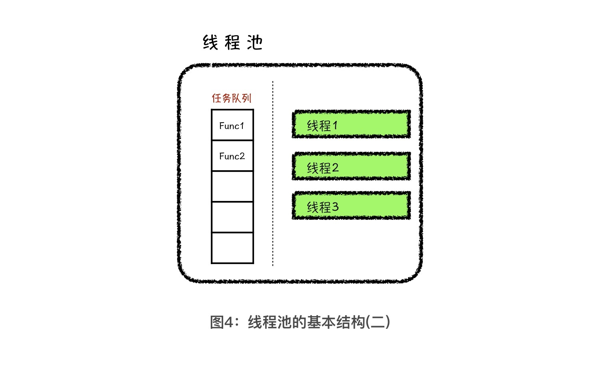

# Java
## 坑
for (Integer n: 时不能添加删除

---- 
JDK是开发环境，包含开发、调试和部署等工具
JRE是运行环境，只包含运行指令和class实现

JVM (Java Virtual Machine) is an abstract machine that enables your computer to run a Java program.
When you run the Java program, Java compiler first compiles your Java code to bytecode. Then, the JVM translates bytecode into native machine code (set of instructions that a computer's CPU executes directly).
Java is a platform-independent language. It's because when you write Java code, it's ultimately written for JVM but not your physical machine (computer). Since, JVM ​executes the Java bytecode which is platform independent, Java is platform-independent.  


JRE (Java Runtime Environment) is a software package that provides Java class libraries, along with Java Virtual Machine (JVM), and other components to run applications written in Java programming. JRE is the superset of JVM.


JDK (Java Development Kit) is a software development kit to develop applications in Java. When you download JDK, JRE is also downloaded, and don't need to download it separately. In addition to JRE, JDK also contains number of development tools (compilers, JavaDoc, Java Debugger etc). 


在部分的商用虚拟机中，Java程序最初是通过解释器（Interpreter）进行解释执行的，当虚拟机发现某个方法或代码块的运行特别频繁时，就会把这些代码认定为“热点代码”（Hot Spot Code）。为了提高热点代码的执行效率，在运行时，虚拟机将会把这些代码编译成与本地平台相关的机器码，并进行各种层次的优化，完成这个任务的编译器称为即时编译器（Just In Time Compiler，简称JIT编译器）。
java常见的编译器有以下类型。

前端编译器：把.java文件转变成.class文件。比如Sun的Javac、Eclipse JDT中的增量式编译器（ECJ）。
JIT编译器：字节码(ByteCode)转变成机器码(NaticeCode)。比如HotSpot VM的C1、C2编译器。
AOT编译器：直接把 .java文件编译成本地机器代码。 比如GNU Compiler for the Java（GCJ）、Excelsior JET。

Java跨平台是class文件的ByteCode可以在各个安装了jdk的系统运行

Cpp是源文件在在新系统都要重新编译

已安装Java SE
Java EE

Python Virtual

'package' keyword actually tells where your '.class' will be stored if you compile your current '.java' file. Each folder is seperated by '.' Dot operator. It is used for Orgainsing your files. Comes pretty handy if you are making a big project!

```java
javac HelloWorld.java // Compile
java HelloWorld // Run
jdb // Debugger
javadoc // 生成HTML格式的API文档，常用于共享成果
```
---- 


Comments: 
```java
//
/* */
/** */ API文档
```

## Primitive Data Type
基本类型转换, 高级类型转换, 数据结构类型转换
相近用Object a，相远用String.valueOf(char)

Object可以转HashMap etc

TreeNode a = new TreeNode(2);
Node b = (Node) a; 只能child转parent. or inverse sometimes?

```java
a.getClass()
a.getClass().getName() // return class type
((Object)a).getClass().getName() //if a is primitive data type
Integer.class.isInstance(20);

boolean b = a instanceof String
```

自动类型转换是指：数字表示范围小的数据类型可以自动转换成范围大的数据类型。

```java
//Primitive Data Type, Wrapper Class. 可以相互转换
byte, Byte 8 bits. 1 bytes. (-128, 127)
short, Short 16 bits. 2 bytes //The short data type is a 16-bit signed two's complement integer. It has a minimum value of -32,768 and a maximum value of 32,767 (inclusive).
(int, Integer 32 bits. 4 bytes)
long, Long 64 bits. 8 bytes
float, Float 32 bits. 4 bytes
(double, Double. 64 bits. 8 bytes. double d = 3.0 / 2.0;)

(char, Character. 16 bits. 2 bytes)

boolean, Boolean
```

32位unsigned int大约可以支持0～40亿的数字，而不是−20亿～+20亿之间的值。unsigned char则可以存储0～255的值。

```java
// Integer Double
int intValue = (int) doubleValue;

int a = 100;
Integer b = a; // same as Integer b = Integer.valueOf(a);
int c = (int) b;

Double d = 5.25;
Integer i = d.intValue(); // i becomes 5

Integer d = 1;
Double i = d.doubleValue();
```

```java
// String to int/Integer
Integer b = Integer.valueOf("20");
int a = Integer.parseInt("10");
int a = Integer.valueOf("20"); 
//?Integer.parseInt(s1, 2); 

// int/Integer to String
int i = 10;  
String s = String.valueOf(i);//Now it will return "10"  
String s = Integer.toString(i);//Now it will return "10"  

String c = String.valueOf(char); // char to String
String c = Character.toString(char); // char to String
```

```java
// ASCII 
char character = 'a';    
int num = (int) character; //ord(character)
int num = 97;
char character = (char) num; // character = chr(num)

s.charAt(i) - 0; // 'a' -> 97
s.charAt(i) - 'a'; // 'a' -> 0
```

```java
Integer a = 1000;
Integer b = 1000;
System.out.println(a.equals(b)); 

int c = 1000;
int d = 1000;
System.out.println(c == d);
```

### Character
```java
Character.isAlphabetic(int); //Determines if the specified character (Unicode code point) is an alphabet.
Character.isDigit(char/int);
Character.isLetter(char/int);
Character.isLetterOrDigit(char/int);
Character.isWhitespace(char/int);
Character.isLowerCase(char);
Character.isUpperCase(char);
Character.toLowerCase(char);
Character.toUpperCase(char);
```

### Integer
```java
Integer inf = Integer.MAX_VALUE;
Integer ninf = Integer.MIN_VALUE;
double inf = Double.POSITIVE_INFINITY;
Integer.intValue(); // error
```

## Math
```java
Math.max(first, second); 
Math.min(first, second);
Math.abs(-1);
Math.pow(double, double);
Math.exp(double); e
Math.sqrt(double);

Math.log(double);
Math.log10(double);

Math.PI;
Math.E;

Math.random(); // 0.0-1.0

int a = 2;
int d = (int) Math.pow(2, a);
```

```java
private static void thresholdBasedFloatsComparison() {
    final double THRESHOLD = .0001;
 
    //Method 1
    double f1 = .0;
    for (int i = 1; i <= 11; i++) {
        f1 += .1;
    }
 
    //Method 2
    double f2 = .1 * 11;
 
    System.out.println("f1 = " + f1);
    System.out.println("f2 = " + f2);
 
    if (Math.abs(f1 - f2) < THRESHOLD)
        System.out.println("f1 and f2 are equal using threshold\n");
    else
        System.out.println("f1 and f2 are not equal using threshold\n");
}

private static void testBdEquality() {
     BigDecimal a = new BigDecimal("2.00");
     BigDecimal b = new BigDecimal("2.0");
 
     System.out.println(a.equals(b));           // false
 
     System.out.println(a.compareTo(b) == 0);   // true
}
```

## Random
```java
Random random = new Random();
min+random.nextInt(max-min); //return between min and max, [min, max)

Random random = new Random(10);
random.nextInt(100); //return between 0-99

// The invocation new Random(seed) is equivalent to:
Random rnd = new Random();
rnd.setSeed(seed);
```

## Data Structures
```java
java.lang  // for advanced features of strings, arrays etc. 这个包下包含了Java语言的核心类，如String、Math、System和Thread类等，使用这个包下的类无须使用import语句导入，系统会自动导入这个包下的所有类。
java.util  // for data structures, regular expressions, date and time functions etc. 这个包下包含了Java的大量工具类/接口和集合框架类/接口，例如Arrays和List、Set等。
java.io //这个包下包含了一些Java输入/输出编程相关的类/接口。

import java.util.Arrays;
import java.util.Collections;
import java.util.List;
import java.util.Enumeration;
import java.util.Iterator;
import java.util.Map;
import java.util.HashMap;
import java.util.LinkedHashMap;
import java.util.LinkedHashSet;
```

Object, Serializable, Cloneable, Comparable\<\>


[https://www.w3schools.com/java/java\_type\_casting.asp](https://www.w3schools.com/java/java_type_casting.asp)

[https://www.google.com/search?q=cast%20response%20java](https://www.google.com/search?q=cast%20response%20java)

[https://javarevisited.blogspot.com/2012/12/what-is-type-casting-in-java-class-interface-example.html?m=1](https://javarevisited.blogspot.com/2012/12/what-is-type-casting-in-java-class-interface-example.html?m=1)

Try running the following code:

List\<String\> listOfString = Arrays.asList("Hello", "World");
ArrayList\<String\> arrayListOfString = new ArrayList(listOfString);
System.out.println(listOfString.getClass());
System.out.println(arrayListOfString.getClass());
You'll get the following result:

class java.util.Arrays$ArrayList
class java.util.ArrayList
So, that means they're 2 different classes that aren't extending each other. java.util.Arrays$ArrayList signifies the private class named ArrayList (inner class of Arrays class) and java.util.ArrayList signifies the public class named ArrayList. Thus, casting from java.util.Arrays$ArrayList to java.util.ArrayList and vice versa are irrelevant/not available

### String
```java
s1.length(); 
s1.isEmpty();
s1.equals(s2); // s1.equalsIgnoreCase(s2)
s1.compareTo(s2) //returns 0 if equal. s1.comparreToIgnoreCase(s2)
s1.contains(s2);
s.charAt(i);
s1.substring(i), s1.substring(i, j) -> String //"unhappy".substring(2) returns "happy"
s1.strip(); //similar to s1.trim() but with Unicode support
s1.split(" "); split(" ", 2) -> String[]; 
s1.replace(a, b)
s1.indexOf(str/char) // -1 if not found
s1.lastIndexOf(str/char) //-1 if not found
s1.startsWith(str/char)
s1.endsWith(str/char)
s1.toLowerCase(), s1.toUpperCase()
s1.concat(s2)
s1.toCharArray()
s1.getBytes() //returns bytes[]
String.format("hello %s %s", "my", "you");
String.format("hello %d %d", 1, 2);
// $c Character, $b Boolean, 
System.out.printf("First Name: %s\nLast Name: %s", firstname, lastname);
System.out.println("First Name: " + firstname + " Last Name: "+ lastname +".");

String str = "Abc";
str.repeat(3); // multiply by 3
```

```java
String test = "edcba";
for (char c: test.toCharArray()) {
	System.out.println(c);
}   

char[] charArray = test.toCharArray(); // String to char array
Arrays.sort(charArray);
String sorted = String.valueOf(charArray); // char array to String
```

```java
String string = "abc ced";
String[] stringArray = string.split(" "); // String split to String array
String string = String.join("", stringArray); // String array to String

List<String> stringList = new ArrayList<>(Arrays.asList(stringArray)); // String array to ArrayList
String string = String.join("", stringList); // ArrayList to String
```

Arrays.asList(array) only read and update
new ArrayList\<\>(Arrays.asList(array)) can also add and delete

#### StringUtils
```java
import org.apache.commons.lang3.StringUtils;
String str = "Abc";
String repeated = StringUtils.repeat(str, 3);
System.out.println(repeated);

int count = StringUtils.countMatches("elephant", "e");
StringUtils.reverse("bat"); // "tab"
StringUtils.isAllLowerCase(s1);
StringUtils.isAllUpperCase(s2);
StringUtils.isAlpha(s1);
StringUtils.isNumeric(s1);
StringUtils.isAlphanumeric(s1);
...
```

```java
commons-collections4
commons-math3
commons-text
...
import org.springframework.util.StringUtils
```

由于频繁地对字符串进行操作会产生大量的内存碎片，从而导致内存性能问题，遇到这种需要频繁操作字符串的情况时, 可以使用 StringBuilder。
因此具体来说，String Builder 是字符串变量，不是像 String 那样是不可变的，而是可改变的对象, 当用进行字符串操作时，是在一个对象上操作的，这样就不会像 String 那样创建一些额外的对象。
Java核心技术及面试指南

### String Builder
[https://www.tutorialspoint.com/java/java\_string\_buffer.htm](https://www.tutorialspoint.com/java/java_string_buffer.htm)

```java
StringBuilder str = new StringBuilder(string);
str.append("hello");
str.append("world");
str.indert(index, str);
str.deleteCharAt(index);
str.delete(left, right);
str.charAt(index);
str.setCharAt(index, char/str);

str.reverse(); //"dlrowolleh"
String s = String.valueOf(str);
String s = str.toString();
```

```java
StringBuffer string = new StringBuffer();
string.append("hello");
```

### Array
`why cannot return arrays[i]`
```java
int[] array = new int[3];

int[] array = {1,3,2}; 

int[] dp = new int[3];
Arrays.fill(dp, 2);

int[][] d = new int[m][n];
for (int[] arr : d) {
	Arrays.fill(arr, 1);
}

int[][] directions = new int[][]{{1, 0}, {-1, 0}, {0, 1}, {0, -1}};

int[][] a = new int[3][3];
for (int i=0; i<a.length; i++) {
	for (int j=0; j<a[0].length; j++) {
		System.out.println(a[i][j]);
    }
}
```

```java
array.length;        
array[i]              
array[i] = val;     
array.clone();   
```

```java
for (int i = 0; i < array.length; i++) {
	System.out.println(array[i]);
}

for (int t: array) {
	System.out.println(t);
}
```

```java
import java.util.*;

String[] fruits = {"Apple","Mango","Kiwi","Banana"};
//String fruits[] = new String[]{"Apple","Mango","Kiwi","Banana"};
ArrayList<String> l = new ArrayList<>(Arrays.asList(fruits)); // doesn't work with int array but yes Integer array
System.out.println("Fruits: " + l);
```

#### Arrays
```java
Arrays.equals(a,b); //compare two arrays
Arrays.copyOf(array, array.length); //shallow copy
Arrays.copyOfRange(array, left, right);
Arrays.sort(a[,left, right]); //sort array in-place 
Arrays.asList(arrayString);
Arrays.toString(array);
Arrays.stream(array);
```

#### ArrayUtils
```java
import org.apache.commons.lang3.ArrayUtils;
ArrayUtils.contains(array, 2);
ArrayUtils.add(array, 2);
ArrayUtils.insert(array, index, 2);
ArrayUtils.reverse(array[, left,right]);
ArrayUtils.subarray(array, left, right);
...
```


### ArrayList
For initializing a container you cannot use a primitive type (i.e. int);
Common:
```java
size();
isEmpty();
equals();
toArray(); 
toString();
clear();
```

```java
import java.util.ArrayList;
list.size();
list.isEmpty();
list.equals();
list.contains(value);
list.get(i);
list.set(i, val);
list.add(val)        //appends val to list
list.add(i, val)     //inserts val at index i shifting subsequent values to the right
list.remove(i)       //removes and returns the value at i
list.subList(i, j). list.subList(1, 3).clear()
list.addAll(collection);
list.addAll(i, collection);
list.removeAll(collection);
list.retainAll(collection);
list.indexOf(value)
list.lastIndexof(value)
list.iterator(); 
list.toArray(); //Object[] array = list.toArray();
list.toString();
list.stream();
list.clone(); // ArrayList arrlist2 = (ArrayList) arrlist1.clone();
List<Integer> list = new ArrayList<>(prev);
list.clear(); //clears the entire ArrayList
```

```java
Integer[] num = {2, 4, 7, 5, 9}; 
List<Integer> list = new ArrayList<>(Arrays.asList(num));
```

```java
List<Integer> list = new ArrayList<>(oldlist); // shadow copy

List<Integer> list = Arrays.asList(1,2,3); //java.util.Arrays$ArrayList
ArrayList<Integer> list2 = new ArrayList<>(Arrays.asList(4,5,6));
// To initialize an list with 60 zeros you do:
List<Integer> list = new ArrayList<>(Collections.nCopies(60, 0)); // Sixty 0

List<List<Integer>> adjacencyList = new ArrayList<>();
for (int i = 0; i < 3; i++) {
	adjacencyList.add(Arrays.asList(1,2,3));
}
```

```java
List<int[]> list = new ArrayList<>();

List<Integer> list = new ArrayList<>(Arrays.asList(1,2,3));
for (int i = 0; i < list.size(); i++)
	System.out.println(list.get(i));

list.forEach(System.out::println);
```

```java
List<String> names = new ArrayList<String>();
names.add("Shyam");
names.add("Rajat");
names.add("Paul");
names.add("Tom");
names.add("Kate");

//Obtaining list iterator
ListIterator<String> litr = names.listIterator();
while(litr.hasNext()){
   System.out.println(litr.next());
}

while(litr.hasPrevious()){
   System.out.println(litr.previous());
}
```

#### Collections
```java
import java.util.Collections;
import java.util.Comparator;

int min = Collections.min(list); 
int max = Collections.max(list); 
Integer[] num = {2, 4, 7, 5, 9}; 
int min = Collections.min(Arrays.asList(num)); 
int max = Collections.max(Arrays.asList(num)); 
Collections.sort(list); // better
Collections.sort(list, Collections.reverseOrder()); 
Collections.reverse(list);
Collections.swap(list, left, right);
Collections.shuffle(list);
Collections.addAll();
Collections.copy(dest, sourc);
public static <T> boolean addAll(Collection<T> c, T... elements)

List<Integer> listOne = new ArrayList<>(Arrays.asList(1,2,3));
List<Integer> listTwo = new ArrayList<>(Arrays.asList(1,3,2));
System.out.println(listOne.toString().compareTo(listTwo.toString()));
```

#### Comparator
type. (integer, string, list, object)

```java
import java.util.Comparator;
// python key
ArrayList<int[]> list = new ArrayList<>();
Collections.sort(list, Comparator.comparing(num -> num[0]); // sort matrix
					   Comparator.comparing(num -> -a[0] * b[0] - a[1] * b[1]))
					   Comparator.comparingDouble(num -> num[0])

// comparable interface. integer, string, object
public class Employee implements Comparable<Employee> { 
    @Override
    public int compareTo(Employee o) {
        return this.getId().compareTo(o.getId()); //this.getId() - o.getId();
    }
}
ArrayList<Employee> employees = getUnsortedEmployeeList();
Collections.sort(employees);

// if the object doesn't have Comparable interface, comparator object
1. Collections.sort(arr, (a,b) -> a == b ? a - b : Math.abs(a-x) - Math.abs(b-x));

2. Comparator<Employee> compareById = (Employee o1, Employee o2) -> o1.getId().compareTo( o2.getId()); 

3. 
Comparator<Employee> compareById = new Comparator<Employee>() {
    @Override
    public int compare(Employee o1, Employee o2) {
        return o1.getId().compareTo(o2.getId()); //o1.getId() - o2.getId()
    }
};

ArrayList<Employee> employees = getUnsortedEmployeeList();
Collections.sort(employees, compareById);
Collections.sort(employees, compareById.reversed());
```

```java
Comparator<int[]> comparator = new Comparator<>(){
    @Override
    public int compare(int[] o1, int[] o2) {
        for(int i=0;i<o1.length;++i) {
            if(o1[i]<o2[i]) {
                return -1;
            } else if(o1[i]>o2[i]) {
                return 1;
            } 
        }
        return 0;
    }
};
```

```java
ArrayList<Object> array = new ArrayList<>(); 
```

```java
ArrayList<T> al = new ArrayList<T>();
Vector<T> v = new Vector<T>(); 
```

### ArrayDeque
```java
Deque<String> stack = new ArrayDeque<>();

// LinkedList是一个双向链表，
Deque<Integer> queue = new ArrayDeque<>();
deque.size();
deque.isEmpty();
deque.contains(3);
deque.add(2); // =addLast() NullPointerException if element is null
	  offer() // offerLast() 
deque.addFirst(); // =push()
// deque.add(2, 3);

deque.remove(); // =removeFirst(), pop(); throw NoSuchElementException if empt. 
	  poll() // return null
deque.removeLast(); 
deque.remove(Object o);

// deque.get(2);
deque.getFirst(); // = element(), throw NoSuchElementException if empty. 
	  peek() // return null if empty
deque.getLast();
// deque.set(2,3);
```

The ArrayDeque class is the resizable array implementation of the Deque interface and LinkedList class is the list implementation
NULL elements can be added to LinkedList but not in ArrayDeque
ArrayDeque is more efficient than the LinkedList for add and remove operation at both ends and LinkedList implementation is efficient for removing the current element during the iteration
The LinkedList implementation consumes more memory than the ArrayDeque
So if you don't have to support NULL elements && looking for less memory && efficiency of add/remove elements at both ends, ArrayDeque is the best

### LinkedList
```java
// LinkedList是一个双向链表，
Deque<Integer> list = new LinkedList<>();
list.size();
list.isEmpty();
list.contains(3);
list.add(2); // =addLast(), offer()
list.addFirst(); // =push()
list.add(2, 3);

list.remove(); // =removeFirst(), pop(); throw NoSuchElementException if empt. poll() return null
list.removeLast(); 
list.remove(Object o);

list.get(2);
list.getFirst(); // = element(), throw NoSuchElementException if empty. peek() return null if empty
list.getLast();
list.set(2,3);

// Creating object of the 
// class linked list 
List<String> ll = new LinkedList<String>(); 
// Adding elements to the linked list 
ll.add("A"); 
ll.add("B"); 
ll.addLast("C"); 
ll.addFirst("D"); 
ll.add(2, "E"); 
System.out.println(ll); //[D, A, E, B, C]
ll.remove("B"); 
ll.remove(3); 
ll.removeFirst(); 
ll.removeLast(); 
System.out.println(ll); //[A]
ll.get(2);
ll.getFirst();
ll.getLast();
ll.peek(); 
```

### Stack and Queue
```java
size();
isEmpty();
clear();
Stack<Integer> stack = new Stack<>();
stack.push(value);
stack.pop();
stack.peek();
```

```java
Queue<Integer> queue = new LinkedList<>();
queue.add(value); offer()
queue.remove();  poll()
queue.peek(); element()
```

### PriorityQueue
```java
import java.util.PriorityQueue;
import java.util.Iterator;

PriorityQueue<Integer> queue = new PriorityQueue<>();
queue.addAll(Collection)
queue.size();
queue.contains();
queue.offer(1); //return false if full, add() raise Exception if full
queue.poll(); 
queue.remove(num);
queue.peek();
```

#### Comparator
type. (integer, string, list, object)

```java
// python key 
PriorityQueue<Integer> heap = new PriorityQueue<Integer>(Comparator.comparing(num -> -a[0] * a[0] - a[1] * a[1])))
```

```java
// Max Heap
Comparator<Integer> compare = (Integer o1, Integer o2) -> o2 - o1; 
// init heap 'the smallest element first'
PriorityQueue<Integer> heap = new PriorityQueue<Integer>(compare);

compare.reversed() 
```

```java
Comparator<Integer> comparator = new Comparator<Integer>() {
	@Override
	public int compare(Integer number1, Integer number2) {
	    // elements are sorted in reverse order
		return number2.compareTo(number1);
};

Comparator<Integer> comparator = new Comparator<Integer>() {
	@Override
	public int compare(Integer number1, Integer number2) {
	    // elements are sorted in reverse order
	    if (number1.compareTo(number2) > 0) {
	        return -1;
	    }
	    else if (number1.compareTo(number2) < 0) {
	        return 1;
	    }
	    else {
	        return 0;
		}
	}
};
```

```java
Comparator<int[]> comparator = new Comparator<int[]>() {
    @Override
    public int compare(int[] l1, int[] l2) {
        if (l1[0] != l2[0]) {
            return l1[0] - l2[0];
        } else {
            if (l1[1] != l2[1]) {
                return l1[1] - l2[1];
            } else {
                return l1[2] - l2[2];
            }
        }
    }
};

Comparator<List<Integer>> comparator = new Comparator<List<Integer>>() {
    @Override
    public int compare(List<Integer> l1, List<Integer> l2) {
        if (!l1.get(0).equals(l2.get(0))) {
            return l1.get(0) - l2.get(0);
        } else {
            if (!l1.get(1).equals(l2.get(1))) {
                return l1.get(1) - l2.get(1);
            } else {
                return l1.get(2) - l2.get(2);
            }
        }
    }
};
```

```java
//Using the iterator() method
Iterator<Integer> iterate = priorityqueue.iterator();
while(iterate.hasNext()) {
	System.out.print(iterate.next());

```

### HashMap
Create a HashMap object called capitalCities that will store String keys and String values:
```java
Map<String, String> map = new HashMap<>();
map.size(); 
map.containsKey(key); 
map.containsValue(value); 
map.equals(map);
map.get(key); //return null if not found. map.getOrDefault(key, 0)
map.put(key, value);
map.putAll(map);
map.remove(key);
map.keySet();
map.values();
map.entrySet(); 
map.toString();
map.clear();
```

```java
// Import the HashMap class
import java.util.HashMap;

// Create a HashMap object called capitalCities
Map<String, String> map = new HashMap<String, String>();
// Add keys and values (Country, City)
map.put("England", "London");
map.put("Germany", "Berlin");
map.put("Norway", "Oslo");
map.put("USA", "Washington DC");
System.out.println(capitalCities);

map.size();
map.get("England");
map.remove("England");
map.clear();

for (String i : map.keySet()) {
	System.out.println(i);
}
for (String i : map.values()) {
	System.out.println(i);
}

Collection<Integer> list = map.values();

map.values().toArray()[0] // only one 

for (Map.Entry<Character, Integer> entry: map.entrySet()) {
	System.out.println(entry.getKey());
    System.out.println(entry.getValue());        
}
Set<Map.Entry<Character, Integer>> set = map.entrySet();

Iterator<Map.Entry<String, Integer>> entryIterator = map.entrySet().iterator();
while (entryIterator.hasNext()) {
	Map.Entry<String, Integer> next = entryIterator.next();
	System.out.println("key=" + next.getKey() + " value=" + next.getValue());
}
    
namesMap.forEach((key, value) -> System.out.println(key + " " + value));
namesMap.entrySet().forEach(entry -> System.out.println(
  entry.getKey() + " " + entry.getValue()));
```

```java
Map<String, Integer> count = new HashMap();
for (String word: words) {
	count.put(word, count.getOrDefault(word, 0) + 1);
}
```

```java
HashMapList<Integer, String> maplist = new HashMapList<Integer, String>();
for (String s : strings) {
int key = computeValue(s);
maplist.put(key, s);
}
```

There is a structure called ordered dictionary, it combines behind both hashmap and linked list. In Python this structure is called OrderedDict and in Java LinkedHashMap.
### LinkedHashMap and TreeMap
```java
import java.util.LinkedHashMap;
LinkedHashMap<Integer, Integer> map = new LinkedHashMap<>();
map.containsValue(key); 
map.get(key);
map.keySet();
map.values();
map.entrySet();
map.removeEldestEntry(Map.Entry<K,​V> eldest); //protected boolean
```

Java TreeMap is a data structure that implements Map\<Key,Value\> interface and it based on Red-Black tree data structure.

```java
import java.util.TreeMap;
TreeMap<String, Integer> sorted = new TreeMap<>(map); //map is a hashmap
Map<String, String> treemap = new TreeMap<>(Collections.reverseOrder());
treemap.putAll(map);

sorted.descendingKeySet() -> NavigableSet<K>;
sorted.descendingMap() -> NavigableMap<K,​V>; 
```

### HashSet 
```java
HashSet<Integer> set = new HashSet<Integer>(ArayList);
HashSet<Integer> set = new HashSet<Integer>();
set.size();
set.isEmpty();
set.contains(value);
set.add(value);
set.remove(value)
set.removeAll(collection) 
set.retainAll(collection) // &
set.iterator();
```

```java
import java.util.*;
public class Demo {
   public static void main(String args[]) {
      int a[] = {77, 23, 4, 66, 99, 112, 45, 56, 39, 89};
      Set<Integer> s = new HashSet<Integer>();
      try {
         for(int i = 0; i < 5; i++) {
            s.add(a[i]);
         }
         System.out.println(s);
         //? TreeSet sorted = new TreeSet<Integer>(s);
         System.out.println("Sorted list = ");
         System.out.println(sorted);
      } 
   }
}

s.forEach(System.out::println);
```

```java
Iterator<String> it = set.iterator(); 
while (it.hasNext()) 
	System.out.println(it.next());

```

### LinkedHashSet and TreeSet
```java
import java.util.LinkedHashSet

Set<String> set = new LinkedHashSet<String>(); 
set.add("bbb"); 
set.add("aaa"); 
set.add("abc"); 
set.add("bbc"); 

for (String n: set) 
	System.out.println(n);
```

### HashMapList
which class to import?
本质上是HashMap\<T, ArrayList\<E\>\>的一种简写。它允许我们将T类型的元素映射到ArrayList，该ArrayList的元素类型为E。

```java
HashMap<Integer, ArrayList<String>> maplist =  new HashMap<Integer, ArrayList<String>>();
for (String s : strings) {
	int key = computeValue(s);
	if (！maplist.containsKey(key)) {
		maplist.put(key, new ArrayList<String>());
	}
	maplist.get(key).add(s);
}

HashMapList<Integer, String> maplist = new HashMapList<Integer, String>();
for (String s : strings) {
int key = computeValue(s);
maplist.put(key, s);
}
```

### CopyOnWriteArrayList

### ConcurrentHashmap
```java
import java.util.concurrent.*; 
ConcurrentHashMap<Integer,String> m = new ConcurrentHashMap<>();  
m.put(100,"Hello"); 
m.put(101,"Geeks"); 
m.put(102,"Geeks"); 
System.out.println(m); 
```

### ConcurrentLinkedQueue
### ConcurrentLinkedDeque

## Guava
```java
Chars.min(myarray);
Ints.min(myarray);
Longs.max(myarray);

List<String> list = Lists.newArrayList("a", "b", "c", "d");
Map<String, Integer> map = Maps.newLinkedHashMap();
```

## Control Flow
```java
for (int i = 0; i < list.size(); i++) {
}
```

while
## Conditional
```java
if ()
else if 
else

&& || !

if (a > b) {
  max = a;
} else {
  max = b;
}

max = a > b ? 1 : 0;
```

## Documentation
Java文档注释 javadoc
文档注释与一般注释的最大区别在于起始符号是/**而不是`/*`或//。

```java
@author
@date
@param input
@return
@deprecated
```

## Class
Constant: public static final NAME = “Ivan”;

private fields

"static void main" must be defined in a public class.
Java compiler distinguish between a method and a constructor by its name and return type. In Java, a constructor has same name as that of the class, and doesn’t return any value.
```java
class ConsMain {
    private int x;
    // constructor
    private ConsMain(){
        System.out.println("Constructor Called");
        x = 5;
    }
    public static void main(String[] args){
        ConsMain obj = new ConsMain();
        System.out.println("Value of x = " + obj.x);
    }
}
```

同一个类里具有多个构造器，多个构造器的形参列表不同，即被称为构造器重载。
```java
// Constructor overloading 
public class Simple {

    public Simple() {
        this(null);
    }

    public Simple(Resource r) {
        this(r, null);
    }

    public Simple(Resource r1, Resource r2) {
        // Guard statements, initialize resources or throw exceptions if
        // the resources are wrong
        if (r1 == null) {
            r1 = new Resource();
        }
        if (r2 == null) {
            r2 = new Resource();
        }

        // do whatever with resources
    }

}
```

class can has static and non-static methods. 

## Inner Class
An instance of an inner class cannot be created without an instance of the outer class. Therefore, an inner class instance can access all of the members of its outer class, without using a reference to the outer class instance. For this reason inner classes can help make programs simple and concise.

What are the differences between static and non-static nested classes?
The following are major differences between static nested classes and inner classes.

A static nested class may be instantiated without instantiating its outer class.
Inner classes can access both static and non-static members of the outer class. A static class can access only the static members of the outer class.

static inner class can have both static and non-static methods. non-static class only has non-static methods

```java
public class Util {
	
	public static main() { 
		Help.test();
	}

	static class Help {
        public int num;
        // public static int var = 2;
    
        public Help(int num) {
            this.num = num;
        }

        public static void test() {
            System.out.println("test");
        }
    }

}
```

## Methods
```java
public class MyClass {
  static void myMethod() {
    // code to be executed
  }
}
```
myMethod() is the name of the method

## Modifiers
public - visible from anywhere
private - visible from only within the class
protected - visible within the package, and among its subclasses
default - visible within the package

static means that the method belongs to the MyClass class and not an object of the MyClass class. You will learn more about objects and how to access methods through objects later in this tutorial.
A static method means that it can be accessed without creating an object of the class, unlike public, which can only be accessed by objects
If you don't want other classes to inherit from a class, use the final keyword. Which also makes the variable immutable 

有时你希望定义一个类成员，使它的使用完全独立于该类的任何对象。通常情况下，类成员必须通过它的类的对象访问，但是可以创建这样一个成员，它能够被它自己使用，而不必引用特定的实例。在成员的声明前面加上关键字static(静态的)就能创建这样的成员。如果一个成员被声明为static，它就能够在它的类的任何对象创建之前被访问，而不必引用任何对象。你可以将方法和变量都声明为static。static 成员的最常见的例子是main( ) 。因为在程序开始执行时必须调用main() ，所以它被声明为static。

声明为static的变量实质上就是全局变量。当声明一个对象时，并不产生static变量的拷贝，而是该类所有的实例变量共用同一个static变量。声明为static的方法有以下几条限制：
• 它们仅能调用其他的static方法。
• 它们只能访问static数据。
• 它们不能以任何方式引用this或super（关键字super 与继承有关，在下一章中描述）

static method静态方法可以直接通过类名调用，任何的实例也都可以调用，因此静态方法中不能用this和super关键字，不能直接访问所属类的实例变量和实例方法(就是不带static的成员变量和成员成员方法)，只能访问所属类的静态成员变量和成员方法。因为实例成员与特定的对象关联！
在静态方法里只能直接调用同类中其他的静态成员（包括变量和方法），而不能直接访问类中的非静态成员。这是因为，对于非静态的方法和变量，需要先创建类的实例对象后才可使用，而静态方法在使用前不用创建任何对象。（备注：静态变量是属于整个类的变量而不是属于某个对象的）
静态方法不能以任何方式引用this和super关键字，因为静态方法在使用前不用创建任何实例对象，当静态方法调用时，this所引用的对象根本没有产生。

class method可以调用static method

static代码块
```java

public class Test5 { 
	private static int a; 
    private int b;
    static { 
		Test5.a = 3; 
		System.out.println(a); 
		Test5 t = new Test5(); 
		t.f(); 
		t.b = 1000; 
		System.out.println(t.b); 
	}

	static { 
		Test5.a = 4; 
		System.out.println(a); 
	}

	public static void main(String[] args) { 
		// TODO 自动生成方法存根 
	}
	
	static { 
		Test5.a = 5; 
		System.out.println(a); 
	} 

	public void f() { 
		System.out.println("hhahhahah"); 
	} 

```
静态程序块：当一个类需要在被载入时就执行一段程序，这样可以使用静态程序块。

对于被static和final修饰过的实例常量，实例本身不能再改变了，但对于一些容器类型（比如，ArrayList、HashMap）的实例变量，不可以改变容器变量本身，但可以修改容器中存放的对象，这一点在编程中用到很多。

new 对象时先执行实例块

void means that this method does not have a return value. You will learn more about return values later in this chapter
```java
public class MyClass {
  static void myMethod() {
    System.out.println("I just got executed!");
  }

  public static void main(String[] args) {
    myMethod();
  }
}

// Outputs "I just got executed!"
```

## Object Class
Object class is present in java.lang package. Every class in Java is directly or indirectly derived from the Object class. If a class does not extend any other class then it is direct child class of Object and if extends other class then it is an indirectly derived. Therefore the Object class methods are available to all Java classes. Hence Object class acts as a root of inheritance hierarchy in any Java Program.

getClass()
hashCode()
equals()
toString()
clone()
finalize()
wait(), notify() notifyAll()

## OOp’s Principles
*Encapsulation*指的是将对象的状态信息隐藏在对象内部，不允许外部程序直接访问对象内部信息，而是通过该类所提供的方法来实现对内部信息的操作和访问。封装把一个对象的属性私有化，同时提供一些可以被外界访问的属性的方法， 如果属性不想被外界访问，我们大可不必提供方法给外界访问。
binding the code and data together into a single unit. called as encapsulation.
java bean is the fully encapsulated class because all the data members are private here.
Advantages:
by providing the setter or getter method you can make the class read only or write only.
it provides you to control over the data of objects.

People often consider encapsulation as data hiding, but that’s not entirely true.
Encapsulation refers to the bundling of related fields and methods together. This allows us to achieve data hiding. Encapsulation in itself is not data hiding.

*Inheritance*
继承是使用已存在的类的定义作为基础建立新类的技术，新类的定义可以增加 新的数据或新的功能，也可以用父类的功能，但不能选择性地继承父类。
1. 子类拥有父类非 private 的属性和方法。
2. 子类可以拥有自己属性和方法，即子类可以对父类进行扩展。
3. 子类可以用自己的方式实现父类的方法。

*Polymorphism*
when a class want to implement same task multiple time then we use polymorphism. We can use this polymorphism in 2 different ways:
1)method overloading. 重载（overloading）是指两种方法的名称相同，但参数类型或个数不同。
2)method overriding. 重写（overriding）是指某种方法与父类的方法拥有相同的名称和函数签名

Parent class methods that are static are not part of a child class (although they are accessible), so there is no question of overriding it. Even if you add another static method in a subclass, identical to the one in its parent class, this subclass static method is unique and distinct from the static method in its parent class.
Only for object. 

```java
public class ClientEnum extends BaseEnum {

	private ClientEnum(String name, int clientId, int screenItemTypeId) {
        super(clientId, name);
        this.m_hasAsyncProcessing = false;
        this.m_rulesetName = name;
        this.m_screenItemTypeId = screenItemTypeId;
    }

    private ClientEnum(String name, int clientId, int screenItemTypeId, boolean hasAsyncProcessing) {
        this(name, clientId, screenItemTypeId);
        this.m_hasAsyncProcessing = hasAsyncProcessing;
    }
}
```

```java
public class SignInElvisRequest extends ElvisRequest {}
ElvisRequest requet = new ElvisRequest();
SignInElvisRequest signinRequest = (SignInElvisRequest) request;
```
Cast only from higher parent to child.? It seems reverse also works

Generics and Object


Interface \<- Implemented by Class \<- Extended by other Classes
  \<- Implemented by Abstract Class \<- Extended by other Classes

## Abstraction
在Java中抽象类表示的是一种继承关系，一个类只能继承一个抽象类，而一个类却可以实现多个接口。
抽象类不能创建对象(比如，不能使用new Shape())，而具体类可以。
与类不同，接口不能new，不能直接创建一个接口对象，对象只能通过类来创建。但可以声明接口类型的变量，引用实现了接口的类对象
但抽象类和接口根本上是不同的，接口中不能定义实例变量，而抽象类可以，一个类可以实现多个接口，但只能继承一个类。
抽象类和接口是配合而非替代关系，它们经常一起使用，接口声明能力，抽象类提供默认实现，实现全部或部分方法，一个接口经常有一个对应的抽象类。比如，在Java类库中，有：
❑ Collection接口和对应的AbstractCollection抽象类。
❑ List接口和对应的AbstractList抽象类。
❑ Map接口和对应的AbstractMap抽象类。
对于需要实现接口的具体类而言，有两个选择：一个是实现接口，自己实现全部方法；另一个则是继承抽象类，然后根据需要重写方法。
继承的好处是复用代码，只重写需要的部分即可，需要编写的代码比较少，容易实现。不过，如果这个具体类已经有父类了，那就只能选择实现接口了。

1. 接口的方法默认是 public，所有方法在接口中不能有实现(Java 8 开始接口方法可以有默认实现），抽象类可以 有非抽象的方法
2. 接口中的实例变量默认是 final 类型的，而抽象类中则不一定
3. 一个类可以实现多个接口，但最多只能实现一个抽象类
4. 一个类实现接口的话要实现接口的所有方法，而抽象类不一定
5. 接口不能用 new 实例化，但可以声明，但是必须引用一个实现该接口的对象 从设计层面来说，抽象是对类的抽象，是一种模板设计，接口是行为的抽象，是一种行为的规范。

## Interface
To access the interface methods, the interface must be "implemented" (kinda like inherited) by another class with the implements keyword (instead of extends). The body of the interface method is provided by the "implement" class:

```java
// Interface
interface Animal {
  public void animalSound(); // interface method (does not have a body)
  public void sleep(); // interface method (does not have a body)
}

// Pig "implements" the Animal interface
class Pig implements Animal {
  @Override
  public void animalSound() {
    // The body of animalSound() is provided here
    System.out.println("The pig says: wee wee");
  }

  @Override
  public void sleep() {
    // The body of sleep() is provided here
    System.out.println("Zzz");
  }
}

class MyMainClass {
  public static void main(String[] args) {
    Pig myPig = new Pig();  // Create a Pig object
    myPig.animalSound();
    myPig.sleep();
  }
}
```

```java
public interface EsamsService {
    TrustStore getTrustStore(String var1);

    TrustStore getAllEnabledCertificates(String var1);

    NonKeyHolder getNonKey(GenericKeyLocator var1);

    CertificateHolder getCertificate(GenericKeyLocator var1);

    KeyPairHolder getPrivateKey(GetPrivateKey var1);

    SecretKeyHolder getSecretKey(GenericKeyLocator var1);

    KeyPairHolder getKeyPair(GenericKeyLocator var1);

    CertificateHolder getCertificateBySelector(CertSelector var1);
}
```

1. Like abstract classes, interfaces cannot be used to create objects (in the example above, it is not possible to create an "Animal" object in the MyMainClass)
2. Interface methods do not have a body - the body is provided by the "implement" class
3. On implementation of an interface, you must override all of its methods
4. Interface methods are by default abstract and public
5. Interface attributes are by default public, static and final
6. An interface cannot contain a constructor (as it cannot be used to create objects)

Why And When To Use Interfaces?
1) To achieve security - hide certain details and only show the important details of an object (interface).
2) Java does not support "multiple inheritance" (a class can only inherit from one superclass). However, it can be achieved with interfaces, because the class can implement multiple interfaces. Note: To implement multiple interfaces, separate them with a comma (see example below).

```java
//Multiple Interfaces
interface FirstInterface {
  public void myMethod(); // interface method
}

interface SecondInterface {
  public void myOtherMethod(); // interface method
}

class DemoClass implements FirstInterface, SecondInterface {
  @Override
  public void myMethod() {
    System.out.println("Some text..");
  }
 
  @Override
  public void myOtherMethod() {
    System.out.println("Some other text...");
  }
}

class MyMainClass {
  public static void main(String[] args) {
    DemoClass myObj = new DemoClass();
    myObj.myMethod();
    myObj.myOtherMethod();
  }
}
```

Composition is a Has-A relationship...means one class can use the functionality of another class using the object of that class


## 枚举 Enumeration
```java
public enum EquipStatus {
    ON("10"),    // 开机 
	OFF("20"), // 关机
    NORMAL("30"),  // 正常
    SLEEP("40"),  // 进入休眠
    AWAKE("41");  // 唤醒

    private String value;

    EquipStatus(String value) {
        this.value = value;
    }

    public String getValue() {
        return value;
    }
}

EquipStatus.ON; // ON
EquipStatus.ON.getValue(); // "10"

EquipStatus.ON.name() // "ON"
```

```java
public enum ResponseCode {

    SUCCESS(0,"SUCCESS"),
    ERROR(1,"ERROR"),
    NEED_LOGIN(10,"NEED_LOGIN"),
    ILLEGAL_ARGUMENT(2,"ILLEGAL_ARGUMENT");

    private final int code;
    private final String desc;

    ResponseCode(int code,String desc) {
        this.code = code;
        this.desc = desc;
    }

    public int getCode(){
        return code;
    }
    public String getDesc(){
        return desc;
    }

}

ResponseCode.SUCCESS.getCode();
```

## 泛形 Generics Programming
泛型的好处就是在编译的时候能够检查类型安全，并且所有的强制转换都是自动和隐式的。
？表示不确定的 java 类型
T (type) 表示具体的一个java类型
K V (key value) 分别代表java键值中的Key Value
E (element) 代表Element

用泛型表示类
```java
//此处T可以随便写为任意标识，常见的如T、E、K、V等形式的参数常用于表示泛型
public class GenericDemo<T>{
	//value这个成员变量的类型为T，T的类型由外部指定
	private T value;
	public GenericDemo(T value) {
		this.value = value;
	}
	
	public T getValue（）{ //泛型方法getKey的返回值类型为T，T的类型由外部指定
		return value;
	}
	
	public void setValue(T value){
		this.value = value
	}
}
```

用泛型表示接口
```java
public interface Generator <T> {
	public T next ();
}
```

泛型方法
```java
public class GenericMethods {
	public <T> void f(T x) {
		System.out.println(x.getClassO.getName);
	}
}
```

泛型通配符
List 是泛型类，为了表示各种泛型 List 的父类，可以使用类型通配符，类型通配符使用\<?\>表示，它的元素类型可以匹配任何类型。
```java
public static void main(String[] args) {
	List<String> name = new Arraylist<String>();
	List<Integer> age = new Arraylist<Integer>();
	List<Number> number = new ArrayList<Number>();
	name.add("cxuan");
	age.add(18);
	number.add(314);
	generic(name);
	generic(age);
	generic(number);
}

public static void generic(List<?> data) {
	System.out.println("Test cxuan :" + data.get(0));
}
```

上界通配符：List\<? extends Animal\> listAnimals 该通配符为 Anima 的所有子类型。它表示的是任何类型都是Animal 类型的子类。
下界通配符: \<? super ClassType\> 该通配符为 ClassType 的所有超类型。它表示的是任何类型的父类都是 ClassType。
[link](https://zhuanlan.zhihu.com/p/82457476)

Type Erasure: 泛型类型仅存在于编译期间，编译后的字节码和运行时不包含泛型信息，所有的泛型类型映射到同一份字节码。
泛型(T) --\> 编译器(type erasure) --\> 原始类型(T被Object替换)
泛型(? extends XXX) --\> 编译器(type erasure) --\> 原始类型(T被XXX替换)
原始类型指被编译器擦除了泛型信息后，类型变量在字节码中的具体类型。

```java
// 假如，我们定义一个泛型类Generic是这样的：
class Generic<T> {
    private T obj;

    public Generic(T o) {
        obj = o;
    }

    public T getObj() {
        return obj;
    }
}

// 那么，Java编译后的字节码中Generic相当于这样的：
class Generic {
    private Object obj;

    public Generic(Object o) {
        obj = o;
    }

    public Object getObj() {
        return obj;
    }
}
```

[https://segmentfault.com/a/1190000008711188](https://segmentfault.com/a/1190000008711188)

## 反射 Reflexion
反射是 Java 中一个非常重要同时也是一个高级特性，基本上 Spring 等一系列框架都是基于反射的思想写成的。我们首先来认识一下什么反射。
Java 反射机制是在程序的运行过程中，对于任何一个类，都能够知道它的所有属性和方法；对于任意一个对象，都能够知道调用它的任意属性和方法，这种动态获取信息以及动态调用对象方法的功能称为 java语言的反射机制。

Java 反射机制主要提供了以下这几个功能 
在运行时判断任意一个对象所属的类
在运行时构造任意一个类的对象
在运行时判断任意—个类所有的成员变量和方法
在运行时调用任意一个对象的方法

在 Java 中，使用 java.long.reflect 包实现了反射机制。

1.通过new对象实现反射机制 2.通过路径实现反射机制 3.通过类名实现反射机制
```java
public class Student { 
	private int id; 
	String name; 
	protected boolean sex; 
	public float score; 
}
```

```java
public class Get {
	//获取反射机制三种方式 
	public static void main(String[] args) throws ClassNotFoundException { 
		//方式一(通过建立对象) 
		Student stu = new Student(); 
		Class classobj1 = stu.getClass(); 
		System.out.println(classobj1.getName()); 
		//方式二（所在通过路径-相对路径） 
		Class classobj2 = Class.forName("com.zhu.Student");
		System.out.println(classobj2.getName()); 
		//方式三（通过类名） 
		Class classobj3 = Student.class; 
		System.out.println(classobj3.getName());

		Constructor<classname> constructor1 = classobj1.getConstructor();
	}
}
```

```java
import java.lang.reflect.Constructor; 
public class ReflectTest { 
	public static void main(String[] args) throws Exception {
		Class clazz = Class.forName("com.jas.reflect.Fruit"); C
		Constructor<Fruit> constructor1 = clazz.getConstructor(); 
		Constructor<Fruit> constructor2 = clazz.getConstructor(String.class);

		Fruit fruit1 = constructor1.newInstance(); 
		Fruit fruit2 = constructor2.newInstance("Apple");
	}
} 

class Fruit{
	public Fruit() { 
		System.out.println("无参构造器 Run..........."); 
	} 

	public Fruit(String type) {
		System.out.println("有参构造器 Run..........." + type); 
	}
}
```

## Error Handling 


检查性异常(checked exceptions) 是必须在在方法的throws子句中声明的异常。它们扩展了异常，旨在成为一种“在你面前”的异常类型。JAVA希望你能够处理它们，因为它们以某种方式依赖于程序之外的外部因素。检查的异常表示在正常系统操作期间可能发生的预期问题。 当你尝试通过网络或文件系统使用外部系统时，通常会发生这些异常。 大多数情况下，对检查性异常的正确响应应该是稍后重试，或者提示用户修改其输入。
非检查性异常(unchecked Exceptions) 是不需要在throws子句中声明的异常。 由于程序错误，JVM并不会强制你处理它们，因为它们大多数是在运行时生成的。 它们扩展了RuntimeException。 最常见的例子是NullPointerException (相当可怕..是不是？)。 未经检查的异常可能不应该重试，正确的操作通常应该是什么都不做，并让它从你的方法和执行堆栈中出来。 在高层次的执行中，应该记录这种类型的异常。
错误(errors) 是严重的运行时系统问题，几乎肯定无法恢复。 例如OutOfMemoryError，LinkageError和StackOverflowError, 它们通常会让程序崩溃或程序的一部分。 只有良好的日志练习才能帮助你确定错误的确切原因

```
java.lang.Exception
java.lang.Error
```

```java
public static void main(String[] args) throws Exception {
	if bad thing happens {
		throw new Exception("Invalid"); // It's a checked exception
	}
}

public void method2() throws ExceptionType {
	if (exception condition) throw instance of ExceptionType;
}	
```

```java
try {
	int divideByZero = 5 / 0;
	System.out.println("Rest of code in try block");

} catch (ArithmeticException e) {
	System.err.println("ArithmeticException => " + e.getMessage());
} catch (Exception e) {
	System.err.println("Other Exception");
} finally {
	System.err.println("Always run");
}
```

```java
e.getMessage();
e.printStackTrace(); //在控制台上打印Throwable对象封装的异常信息
```

Error 类是指 java 运行时系统的内部错误和资源耗尽错误。应用程序不会抛出该类对象。如果出现了这样的错误，除了告知用户，剩下的就是尽力使程序安全的终止。

**RuntimeException**. Unchecked Exception.
RuntimeException 是那些可能在 Java 虚拟机正常运行期间抛出的异常的超类。 如果出现 RuntimeException，那么一定是程序员的错误. 


Try catch
Throw for upper method to handle

**Checked Exception** must throws
一般是外部错误，这种异常都发生在编译阶段，Java 编译器会强制程序去捕获此类异常，即会出现要求你把这段可能出现异常的程序进行 try catch，该类异常一般包括几个方面：
试图在文件尾部读取数据
试图打开一个错误格式的 URL
试图根据给定的字符串查找 class 对象，而这个字符串表示的类并不存在
IOException, SQLException


java.net.SocketTimeoutException. This exception is a subclass of java.io.IOException, so it is a checked exception.

Java面试突击
[https://beginnersbook.com/2013/04/user-defined-exception-in-java/](https://beginnersbook.com/2013/04/user-defined-exception-in-java/)

当一个方法产生一个它不处理的异常时，那么就需要在该方法的头部声明这个异常，以便将该异常传递到方法的外部进行处理。可以使用 throws 关键字在方法的头部声明一个异常
[http://c.biancheng.net/view/1049.html](http://c.biancheng.net/view/1049.html)


## File
IO包括文件，网络

```java
import java.util.Date; // imports only Date class
import java.io.*;      // imports everything inside java.io package

import java.io.Serializable;

import javax.servlet.ServletContext;
import javax.servlet.http.HttpSession;
import javax.servlet.http.HttpSessionBindingEvent;
import javax.servlet.http.HttpSessionBindingListener;

Files.size()
Files.exists()
Files.read()
Files.write()
Files.createFile()
Files.createDirectory()
Files.delete()
Files.copy()
Files.move()
```

微信粘贴

## 网络编程

## 函数式编程. Functional Programming
```java
set.forEach(System.out::println);
```

### Stream
A stream does not store data and, in that sense, is not a data structure. It also never modifies the underlying data source.
```java
import java.util.stream.Stream
.map(n -> n*n)

Stream.of(arrayOfEmps); //array
list.stream(); //list

//Here, we obtain an Integer stream of employee ids from an array. Each Integer is passed to the function employeeRepository::findById() – which returns the corresponding Employee object; this effectively forms an Employee stream.
public void whenMapIdToEmployees_thenGetEmployeeStream() {
    Integer[] empIds = { 1, 2, 3 };
    
    List<Employee> employees = Stream.of(empIds)
      .map(employeeRepository::findById) 
      .collect(Collectors.toList()); // Convert stream to arraylist
}
```

A java.util.Stream represents a sequence of elements on which one or more operations can be performed. Stream operations are either intermediate or terminal. While terminal operations return a result of a certain type, intermediate operations return the stream itself so you can chain multiple method calls in a row. Streams are created on a source, e.g. a java.util.Collection like lists or sets (maps are not supported). Stream operations can either be executed sequential or parallel. All intermediate operations will NOT be executed without a terminal operation at the end.
**intermediate operations**
filter(Predicate\<T\>)
map(Function\<T\>)
flatMap(Function\<T\>)
sorted(Comparator\<T\>)
peek(Consumer\<T\>)
distinct()
limit(long n)
skip(long n)
**terminal operations**
forEach
forEachOrdered
toArray
reduce
collect
min
max
count
anyMatch
allMatch
noneMatch
findFirst    
findAny
Last 5 are short-circuiting terminal operations.

```java
List<String> stringCollection = new ArrayList<>();
stringCollection.add("ddd2");
stringCollection.add("aaa2");
stringCollection.add("bbb1");
stringCollection.add("aaa1");
stringCollection.add("bbb3");
stringCollection.add("ccc");
stringCollection.add("bbb2");
stringCollection.add("ddd1");
```

Collections in Java 8 are extended so you can simply create streams either by calling Collection.stream() or Collection.parallelStream(). The following sections explain the most common stream operations.

Filter accepts a predicate to filter all elements of the stream. This operation is intermediate which enables us to call another stream operation (forEach) on the result. ForEach accepts a consumer to be executed for each element in the filtered stream. ForEach is a terminal operation. It's void, so we cannot call another stream operation.
```java
stringCollection.stream()
			    .filter((s) -> s.startsWith("a"))
			    .forEach(System.out::println);
// "aaa2", "aaa1"
```

Sorted is an intermediate operation which returns a sorted view of the stream. The elements are sorted in natural order unless you pass a custom Comparator.
```java
stringCollection
    .stream()
    .sorted()
    .filter((s) -> s.startsWith("a"))
    .forEach(System.out::println);
// "aaa1", "aaa2"
//Keep in mind that sorted does only create a sorted view of the stream without manipulating the ordering of the backed collection. The ordering of stringCollection is untouched:
System.out.println(stringCollection);
// ddd2, aaa2, bbb1, aaa1, bbb3, ccc, bbb2, ddd1
```

```java
sorted(comparing(Dishes::getCalories))
```

The intermediate operation map converts each element into another object via the given function. The following example converts each string into an upper-cased string. But you can also use map to transform each object into another type. The generic type of the resulting stream depends on the generic type of the function you pass to map.
```java
stringCollection
    .stream()
    .map(String::toUpperCase)
    .sorted((a, b) -> b.compareTo(a))
    .forEach(System.out::println);

// "DDD2", "DDD1", "CCC", "BBB3", "BBB2", "AAA2", "AAA1"
```

Count is a terminal operation returning the number of elements in the stream as a long.
```java
long startsWithB = stringCollection.stream()
							        .filter((s) -> s.startsWith("b"))
							        .count();
System.out.println(startsWithB);    // 3
```

```java
limit(3)
```

Reduce is a terminal operation performs a reduction on the elements of the stream with the given function. The result is an Optional holding the reduced value.
```java
Optional<String> reduced =
    stringCollection
        .stream()
        .sorted()
        .reduce((s1, s2) -> s1 + "#" + s2);

reduced.ifPresent(System.out::println);
// "aaa1#aaa2#bbb1#bbb2#bbb3#ccc#ddd1#ddd2"
```

Various matching operations can be used to check whether a certain predicate matches the stream. All of those operations are terminal and return a boolean result.
```java
boolean anyStartsWithA =
    stringCollection
        .stream()
        .anyMatch((s) -> s.startsWith("a"));

System.out.println(anyStartsWithA);      // true

boolean allStartsWithA =
    stringCollection
        .stream()
        .allMatch((s) -> s.startsWith("a"));

System.out.println(allStartsWithA);      // false

boolean noneStartsWithZ =
    stringCollection
        .stream()
        .noneMatch((s) -> s.startsWith("z"));

System.out.println(noneStartsWithZ);      // true
```

As we’ve been discussing, Java stream operations are divided into intermediate and terminal operations.
Intermediate operations such as filter() return a new stream on which further processing can be done. Terminal operations, such as forEach(), mark the stream as consumed, after which point it can no longer be used further.
A stream pipeline consists of a stream source, followed by zero or more intermediate operations, and a terminal operation.
```java
//Here’s a sample stream pipeline, where empList is the source, filter() is the intermediate operation and count is the terminal operation:
public void whenStreamCount_thenGetElementCount() {
    Long empCount = empList.stream()
      .filter(e -> e.getSalary() > 200000)
      .count();
}
```

```java
public void whenSortStream_thenGetSortedStream() {
    List<Employee> employees = empList.stream()
      .sorted((e1, e2) -> e1.getName().compareTo(e2.getName()))
      .collect(Collectors.toList());
}
```

```java
public void whenFindMin_thenGetMinElementFromStream() {
    Employee firstEmp = empList.stream()
      .min((e1, e2) -> e1.getId() - e2.getId())
      .orElseThrow(NoSuchElementException::new);
}

public void whenFindMax_thenGetMaxElementFromStream() {
    Employee maxSalEmp = empList.stream()
      .max(Comparator.comparing(Employee::getSalary))
      .orElseThrow(NoSuchElementException::new);
}
```

### Parallel Streams
As mentioned above streams can be either sequential or parallel. Operations on sequential streams are performed on a single thread while operations on parallel streams are performed concurrent on multiple threads.

### Functional Interfaces
**What is functional interface in java?**
In Java, a Marker interface is an interface without any methods or fields declaration, means it is an empty interface. Similarly, a Functional Interface is an interface with just one abstract method declared in it. Runnable interface is an example of a Functional Interface. It has only run() method declared in it.
Lambda expression works on functional interfaces to replace anonymous classes.
@FunctionalInterface is a new annotation added in Java 8 to indicate that an interface declaration is intended to be a functional interface as defined by the Java Language Specification. @FunctionalInterface can be used for compiler level errors when the interface you have annotated is not a valid Functional Interface.


java.util.function.Predicate\<T\>接口定义了一个名叫test的抽象方法，它接受泛型T对象，并返回一个boolean。这恰恰和你先前创建的一样，现在就可以直接使用了。在你需要表示一个涉及类型T的布尔表达式时，就可以使用这个接口。比如，你可以定义一个接受String对象的Lambda表达式
```java
  @FunctionalInterface
        public interface Predicate<T> {
            boolean test(T t);
        }
        public <T> List<T> filter(List<T> list, Predicate<T> p) {
            List<T> results = new ArrayList<>();
            for(T t: list) {
                if(p.test(t)) {
                    results.add(t);
                }
            }
            return results;
        }
        Predicate<String> nonEmptyStringPredicate = (String s) -> ! s.isEmpty();
        List<String> nonEmpty = filter(listOfStrings, nonEmptyStringPredicate);
```
filter()

java.util.function.Consumer\<T\>接口定义了一个名叫accept的抽象方法，它接受泛型T的对象，没有返回（void）。你如果需要访问类型T的对象，并对其执行某些操作，就可以使用这个接口。比如，你可以用它来创建一个forEach方法，接受一个Integers的列表，并对其中每个元素执行操作。在下面的代码中，你就可以使用这个forEach方法，并配合Lambda来打印列表中的所有元素。

print()
peek()

java.util.function.Function\<T, R\>接口定义了一个叫作apply的抽象方法，它接受泛型T的对象，并返回一个泛型R的对象。如果你需要定义一个Lambda，将输入对象的信息映射到输出，就可以使用这个接口（比如提取苹果的重量，或把字符串映射为它的长度）。在下面的代码中，我们向你展示如何利用它来创建一个map方法，以将一个String列表映射到包含每个String长度的Integer列表

map()


## JVM
在运行Java程序的时候，需要指定一个主Java类。Java虚拟机在启动之后，会从主Java类的main方法开始执行。当main方法执行结束之后，Java虚拟机会自动终止。每个Java虚拟机在运行时是底层操作系统上的一个独立的进程。比如，当在Windows操作系统上运行Java程序的时候，可以从任务管理器的进程列表中看到名为“java.exe”或“javaw.exe”的进程，这些就是Java虚拟机的进程。

Memory is where data structure and class objects (includes methods) located. 
Stack for primitive data and Heap for objects
class attributes are located in Heap

for loop adding element in array cannot delete at the same time

outside for, while, if cannot access inside variable 
```java
int a;
if (2 > 1) { 
	a = 1;
}

System.out.println(a);

List<String> list = new ArrayList<>(); // or null;
for (int i = 0; i < 10; i++) {
	list = new ArrayList<String>();
	list.add("Hello");
}
System.out.println(list);
```
Inside bracket variable is destroyed so it cannot be accessed later.

Each thread has its own stacks. while heap is shared by all thread
thread1. stack1, stack2
thread2. stack3, stack4

Java平台上的内存管理由垃圾回收器负责完成。垃圾回收器属于Java虚拟机的一部分。当Java程序在虚拟机中运行时，垃圾回收器也在运行。垃圾回收器负责管理虚拟机中的内存。它的职责很简单，即负责内存的分配和释放。在程序运行过程中创建新对象时，垃圾回收器要在虚拟机可用的内存中找到一块合适的内存区域供此对象来使用。当不再需要某一个对象时，垃圾回收器会负责回收该对象占用的内存空间，以供之后的内存分配所用。虽然从描述上来说，垃圾回收器的功能并不复杂，但是要实现一个实用的垃圾回收器并非易事，最重要的是处理好垃圾回收器与运行的程序之间的关系。

## 并发. Concurrency
thread run contains what


Java 线程池(Runnable, Callable), Java Stream+线程池+回调(CompletableFuture). Reactive(Flow-RxJava, Reactor). 
Spring 线程池 线程池+回调(@Async: Future, DeferredResult, Callable). Spring WebFlux
消息队列
生产者与消费者模式

多个线程(创建的对象)运行相同函数或不同函数里在操作(除了读)的共享变量并发问题 数据库并发
多个线程配合完成一个大任务

回调的意义是一个程序内部有回调函数，线程在等待回调函数的处理其他任务，等回调函数出结果了在继续下面的操作。为了尽可能多运行函数。 qps
消息队列相似只是用于分布式微服务的调用
mq db

Execute or submit 
Get(timeout
List(future) parallelstream

BIO: Block IO 同步阻塞IO
NIO: New IO 同步非阻塞IO，通过Channel通讯，实现多路复用
AIO: Asynchronous IO 异步非阻塞IO，异步IO的操作基于事件和回调机制

把上面两块联系起来

Tomcat 200QPS
@Async. Thread num?

尤其是Java 8中提供的CompletableFuture，这通常是既简单又有效的解决方案（详情请参考第16章）。最近Java 9又新增了对反应式编程的支持，它基于Flow API实现了所谓的“发布-订阅”协议，使用它能提供更加细粒度的程序控制

消息队列？
开线程也是异步，消息队列也是异步为什么还要用消息队列？ 
因为开线程始终是在一个项目中，处理也需要这个项目或者这台电脑的资源他不能跳出这台电脑。
而消息队列可以在不同的项目中去处理，可以在不同服务器去处理 ，耦合度会更低。也是分布式架构很好的桥梁
---- 
计算密集型任务的特点是要进行大量的计算，消耗CPU资源，比如计算圆周率、对视频进行高清解码等等，全靠CPU的运算能力。这种计算密集型任务虽然也可以用多任务完成，但是任务越多，花在任务切换的时间就越多，CPU执行任务的效率就越低，所以，要最高效地利用CPU，计算密集型任务同时进行的数量应当等于CPU的核心数。
计算密集型任务由于主要消耗CPU资源，因此，代码运行效率至关重要。Python这样的脚本语言运行效率很低，完全不适合计算密集型任务。对于计算密集型任务，最好用C语言编写。
第二种任务的类型是IO密集型，涉及到网络、磁盘IO的任务都是IO密集型任务，这类任务的特点是CPU消耗很少，任务的大部分时间都在等待IO操作完成（因为IO的速度远远低于CPU和内存的速度）。对于IO密集型任务，任务越多，CPU效率越高，但也有一个限度。常见的大部分任务都是IO密集型任务，比如Web应用。
IO密集型任务执行期间，99%的时间都花在IO上，花在CPU上的时间很少，因此，用运行速度极快的C语言替换用Python这样运行速度极低的脚本语言，完全无法提升运行效率。对于IO密集型任务，最合适的语言就是开发效率最高（代码量最少）的语言，脚本语言是首选，C语言最差。
综上，Python多线程相当于单核多线程，多线程有两个好处：CPU并行，IO并行，单核多线程相当于自断一臂。所以，在Python中，可以使用多线程，但不要指望能有效利用多核。如果一定要通过多线程利用多核，那只能通过C扩展来实现，不过这样就失去了Python简单易用的特点。不过，也不用过于担心，Python虽然不能利用多线程实现多核任务，但可以通过多进程实现多核任务。多个Python进程有各自独立的GIL锁，互不影响。[-参考](https://www.zhihu.com/question/23474039/answer/269526476)

Python 不适合开发 CPU 密集型的程序，GL 的作用通俗来讲就是，同一时刻一个解释进程只有行 bytecode 在执行，那 Python 多线程的意义就是能让每条语句宏观上并发执行，而并不代表能提升总体的执行效率，运行时间总和是不减反增的，毕竟多了上下文切。
当然了，对于 IO 密集型的程序，Python 多线程还是有很大作用的。然而 Python3 引入的 async 模块使得很多操作有了更好的方式去解，这就非常类似 Node.js 了，都是没有多线程，而是采用 Event Loop 来处理耗时的操作。

## 多线程 线程池
thread与线程池 
方法 returns void or something


并发编程又叫多线程编程。
在程序中，往往有很多很耗时的工作，比如上传文件、下载文件、跟客户聊天需要长时间建立连接。这种时候，一个线程是服务不了多个用户的，会产生因为资源独占产生的等待问题。
例如：编写一个耗时的单线程程序：
　　新建一个基于对话框的应用程序SingleThread，在主对话框`IDD_SINGLETHREAD_DIALOG`添加一个按钮，ID为`IDC_SLEEP_SIX_SECOND`，标题为“延时6秒”，添加按钮的响应函数，代码如下： 
[https://blog.csdn.net/sinat_20265495/java/article/details/52484438_](#)
```java
void CSingleThreadDlg::OnSleepSixSecond() {
	Sleep(6000); //延时6秒
}
```
编译并运行应用程序，单击“延时6秒”按钮，你就会发现在这6秒期间程序如下图就象“死机”一样，不在响应其它消息。为了更好地处理这种耗时的操作，我们有必要学习——多线程编程。

创建对象
启动线程运行对象方法.

当对象new出来，实体存在于堆，对象的成员变量已经在堆上分配空间，但对象里面的方法是没有出现的，只出现方法的声明，方法里面的局部变量并没有创建。等到对象调用此方法时，为了加快运行的速度，方法中的局部变量才会在栈中创建，所以，方法中的局部变量是在栈内的。
当然需要注意的是类变量（静态变量）存在于方法区！！引用类型的局部变量声明在栈，存储在堆

栈 1.存放局部变量 2.不可以被多个线程共享 3.空间连续，速度快
堆 1.存放对象 2.可以被多个线程共享 3.空间不连续，速度慢，但是灵活 
方法区 1.存放类的信息：代码、静态变量、字符串常量等等 2.可以被多个线程共享 3.空间不连续，速度慢，但是灵活

总的来说：我们先来记住两条黄金法则：
1.引用类型总是被分配到“堆”上。不论是成员变量还是局部
2.基础类型总是分配到它声明的地方：成员变量在堆内存里，局部变量在栈内存里。

进程可以看作是程序执行时的实例，是一个分配了系统资源（比如CPU时间和内存）的独立实体。每个进程都在各自独立的地址空间里执行，一个进程无法访问另一个进程的变量和数据结构。如果一个进程想要访问其他进程的资源，就必须使用进程间通信机制，包括管道、文件、套接字（socket）及其他形式。


由于 Java 内存模型(JMM)规定，所有的变量都存放在主内存中，而每个线程都有着自己的工作内存(高速缓存)。
线程在工作时，需要将主内存中的数据拷贝到工作内存中。这样对数据的任何操作都是基于工作内存(效率提高)，并且不能直接操作主内存以及其他线程工作内存中的数据，之后再将更新之后的数据刷新到主内存中。
这里所提到的主内存可以简单认为是堆内存，而工作内存则可以认为是栈内存。


### 创建方式
继承Thread类、实现Runnable接口、基于Callable和Future接口、Timer是后台线程、线程池。
runnable 没有返回值，callable 可以拿到有返回值，callable 可以看作是 runnable 的补充。

```java
public class MyThread extends Thread {

	public void run() {
		System.out.println("MyThread.run()");
	}

}

MyThread myThread1 = new MyThread();
myThread1.start();
```

```java
public class MyThread extends OtherClass implements Runnable {
	public void run() {
		System.out.println("MyThread.run()");
	}
}
```

```java

```

### 线程的五种基本状态
1、新建状态（New）:当线程对象对创建后，即进入了新建状态，如: Thread t= new MyThread()；
2、就绪状态（Runnable）:当调用线程对象的start()方法（t.start()；），线程即进入就绪状态。处于就绪状态的线程，只是说明此线程已经做好了准备，随时等待CPU调度执行，并不是说执行了t.start()此线程立即就会执行；
3、运行状态（Running）:当CPU开始调度处于就绪状态的线程时，此时线程才得以真正执行，即进入到运行状态。注:就绪状态是进入到运行状态的唯一入口，也就是说，线程要想进入运行状态执行，首先必须处于就绪状态中；
4、阻塞状态（Blocked）:处于运行状态中的线程由于某种原因，暂时放弃对CPU的使用权，停止执行，此时进入阻塞状态，直到其进入到就绪状态，才有机会再次被CPU调用以进入到运行状态。
根据阻塞产生的原因不同，阻塞状态又可以分为三种:
1、等待阻塞:运行状态中的线程执行wait()方法，使本线程进入到等待阻塞状态；
2、同步阻塞:线程在获取synchronized同步锁失败（因为锁被其它线程所占用），它会进入同步阻塞状态；
3、其他阻塞:通过调用线程的sleep()或join()或发出了I/O请求时，线程会进入到阻塞状态。当sleep()状态超时、join()等待线程终止或者超时、或者I/O处理完毕时，线程重新转入就绪状态。
5、死亡状态（Dead）:线程执行完了或者因异常退出了run()方法，该线程结束生命周期。


start()
run()
sleep() / wait()  
stop()

等待/通知机制，是指一个线程A调用了对象O的wait()方法进入等待状态，而另一个线程B调用了对象O的notify()或者notifyAll()方法，线程A收到通知后从对象O的wait()方法返回，进而执行后续操作。上述两个线程通过对象O来完成交互，而对象上的wait()和notify/notifyAll()的关系就如同开关信号一样，用来完成等待方和通知方之间的交互工作。

在一个线程中调用 other.join() ，这时候当前线程会让出执行权给 other 线程，直到 other 线程执行完或者过了超时时间之后再继续执行当前线程. 从源码中可以看出 join() 方法底层还是通过 wait() 方法来实现的。

---- 
**原子性**：这一点，跟数据库事务的原子性概念差不多，即一个操作（有可能包含有多个子操作）要么全部执行（生效），要么全部都不执行（都不生效）。
**可见性**：可见性是指，当多个线程并发访问共享变量时，一个线程对共享变量的修改，其它线程能够立即看到。可见性问题是好多人忽略或者理解错误的一点。
CPU从主内存中读数据的效率相对来说不高，现在主流的计算机中，都有几级缓存。每个线程读取共享变量时，都会将该变量加载进其对应CPU的高速缓存里，修改该变量后，CPU会立即更新该缓存，但并不一定会立即将其写回主内存（实际上写回主内存的时间不可预期）。此时其它线程（尤其是不在同一个CPU上执行的线程）访问该变量时，从主内存中读到的就是旧的数据，而非第一个线程更新后的数据。
这一点是操作系统或者说是硬件层面的机制，所以很多应用开发人员经常会忽略。
**顺序性**

### Java如何保证原子性
悲观琐
总是假设最坏的情况，每次去拿数据的时候都认为别人会修改，所以每次在拿数据的时候都会上锁，这样别人想拿这个数据就会阻塞直到它拿到锁（共享资源每次只给一个线程使用，其它线程阻塞，用完后再把资源转让给其它线程）。传统的关系型数据库里边就用到了很多这种锁机制，比如行锁，表锁 等，读锁，写锁等，都是在做操作之前先上锁。Java 中 synchronized 和 ReentrantLock 等独占锁就是悲观锁思想的实现。

乐观锁
总是假设最好的情况，每次去拿数据的时候都认为别人不会修改，所以不会上锁，但是在更新的时候会判断一下在此期间别人有没有去更新这个数据，可以 使用版本号机制和 CAS 算法实现。乐观锁适用于多读的应用类型，这样可以提高吞吐量，像数据库提供的类似于 `write_condition` 机制，其实都是提供的乐观锁。在 Java 中 java.util.concurrent.atomic 包下面的原子变量类就是使用了乐观锁的一种实现方式 CAS 实现的。

#### synchronized
Synchronized关键字同步控制，可以修饰方法，修饰代码块，修饰静态方法等，同步控制的资源少，可以提高多线程效率。
与锁类似的是同步方法或者同步代码块。使用非静态同步方法时，锁住的是当前实例；使用静态同步方法时，锁住的是该类的Class对象；使用静态代码块时，锁住的是synchronized关键字后面括号内的对象。
```java
public void testLock () {
  synchronized (anyObject){
    int j = i;
    i = j + 1;
  }
}
```
无论使用锁还是synchronized，本质都是一样，通过锁来实现资源的排它性，从而实际目标代码段同一时间只会被一个线程执行，进而保证了目标代码段的原子性。这是一种以牺牲性能为代价的方法。

synchronized几种用法
每个Java对象都可以用做一个实现同步的互斥锁，这些锁被称为内置锁。线程进入同步代码块或方法时自动获得内置锁，退出同步代码块或方法时自动释放该内置锁。进入同步代码块或者同步方法是获得内置锁的唯一途径。
**实例同步方法**
synchronized用于修饰实例方法（非静态方法）时，执行该方法需要获得的是该类实例对象的内置锁（同一个类的不同实例拥有不同的内置锁）。如果多个实例方法都被synchronized修饰，则当多个线程调用同一实例的不同同步方法（或者同一方法）时，需要竞争锁。但当调用的是不同实例的方法时，并不需要竞争锁。
**静态同步方法**
synchronized用于修饰静态方法时，执行该方法需要获得的是该类的class对象的内置锁（一个类只有唯一一个class对象）。调用同一个类的不同静态同步方法时会产生锁竞争。
**同步代码块**
synchronized用于修饰代码块时，进入同步代码块需要获得synchronized关键字后面括号内的对象（可以是实例对象也可以是class对象）的内置锁。
**synchronized使用总结**
锁的使用是为了操作临界资源的正确性，而往往一个方法中并非所有的代码都操作临界资源。换句话说，方法中的代码往往并不都需要同步。此时建议不使用同步方法，而使用同步代码块，只对操作临界资源的代码，也即需要同步的代码加锁。这样做的好处是，当一个线程在执行同步代码块时，其它线程仍然可以执行该方法内同步代码块以外的部分，充分发挥多线程并发的优势，从而相较于同步整个方法而言提升性能。
释放Java内置锁的唯一方式是synchronized方法或者代码块执行结束。若某一线程在synchronized方法或代码块内发生死锁，则对应的内置锁无法释放，其它线程也无法获取该内置锁（即进入跟该内置锁相关的synchronized方法或者代码块）。

还有另外的一种常用方法——读写锁。分为读锁和写锁，多个读锁不互斥，读锁与写锁互斥，由Java虚拟机控制。如果代码允许很多线程同时读，但不能同时写，就上读锁；如果代码不允许同时读，并且只能有一个线程在写，就上写锁。
读写锁的接口是ReadWriteLock，具体实现类是 ReentrantReadWriteLock。synchronized属于互斥锁，任何时候只允许一个线程的读写操作，其他线程必须等待；而ReadWriteLock允许多个线程获得读锁，但只允许一个线程获得写锁，效率相对较高一些。
```java
public enum Locker {

	INSTANCE;

	private static final ReadWriteLock lock = new ReentrantReadWriteLock();

	public Lock writeLock() {
		return lock.writeLock();
	}

}

public static void addCount() {
	// 上锁
	Lock writeLock = Locker.INSTANCE.writeLock();
	writeLock.lock();
	count++;
	// 释放锁
	writeLock.unlock();
}
```

#### CAS(compare and swap)
基础类型变量自增（`i++`）是一种常被新手误以为是原子操作而实际不是的操作。Java中提供了对应的原子操作类来实现该操作，并保证原子性，其本质是利用了CPU级别的CAS指令。由于是CPU级别的指令，其开销比需要操作系统参与的锁的开销小。AtomicInteger使用方法如下。
```java
AtomicInteger atomicInteger = new AtomicInteger();
for(int b = 0; b < numThreads; b++) {
  new Thread(() -> {
    for(int a = 0; a < iteration; a++) {
      atomicInteger.incrementAndGet();
    }
  }).start();
}
```
那如何解决这种线程并发往队列中添加数据时，导致的数据覆盖、运行不正确问题呢？
最简单的处理方法就是给这段代码加锁，同一时间只允许一个线程执行add() 函数。这就 相当于将这段代码的执行，由并行改成了串行，也就不存在我们刚刚说的问题了。
不过，天下没有免费的午餐，加锁将并行改成串行，必然导致多个生产者同时生产数据的时候，执行效率的下降。当然，我们可以继续优化代码，用CAS（compare and swap，比较并交换）操作等减少加锁的粒度
### Java如何保证可见性
volatile
volatile修饰成员变量，不能修饰方法，即标识该线程在访问这个变量时需要从共享内存中获取，对该变量的修改，也需要同步刷新到共享内存中，保证了变量对所有线程的可见性。
Java提供了volatile关键字来保证可见性。当使用volatile修饰某个变量时，它会保证对该变量的修改会立即被更新到内存中，并且将其它缓存中对该变量的缓存设置成无效，因此其它线程需要读取该值时必须从主内存中读取，从而得到最新的值。

在多线程并发编程中synchronized和volatile都扮演着重要的角色，volatile是轻量级的synchronized，它在多处理器开发中保证了共享变量的“可见性”。可见性的意思是当一个线程修改一个共享变量时，另外一个线程能读到这个修改的值。如果volatile变量修饰符使用恰当的话，它比synchronized的使用和执行成本更低，因为它不会引起线程上下文的切换和调度。

### Java如何保证顺序性
上文讲过编译器和处理器对指令进行重新排序时，会保证重新排序后的执行结果和代码顺序执行的结果一致，所以重新排序过程并不会影响单线程程序的执行，却可能影响多线程程序并发执行的正确性。
Java中可通过volatile在一定程序上保证顺序性，另外还可以通过synchronized和锁来保证顺序性。
synchronized和锁保证顺序性的原理和保证原子性一样，都是通过保证同一时间只会有一个线程执行目标代码段来实现的。
除了从应用层面保证目标代码段执行的顺序性外，JVM还通过被称为happens-before原则隐式地保证顺序性。两个操作的执行顺序只要可以通过happens-before推导出来，则JVM会保证其顺序性，反之JVM对其顺序性不作任何保证，可对其进行任意必要的重新排序以获取高效率。

happens-before原则（先行发生原则）
传递规则：如果操作1在操作2前面，而操作2在操作3前面，则操作1肯定会在操作3前发生。该规则说明了happens-before原则具有传递性
锁定规则：一个unlock操作肯定会在后面对同一个锁的lock操作前发生。这个很好理解，锁只有被释放了才会被再次获取
volatile变量规则：对一个被volatile修饰的写操作先发生于后面对该变量的读操作
程序次序规则：一个线程内，按照代码顺序执行
线程启动规则：Thread对象的start()方法先发生于此线程的其它动作
线程终结原则：线程的终止检测后发生于线程中其它的所有操作
线程中断规则： 对线程interrupt()方法的调用先发生于对该中断异常的获取
对象终结规则：一个对象构造先于它的finalize发生

### 线程池: 极客时间



#### Executor

线程池任务：核心接口：Runnable、Callable接口和接口实现类；
任务的结果：接口Future和实现类FutureTask；
任务的执行：核心接口Executor和ExecutorService接口。在Executor框架中有两个核心类实现了ExecutorService接口，ThreadPoolExecutor和ScheduledThreadPoolExecutor。

Executor接口
Executor系统中，将线程任务提交和任务执行进行了解耦的设计，Executor有各种功能强大的实现类，提供便捷方式来提交任务并且获取任务执行结果，封装了任务执行的过程，不再需要Thread().start()方式，显式创建线程并关联执行任务。


不能使用Executors创建线程池，那么该怎么创建线程池呢？
直接调用ThreadPoolExecutor的构造函数来创建线程池呗。其实Executors就是这么做的，只不过没有对BlockQueue指定容量。我们需要做的就是在创建的时候指定容量。
```java
ExecutorService executor = new ThreadPoolExecutor(10, 10,
        60L, TimeUnit.SECONDS,
        new ArrayBlockingQueue(10));
```

#### Executors
java.util.concurrent.Executors类提供了一系列工厂方法用于创建线程池，可把多个线程放在一起进行更高效地管理。示例如下。
```java
public class Wanger {
	public static void main(String[] args) {
		ExecutorService executorService = Executors.newCachedThreadPool();

		for (int i = 0; i < 10; i++) {
			Runnable r = new Runnable() {
				@Override
				public void run() {
					System.out.println("我叫" + Thread.currentThread().getName() + "，我超喜欢沉默王二的写作风格");
				}
			};
			executorService.execute(r);
		}
		executorService.shutdown();
	}
}
```
Executors.newCachedThreadPool()方法用于创建一个可缓存的线程池，调用该线程池的方法execute()可以重用以前的线程，只要该线程可用。如果没有可用的线程，就会创建一个新线程并添加到池中。当然了，那些60秒内还没有被使用的线程也会从缓存中移除。

Executors.newFiexedThreadPool(int num)方法用于创建固定数目线程的线程池, 核心线程数和最大线程数一样的一个线程池；

Executors.newSingleThreadExecutor()方法用于创建单线程化的线程池, 队列LinkedBlockingQueue，一个几乎认为容量很大的队列。
（你能想到它应该使用的场合吗？）

但是，故事要转折了。阿里巴巴的Java开发手册（可在「沉默王二」公众号的后台回复关键字「Java」获取）中明确地指出，不允许使用Executors来创建线程池。

现在选用开发框架一般都会选择Spring，或是类似Spring这样的东西，而代码中经常用到的依赖注入的Bean如果没做处理一般都会是单例模式。试想一下，按下面这个方式引用Service或其它类似的Bean，在UserService中又不小心用到了共享变量，同时没有处理它的共享可见性，即同步，那将会产生意想不到的结果。不光Service是单例的，Spring MVC中的Controller也是单例的，所以编写代码的时候一定要注意共享变量的问题。 
所以我们要尽可能的不使用共享变量，避开它，因为处理好共享变量可见性不是一个很简单的问题。如果有非用不可的理由，请使用java.util.concurrent.atomic包下面的原子类来代替常用变量类型。比如用AtomicInteger代替int，AtomicLong代替long等等，具体可以参考API文档。如果需求比这更复杂，那还得想其它解决办法。

## 异步编程. Asynchronous Programming. 异步回调
因为传统多线程，即使采用线程池情况下，切换线程也会大量耗费系统资源。一个cpu核心对应一个执行栈，理想情况下线程不切换，只需要设置和cpu核心数一样的线程数是最高效率的。基于这个想法，有两个方案，协程和异步回调方案。

异步和多线程并不是一个同等关系,异步是最终目的,多线程只是我们实现异步的一种手段。异步是当一个调用请求发送给被调用者,而调用者不用等待其结果的返回而可以做其它的事情。实现异步可以采用多线程技术或则交给另外的进程来处理。

异步编程是可以让程序并行运行的一种手段，其可以让程序中的一个工作单元与主应用程序线程分开独立运行，并且在工作单元运行结束后，会通知主应用程序线程它的运行结果或者失败原因。使用异步编程可以提高应用程序的性能和响应能力等。

在 Java 中，在 JDK 1.8 里也引入了类 JavaScript 的玩法 —— CompletableFuture。这个类提供了大量的异步编程中 Promise 的各种方式。
```java
// 链式处理
CompletableFuture.suppluAsync(this::findReceiver)
				 .thenApply(this::sendMsg)
				 .thenAccept(this::notify) // 其中的 supplyAsync() 表示执行 一个异步方法，而 thenApply() 表示执行成功后再串联另外一个异步方法，最后是 thenAccept() 来处理最终结果。

String result = CompletableFuture.supplyAsync(() -> { 
		return "hello";
	}).thenCombine(CompletableFuture.supplyAsync(() -> { 
		return "world";
	}), (s1, s2) -> s1 + " " + s2).join()); 

System.out.println(result);

CompletableFuture.supplyAsync(Integer::parseInt) // 输入: "ILLEGAL" 
				 .thenApply(r -> r * 2 * Math.PI)
                 .thenApply(s -> "apply>> " + s)
                 .exceptionally(ex -> "Error: " + ex.getMessage());
// 除了exceptionally()
				 .handle((result, ex) -> {
					if (result != null) {
						return result;
					} else {
						return "Error handling: " + ex.getMessage();
					}
				 }); // 上面代码中，你可以看到，其使用了 handle() 方法来处理最终的结果，其中包含了异步函数 中的错误处理。
```
-左耳听风

## Reactive Programming
RxJava(Flowable) and Reactor(Mono, Flux)

Responsive
Resilient
Elastic
Message Drive

## 设计模式 Design Patterns
SOLID
Single Responsibility Principle: A class should have one, and only one, reason to change
Open Close Principle: 一个软件实体如类、模块和函数应该对修改封闭，对扩展开放。
Liskov Subtsitution Principle: 子类应该可以完全替换父类。也就是说在使用继承时，只扩展新功能，而不要破坏父类原有的功能。
Interface Segregation Principle: 客户端不应依赖它不需要的接口。如果一个接口在实现时，部分方法由于冗余被客户端空实现，则应该将接口拆分，让实现类只需依赖自己需要的接口方法。
Dependence Inversion Principle: 细节应该依赖于抽象，抽象不应依赖于细节。把抽象层放在程序设计的高层，并保持稳定，程序的细节变化由低层的实现层来完成。
Law of Demeter, Least Knowledge Principle: 一个类不应知道自己操作的类的细节，换言之，只和朋友谈话，不和朋友的朋友谈话。

### Singleton
The use of private constructor is to serve singleton classes. Using private constructor we can ensure that no more than one object can be created at a time

If the constructor is made private, then only the code within that class can access this.
```java
// 一开始就占用内存，没线程问题
public class Singleton {
	private static Singleton uniqueInstance = new Singleton();
 	private Singleton() {}
	
	public static Singleton getInstance(){
    	return uniqueInstance;
  }
}
```

```java
// 性能高，有线程问题
public class Singleton {
   private static Singleton instance;
   private Singleton() {}
 
   public static Singleton getInstance() {
      if(instance == null) {
         instance = new Singleton();
      }
      return instance;
   }
 
   public static void main(String[] args) {
      Tester tester = Tester.getInstance();
      Tester tester1 = Tester.getInstance();
      System.out.println(tester.equals(tester1)); // print true
   }  
}

//上面这种写法也就是我们平时较常用的双检锁方式实现的线程安全的单例模式。
public class Singleton {
    private static Singleton instance;
    private Singleton() {}

    public static Singleton getInstance() {
        if (instance == null) {
            synchronized (Singleton.class) {
                if (instance == null) {
                    instance = new Singleton();
                }
            }
        }
        return instance;
    }
}
```

这是官方推荐的。外部类加载时并不需要立即加载内部类，内部类不被加载则不去初始化INSTANCE，故而不占内存。不仅能确保线程安全，也能保证单例的唯一性，同时也延迟了单例的实例化。
```java
public class Singleton{
  private Singleton(){}
 
  private static class SingletonHoler {
     private static Singleton INSTANCE = new Singleton();
  }
 
  public static Singleton getInstance(){
    return SingletonHoler.INSTANCE;
  }
}
```

### SimpleFactory, Static Factory
简单工厂模式只是工厂方法模式的一个特例而已。
所以，从权威的角度说，工厂模式只分为：工厂模式 和 抽象工厂模式 两大类。

```python
class Fruit:
    """
    水果基类
    """
    def produce(self):
        print 'Fruit is produced'

class Apple(Fruit):
    """
    水果苹果
    """
    def produce(self):
        print 'Apple is produced'

class Banana(Fruit):
    """
    水果香蕉
    """
    def produce(self):
        print 'Banana is produced'

class FruitFactory:
    """
    水果工厂
    """
    def fruitProduce(self, name):
        if name == 'Apple':
            return Apple()
        elif name == 'Banana':
            return Banana()
        else:
            return Fruit()

factory = FruitFactory()
apple = factory.fruitProduce("Apple")
apple.produce()
banana = factory.fruitProduce("Banana")
banana.produce()
```

### Factory
为了解决简单工厂模式的这两个弊端，工厂方法模式应运而生，它规定每个产品都有一个专属工厂。比如苹果有专属的苹果工厂，梨子有专属的梨子工厂
```java
public class AppleFactory {
    public Fruit create(){
        return new Apple();
    }
}

public class PearFactory {
    public Fruit create(){
        return new Pear();
    }
}

public class User {
    private void eat(){
        AppleFactory appleFactory = new AppleFactory();
        Fruit apple = appleFactory.create();
        PearFactory pearFactory = new PearFactory();
        Fruit pear = pearFactory.create();
        apple.eat();
        pear.eat();
    }
}
```

### AbstractFactory
工厂方法模式可以进一步优化，提取出工厂接口：
```java
public interface IFactory {
    Fruit create();
}

public class AppleFactory implements IFactory {
    @Override
    public Fruit create(){
        return new Apple();
    }
}

public class PearFactory implements IFactory {
    @Override
    public Fruit create(){
        return new Pear();
    }
}

public class User {
    private void eat(){
        IFactory appleFactory = new AppleFactory();
        Fruit apple = appleFactory.create();
        IFactory pearFactory = new PearFactory();
        Fruit pear = pearFactory.create();
        apple.eat();
        pear.eat();
    }
}
```

抽象工厂模式很好的发挥了开闭原则、依赖倒置原则，但缺点是抽象工厂模式太重了，如果 IFactory 接口需要新增功能，则会影响到所有的具体工厂类。使用抽象工厂模式，替换具体工厂时只需更改一行代码，但要新增抽象方法则需要修改所有的具体工厂类。所以抽象工厂模式适用于增加同类工厂这样的横向扩展需求，不适合新增功能这样的纵向扩展。-leetcode力扣

### 代理模式 (Proxy Pattern): 为其它对象提供一种代理以控制对这个对象的访问。
静态代理
静态代理由程序员创建或特定工具自动生成源代码，也就是在编译时就已经将接口，被代理类，代理类等确定下来。在程序运行之前，代理类的.class文件就已经生成。

动态代理
代理类在程序运行时创建的代理方式被成为动态代理。 我们上面静态代理的例子中，代理类(studentProxy)是自己定义好的，在程序运行之前就已经编译完成。然而动态代理，代理类并不是在Java代码中定义的，而是在运行时 根据我们在Java代码中的“指示”动态生成的。相比于静态代理， 动态代理的优势在于可以很方便的对代理类的函数 进行统一的处理，而不用修改每个代理类中的方法。
也就是说，有了动态代理，我们只需要编写一份开始事务，提交事务的代码，然后再指明哪些方法需要事务就可以了，程序会自动地帮我们生成代理类

#### JDK动态代理
基于java的反射，适用于有接口的类
```java
import java.lang.reflect.InvocationHandler;
import java.lang.reflect.InvocationTargetException;
import java.lang.reflect.Method;
import java.lang.reflect.Proxy;

/**
 * JDK Proxy 相关示例
 */
public class ProxyExample {
    static interface Car {
        void running();
    }

    static class Bus implements Car {
        @Override
        public void running() {
            System.out.println("The bus is running.");
        }
    }

    static class Taxi implements Car {
        @Override
        public void running() {
            System.out.println("The taxi is running.");
        }
    }

    /**
     * JDK Proxy
     */
    static class JDKProxy implements InvocationHandler {
        private Object target; // 代理对象

        // 获取到代理对象
        public Object getInstance(Object target) {
            this.target = target;
            // 取得代理对象
            return Proxy.newProxyInstance(target.getClass().getClassLoader(),
                    target.getClass().getInterfaces(), this);
        }

        /**
         * 执行代理方法
         * @param proxy  代理对象
         * @param method 代理方法
         * @param args   方法的参数
         * @return
         * @throws InvocationTargetException
         * @throws IllegalAccessException
         */
        @Override
        public Object invoke(Object proxy, Method method, Object[] args)
                throws InvocationTargetException, IllegalAccessException {
            System.out.println("动态代理之前的业务处理.");
            Object result = method.invoke(target, args); // 执行调用方法（此方法执行前后，可以进行相关业务处理）
            return result;
        }
    }

    public static void main(String[] args) {
        // 执行 JDK Proxy
        JDKProxy jdkProxy = new JDKProxy();
        Car carInstance = (Car) jdkProxy.getInstance(new Taxi());
        carInstance.running();
```

#### CGLIB (Code Generation Library) 动态代理
基于ASM字节码操纵技术，适用于没有接口的类
```java
public interface InvocationHandler {
  public Object invoke(Object proxy, Method method, Object[] args)
          throws Throwable;
}


这是因为在动态代理中有一个重要的角色也就是代理器，它用于统一管理被代理的对象，显然 InvocationHandler 就是这个代理器，而 invoke() 方法则是触发代理的执行方法，我们通过实现 Invocation 接口来拥有动态代理的能力。

 

CGLib 的实现

 

在使用 CGLib 之前，我们要先在项目中引入 CGLib 框架，在 pom.xml 中添加如下配置： 


<!-- https://mvnrepository.com/artifact/cglib/cglib -->
<dependency>
    <groupId>cglib</groupId>
    <artifactId>cglib</artifactId>
    <version>3.3.0</version>
</dependency>


CGLib 实现代码如下：


package com.lagou.interview;

import net.sf.cglib.proxy.Enhancer;
import net.sf.cglib.proxy.MethodInterceptor;
import net.sf.cglib.proxy.MethodProxy;

import java.lang.reflect.Method;

public class CGLibExample {

    static class Car {
        public void running() {
            System.out.println("The car is running.");
        }
    }

    /**
     * CGLib 代理类
     */
    static class CGLibProxy implements MethodInterceptor {
        private Object target; // 代理对象

        public Object getInstance(Object target) {
            this.target = target;
            Enhancer enhancer = new Enhancer();
            // 设置父类为实例类
            enhancer.setSuperclass(this.target.getClass());
            // 回调方法
            enhancer.setCallback(this);
            // 创建代理对象
            return enhancer.create();
        }

        @Override
        public Object intercept(Object o, Method method,
                                Object[] objects, MethodProxy methodProxy) throws Throwable {
            System.out.println("方法调用前业务处理.");
            Object result = methodProxy.invokeSuper(o, objects); // 执行方法调用
            return result;
        }
    }

    // 执行 CGLib 的方法调用
    public static void main(String[] args) {
        // 创建 CGLib 代理类
        CGLibProxy proxy = new CGLibProxy();
        // 初始化代理对象
        Car car = (Car) proxy.getInstance(new Car());
        // 执行方法
        car.running();
```
### 装饰器模式 (Decorator Pattern): 动态地给一个对象添加一些额外的职责。
从语意上讲，代理模式的目标是控制对被代理对象的访问，而装饰模式是给原对象增加额外功能。

### 观察者模式
当对象间存在一对多关系时，则使用观察者模式（Observer Pattern）。比如，当一个对象被修改时，则会 自动通知它的依赖对象。观察者模式属于行为型模式。

定义对象间的一种一对多的依赖关系，当一个对象的状态发生改变时，所有依赖于它的对象都得到通知并被 自动更新。


### UML
类UML

可见性 名称 : 类型 `[=缺省值]`
可见性 方法名 `[参数名 : 参数类型]` : 返回值类型
public 用[+](#)表示
private 用[-](#)表示
protected 用[\\#](#)表示
package 用[](#)表示

接口UML

接口的表示形式与类类似，区别在于接口名须以尖括号包裹，同时接口无属性框，方法可见性只可能为public，这是由接口本身的特性决定的。

#### 1.继承关系（extends）: 子类指向 父类，使用空心三角型箭头的实线

#### 2.实现关系（implements）: 实现类指向接口，空心三角形箭头的虚线

#### 3.依赖关系(Dependency)（使用、引用）: 类A中的方法需要类B的实例作为其参数或者变量. 引用者类指向被引用者，虚线的箭头

#### 4.关联关系(Association): 类A中的有类B类型的成员变量
.双向关联 


#### 5.聚合(Aggregation)（has-a）
must have

#### 6.组合(Composition)（contains-a）
could have or not 


# 面试
Features of Java Technology
1) Platform independent Programming

what is the platform
it is a hardware or software environment where we run our apps
so java has its own JRE Platform to run the java apps in any OS

JDK ---\> Java Development Kit  (It Provides all the inbuilt API which helps to design the Apps) 
JRE --\> Java Runtime Environment (It Provides Complete Run time environment support in platform) 
JVM ---\> which converts byte code to another machine code language and execute the apps

The Above three are platform dependent

JVM Process Internal Steps
1) Load the class Files (bootstrap class loader, system class loader) 
2) Byte Code Verifier (verify every. Class file)
3) convert byte code to machine understanding language code (with the help] IT Compiler) 
4) execute the converted byte code successfully 

How JVM works
What is JIT compiler

2) It Support object Oriented Principles
oops which is a techniques to helps to design a application followed by its principles class object abstraction encapsulation inheritance polymorphism

3) Portable
Simple i can carry my set of byte code files to execute any client system
so it is very comfortable for the developer to run the apps in any sort of os or any configuration of system

4) Robust
It does not allow to terminate the application in any situations
We can handle the compile time and as well as run time error also
and makes my application 100% bug free

5) garbage collection
Deallocate the memory (deallocate the object from the memory area which is not used by the programmer for longtime)

6) multi threading concepts
we can execute multiple task in a single process

7) Security

Csharp for console app

SDLC
It is a standard process to follow while developing any software application
1) Waterfall model
2) Agile Model
3) Rapid Application model

```java
//java command line arguments class Demo
public static void main (String args []) {
	String name = args[0]; 
	String address = args[1];

	int emp_id = Integer.parseTnt(args [21])
	float sal = Float.parseFloat(args [3]) 
	char grade = args [4]. Charat (); 
	System.out.printin("Hello world);
}
```

During the execution of your program you need to follow to pass the same arguments how we have declare in the program
if i am not giving the proper arguments then VM will throw an exception arrayindexoutobbounds

## 谈谈你对Java平台的理解?“Java是解释执行”,这句话正确吗？
Java本身是一种面向对象的语言,最显著的特性有两个方面, 一是所谓的“书写一次,到处运行”(Write once, run anywhere), 能够非常容易地获得跨平台能力; 另外就是垃圾收集(GC, Garbage Collection), Java通过垃圾收集器(Garbage Collector)回收分配内存,大部分情况下, 程序员不需要自己操心内存的分配和回收。
我们日常会接触到JRE或者JDK。JRE, 也就是Java运行环境, 包含了JVM和Java类库,以及一些模块等。而JDK可以看作是JRE的一个超集, 提供了更多工具,比如编译器、各种诊断工具等。
对于“Java是解释执行”这句话,这个说法不太准确。我们开发的Java的源代码,首先通过Javac编译成为字节码(bytecode),然后在运行时, 通过 Java虚拟机(JVM)内嵌的解释器将字节码转换成为最终的机器码。但是常见的JVM, 比如我们大多数情况使用的Oracle JDK提供的Hotspot JVM, 都提供了JIT(Just-In-Time)编译器, 也就是通常所说的动态编译器, JIT能够在运行时将热点代码编译成机器码,这种情况下部分热点代码就属于编译执行,而不是解释执行了。

## Different between constructor and method

## final finally finalize  
final关键字主要用在三个地方：变量、方法、类。
1. 对于一个final变量，如果是基本数据类型的变量，则其数值一旦在初始化之后便不能更改；如果是引用类型的 变量，则在对其初始化之后便不能再让其指向另一个对象。
2. 当用final修饰一个类时，表明这个类不能被继承。final类中的所有成员方法都会被隐式地指定为final方法。
3. 使用final方法的原因有两个。第一个原因是把方法锁定，以防任何继承类修改它的含义；第二个原因是效率。 在早期的Java实现版本中，会将final方法转为内嵌调用。但是如果方法过于庞大，可能看不到内嵌调用带来的 任何性能提升（现在的Java版本已经不需要使用final方法进行这些优化了）。类中所有的private方法都隐式地指定为final。

a. final是定义类、⽅法、字段的修饰符，表示类不可被继承，⽅法不能被重写，字段值不能被修改
b. finally是异常处理机制的关键字，表示最后执⾏
c. finalize是Object的⼀个⽅法，在对象被虚拟机回收时会判断是否执⾏该⽅法，当对象没有覆盖finalize⽅法，或者finalize⽅法已经被虚拟机调⽤过，虚拟机将这两种情况都视为“没有必要执⾏”

## iterator, foreach, listiterator
We can iterate through elements of a collection using Iterator.
Here are the steps for using an Iterator:
1) Obtain an iterator by using collection’s iterator() method
2) Loop through the elements using iterator’s hasNext() method
3) Obtain the next element by calling next() method.

ListIterator is available only in collections that implement the List interface.
A ListIterator gives us the ability to access the collection in either forward or backward direction and lets you modify an element. Otherwise, ListIterator is used like an Iterator.

Foreach
```java
for (String country : countries) {
        System.out.print(country + " ");
    }
```

## Fail Fast and Fail Safe Iterators
Iterators in java are used to iterate over the Collection objects.Fail-Fast iterators immediately throw ConcurrentModificationException if there is structural modification of the collection. Structural modification means adding, removing or updating any element from collection while a thread is iterating over that collection. Iterator on ArrayList, HashMap classes are some examples of fail-fast Iterator.

Fail-Safe iterators don’t throw any exceptions if a collection is structurally modified while iterating over it. This is because, they operate on the clone of the collection, not on the original collection and that’s why they are called fail-safe iterators. Iterator on CopyOnWriteArrayList, ConcurrentHashMap classes are examples of fail-safe Iterator.

## What are Wrapper classes?
Java wrapper classes are the Object representation of eight primitive types in java. All the wrapper classes in java are immutable and final. Java 5 autoboxing and unboxing allows easy conversion between primitive types and their corresponding wrapper classes.

## Collection and Collections
java.util.Collection 是一个集合接口。它提供了对集合对象进行基本操作的通用接口方法。 java.util.Collections 是针对集合类的一个帮助类，他提供一系列静态方法实现对各种集合的搜索、排序、 线程安全等操作。 然后还有混排（Shuffling）、反转（Reverse）、替换所有的元素（fill）、拷贝（copy）、返 回Collections中最小元素（min）、返回Collections中最大元素（max）、返回指定源列表中最后一次出现指定目 标列表的起始位置（ lastIndexOfSubList ）、返回指定源列表中第一次出现指定目标列表的起始位置 （ IndexOfSubList ）、根据指定的距离循环移动指定列表中的元素（Rotate）;
事实上Collections.sort方法底层就是调用的array.sort方法

## String 和 StringBuffer、StringBuilder 的区别是什么？String 为什么是不可变的？
String 不可变，因此是线程安全的
StringBuilder 可变，不是线程安全的
StringBuffer 可变，是线程安全的，内部使用 synchronized 进行同步

*可变性*
简单的来说：String 类中使用 final 关键字字符数组保存字符串,`private final char value[]`，所以 String 对象是不可变的。而StringBuilder 与 StringBuffer 都继承自 AbstractStringBuilder 类，在 AbstractStringBuilder 中也是使用字符数组保存字符串`char[]value`但是没有用 final 关键字修饰，所以这两种对象都是可变的。

StringBuilder 与 StringBuffer 的构造方法都是调用父类构造方法也就是 AbstractStringBuilder 实现的，大家可以自 行查阅源码。
```java
abstract class AbstractStringBuilder implements Appendable, CharSequence { 
	char[] value; 
	int count; 
	
	AbstractStringBuilder() { 
	} 
	
	AbstractStringBuilder(int capacity) { 
		value = new char[capacity]; 
	}
```

*线程安全性*
String 中的对象是不可变的，也就可以理解为常量，线程安全。AbstractStringBuilder 是 StringBuilder 与 StringBuffer 的公共父类，定义了一些字符串的基本操作，如 expandCapacity、append、insert、indexOf 等公共方法。StringBuffer 对方法加了同步锁或者对调用的方法加了同步锁，所以是线程安全的。StringBuilder 并没有对方法进行加同步锁，所以是非线程安全的。

*性能*
每次对 String 类型进行改变的时候，都会生成一个新的 String 对象，然后将指针指向新的 String 对象。 StringBuffer 每次都会对 StringBuffer 对象本身进行操作，而不是生成新的对象并改变对象引用。相同情况下使用 StirngBuilder 相比使用 StringBuffer 仅能获得 10%-15% 左右的性能提升，但却要冒多线程不安全的风险。

1. 操作少量的数据 = String
2. 单线程操作字符串缓冲区下操作大量数据 = StringBuilder
3. 多线程操作字符串缓冲区下操作大量数据 = StringBuffer

## ArrayList or LinkedList?
ArrayList and LinkedList both implement List interface but there are some differences between them.

微信
1. 是否保证线程安全： ArrayList 和 LinkedList 都是不同步的，也就是不保证线程安全；
2. 底层数据结构： Arraylist 底层使用的是Object数组；LinkedList 底层使用的是双向链表数据结构
3. 插入和删除是否受元素位置的影响： 
	① ArrayList 采用数组存储，所以插入和删除元素的时间复杂度受元素位置的影响。 比如：执行 add(E e) 方法的时候， ArrayList 会默认在将指定的元素追加到此列表的末尾，这种 情况时间复杂度就是O(1)。但是如果要在指定位置 i 插入和删除元素的话（ add(int index, E element) ）时间复杂度就为 O(n-i)。因为在进行上述操作的时候集合中第 i 和第 i 个元素之后的(n-i)个元素都要执行向后位/向 前移一位的操作。 
	ArrayList is an index based data structure backed by Array, so it provides random access to its elements with performance as O(1) but LinkedList stores data as list of nodes where every node is linked to its previous and next node. So even though there is a method to get the element using index, internally it traverse from start to reach at the index node and then return the element, so performance is O(n) that is slower than ArrayList.
	② LinkedList 采用链表存储，所以插入，删除元素时间复杂度不受元素位置的影响，都是近似 O（1）而数组为近似 O（n）
	Insertion, addition or removal of an element is faster in LinkedList compared to ArrayList because there is no concept of resizing array or updating index when element is added in middle.
4. 是否支持快速随机访问： LinkedList 不支持高效的随机元素访问，而 ArrayList 支持。快速随机访问就是通过元素的序号快速获取元素对象(对应于 get(int index) 方法)。
5. 内存空间占用： ArrayList的空间浪费主要体现在在list列表的结尾会预留一定的容量空间，而LinkedList的空间花费则体现在它的每一个元素都需要消耗比ArrayList更多的空间（因为要存放直接后继和直接前驱以及数据）。LinkedList consumes more memory than ArrayList because every node in LinkedList stores reference of previous and next elements.

## ArrayList 与 Vector 区别
Vector类的所有方法都是同步的。可以由两个线程安全地访问一个Vector对象、但是一个线程访问Vector的话代码要在同步操作上耗费大量的时间。 Arraylist不是同步的，所以在不需要保证线程安全时时建议使用Arraylist。


## HashMap底层
JDK1.8 之前 HashMap 底层是**数组和链表**结合在一起使用也就是链表散列。HashMap 通过 key 的 hashCode 经过扰动函数处理过后得到 hash 值，然后通过 (n - 1) & hash 判断当前元素存放的位置（这里的 n 指的是数组的长度），如果当前位置存在元素的话，就判断该元素与要存入的元素的 hash 值以及 key 是否相同，如果相同的话，直接覆盖，不相同就通过拉链法解决冲突。

所谓扰动函数指的就是 HashMap 的 hash 方法。使用 hash 方法也就是扰动函数是为了防止一些实现比较差的 hashCode() 方法 换句话说使用扰动函数之后可以减少碰撞。

```java
// JDK 1.8 
static final int hash(Object key) {
	int h; 
	// key.hashCode()：返回散列值也就是hashcode 
	// ^ ：按位异或 
	// >>>:无符号右移，忽略符号位，空位都以0补齐 
	return (key == null) ? 0 : (h = key.hashCode()) ^ (h >>> 16);

// JDK 1.7
static int hash(int h) {
	// This function ensures that hashCodes that differ only by 
	// constant multiples at each bit position have a bounded 
	// number of collisions (approximately 8 at default load factor).
	h ^= (h >>> 20) ^ (h >>> 12);
	return h ^ (h >>> 7) ^ (h >>> 4);
}
```


## HashMap or TreeMap?
微信
For inserting, deleting, and locating elements in a Map, the HashMap offers the best alternative. If, however, you need to traverse the keys in a sorted order, then TreeMap is your better alternative. Depending upon the size of your collection, it may be faster to add elements to a HashMap, then convert the map to a TreeMap for sorted key traversal.

## HashMap and Hashtable
HashMap and Hashtable both implements Map interface and looks similar, however, there is the following difference between HashMap and Hashtable.
1. HashMap allows null key and values whereas Hashtable doesn’t allow null key and values.
2. Hashtable is synchronized but HashMap is not synchronized. So HashMap is better for single threaded environment, Hashtable is suitable for multithreaded environment.
3. LinkedHashMap was introduced in Java 1.4 as a subclass of HashMap, so incase you want iteration order, you can easily switch from HashMap to LinkedHashMap but that is not the case with Hashtable whose iteration order is unpredictable.
4. HashMap provides Set of keys to iterate and hence it’s fail-fast but Hashtable provides Enumeration of keys that doesn’t support this feature.
5. Hashtable is considered to be legacy class and if you are looking for modifications of Map while iterating, you should use ConcurrentHashMap.

## HashHap, ConcurrentHashmap
In HashMap, null values are allowed for key and values, whereas in ConcurrentHashMap null value is not allowed for key and value, otherwise we will get Run-time exception saying NullPointerException.

## ConcurrentHashmap an Hashtable
底层数据结构: JDK1.7的 ConcurrentHashMap 底层采用分段的数组+链表实现，JDK1.8采用的数据结构跟HashMap1.8的结构一样，数组+链表/红黑二叉树。Hashtable 和 JDK1.8 之前的 HashMap 的底层数据结构类似都是采用数组数组+链表链表的形式，数组是 HashMap 的主体，链表则是主要为了解决哈希冲突而存在的

实现线程安全的方式（重要）：
① 在在JDK1.7的时候，的时候，ConcurrentHashMap（分段锁）对整个桶数组进行了分割分段(Segment)，每一把锁只锁容器其中一部分数据，多线程访问容器里不同数据段的数据，就不会存在锁竞争，提高并发访问率。 到了到了 JDK1.8的时候已经摒弃了的时候已经摒弃了Segment的概念, 而是直接用而是直接用 Node 数组+链表+红黑树的数据结构来实现，并发控制使用 synchronized 和和 CAS 来操作。来操作。（JDK1.6以后对synchronized锁做了很多优化） 整个看起来就像是优化过且线程安全的 HashMap，虽然在JDK1.8中还能看到 Segment 的数据结构，但是已经简化了属性，只是为了兼容旧版本；
② Hashtable(同一把锁) :使用 synchronized 来保证线程安全，效率非常低下。当一个线程访问同步方法时，其他线程也访问同步方法，可能会进入阻塞或轮询状态，如使用 put 添加元素，另一个线程不能使用 put 添加元素，也不能使用 get，竞争会越来越激烈效率越低。

## Custom Key
```java
package com.howtodoinjava.demo.map;
 
public class Account {
    private int accountNumber;
    private String holderName;
 
    public Account(int accountNumber) {
        this.accountNumber = accountNumber;
    }
 
    public String getHolderName() {
        return holderName;
    }
 
    public void setHolderName(String holderName) {
        this.holderName = holderName;
    }
 
    public int getAccountNumber() {
        return accountNumber;
    }
 
    //Depends only on account number
    @Override
    public int hashCode() {
        final int prime = 31;
        int result = 1;
        result = result * prime + accountNumber;  
        return result;
    }
 
    //Compare only account numbers
    @Override
    public boolean equals(Object obj) {
        if (this == obj)
            return true;
        if (obj == null)
            return false;
        if (getClass() != obj.getClass())
            return false;
        Account other = (Account) obj;
        if (accountNumber != other.accountNumber)
            return false;
        return true;
    }
}
```

## 接口和抽象类的区别
接口是对行为的抽象，它是抽象方法的集合，利用接口可以达到API定义和实现分离的目的。接口，不能实例化;不能包含任何非常量成员，任何field都是隐含着public static fnal的意义; 同时，没有非静态方法实现，也就是说要么是抽象方法，要么是静态方法。Java标准类库中，定义了非常多的接口，比如java.util.List。
抽象类是不能实例化的类，用abstract关键字修饰class，其目的主要是代码重用。除了不能实例化，形式上和一般的Java类并没有太大区别，可以有一个或者多个抽象方法，也可以没有抽象方法。抽象类大多用于抽取相关Java类的共用方法实现或者是共同成员变量，然后通过继承的方式达到代码复用的目的。Java标准库中，比如collection框架，很多通用 部分就被抽取成为抽象类，例如java.util.AbstractList。

Java类实现interface使用implements关键词，继承abstract class则是使用extends关键词，我们可以参考Java标准库中的ArrayList。

1. 接口的方法默认是 public，所有方法在接口中不能有实现(Java 8开始接口方法可以有默认实现），抽象类可以有非抽象的方法
2. 接口中的实例变量默认是 final 类型的，而抽象类中则不一定
3. 一个类可以实现多个接口，但最多只能实现一个抽象类
4. 一个类实现接口的话要实现接口的所有方法，而抽象类不一定
5. 接口不能用 new 实例化，但可以声明，但是必须引用一个实现该接口 的对象从设计层面来说，抽象是对类的抽象，是一种模板设计，接口是行为的抽象，是一种行为的规范。
6. main 方法：抽象类可以有 main 方法，并且我们能运行它；接口不能有 main 方法。

## HashCode() and equals()
A hash code is an integer value that is associated with each object in Java. Its main purpose is to facilitate hashing in hash tables, which are used by data structures like HashMap.

obj.hashCode()

If two objects are equal, their hash codes must be equal as well. 

HashMap中使用了对象的hashcode方法，而且很关键，所以再重写对象的equals时建议一定要重写hashcode方法。
如果是用对象作为HashMap的key，那么请将对象设置为final，以防止对象被重新赋值，因为一旦重新赋值其实就代表了一个新对象作为了key，因为两个对象的hashcode可能不同。

## 构造器 Constructor 是否可被 override
在讲继承的时候我们就知道父类的私有属性和构造方法并不能被继承，所以 Constructor 也就不能被 override（重写）,但是可以 overload（重载）,所以 你可以看到一个类中有多个构造函数的情况。

## How to make immutable class?
1. Make your class final, so that no other classes can extend it.
2. Make all your fields final, so that they’re initialized only once inside
the constructor and never modified afterward.
3. Don’t expose setter methods.
4. When exposing methods which modify the state of the class, you must always return a new instance of the class.

## Override and Overload
重载： 发生在同一个类中，方法名必须相同，参数类型不同、个数不同、顺序 不同，方法返回值和访问修饰符可以不同，发生在编译时。 　　

重写： 发生在父子类中，方法名、参数列表必须相同，返回值范围小于等于父 类，抛出的异常范围小于等于父类，访问修饰符范围大于等于父类；如果父类 方法访问修饰符为 private 则子类就不能重写该方法。

## Serialization and Deserialization
**Serialization** is the conversion of the state of an object into a byte stream; **deserialization** does the opposite. Stated differently, serialization is the conversion of a Java object into a static stream (sequence) of bytes which can then be saved to a database or transferred over a network.

We can convert a Java object to a Stream that is called Serialization. Once an object is converted to Stream, it can be saved to file or send over the network or used in socket connections.

The object should implement Serializable interface and we can use java.io.ObjectOutputStream to write object to file or to any OutputStream object. The process of converting stream data created through serialization to Object is called deserialization.

## When to use a transient variable in Java?
When you want to make a variable non-serializable in a class, which implements the Serializable interface. In other words, you can use it for a variable whose value you don't want to save.

## Serializable 与 Externalizable 的区别？
Serializable接口是一个序列化Java类的接口，以便于它们可以在网络上传输或者可以将它们的状态保存在磁盘上，是JVM内嵌的默认序列化方式，成本高、脆弱而且不安全。Externalizable 允许你控制整个序列化过程，指定特定的二进制格式，增加安全机制。

## Cloneable and Serialization
**Shadow Clone**

**Deep Clone**
所有对象都实现克隆方法；
通过构造方法实现深克隆；
使用 JDK 自带的字节流实现深克隆；
使用第三方工具实现深克隆，比如 Apache Commons Lang；
使用 JSON 工具类实现深克隆，比如 Gson、FastJSON 等。

在 Java 语言中要实现克隆则需要实现 Cloneable 接口，并重写 Object 类中的 clone() 方法，实现代码如下
```java
public class CloneExample {
    public static void main(String[] args) throws CloneNotSupportedException {
          // 创建被赋值对象
          Address address = new Address(110, "北京");
          People p1 = new People(1, "Java", address);
          // 克隆 p1 对象
          People p2 = p1.clone();
          // 修改原型对象
          p1.getAddress().setCity("西安");
          // 输出 p1 和 p2 地址信息
          System.out.println("p1:" + p1.getAddress().getCity() +
                  " p2:" + p2.getAddress().getCity());
    }
    /**
     * 用户类
     */
    static class People implements Cloneable {
        private Integer id;
        private String name;
        private Address address;
        /**
         * 重写 clone 方法
         * @throws CloneNotSupportedException
         */
        @Override
        protected People clone() throws CloneNotSupportedException {
            People people = (People) super.clone();
            people.setAddress(this.address.clone()); // 引用类型克隆赋值
            return people;
        }
        // 忽略构造方法、set、get 方法
    }
    /**
     * 地址类
     */
    static class Address implements Cloneable {
        private Integer id;
        private String city;
        /**
         * 重写 clone 方法
         * @throws CloneNotSupportedException
         */
        @Override
        protected Address clone() throws CloneNotSupportedException {
            return (Address) super.clone();
        }
        // 忽略构造方法、set、get 方法
    }
}
```

—拉钩面试
## throw 和 throws 有什么区别
throw 用于抛出java.lang.Throwable 类的一个实例化对象 ， 意思是说你可以通过关键字 throw 抛出一个 Error 或者一个 Exception, 如＇throw new illegalArgumentException("size must be multiple of 2")

而 throws 的作用是作为方法芦明和签名的一部分，方法被抛出相应的异常以便调用者能处理。 Java中，任何未处理的受检 查异常强制在 throws 子句中声明。

## Checked and unchecked exceptions
The main difference between checked and unchecked exception is that the checked exceptions are checked at compile-time while unchecked exceptions are checked at runtime.

## synchronized
问：平时项目中使用锁和synchronized比较多，而很少使用volatile，难道就没有保证可见性？
答：锁和synchronized即可以保证原子性，也可以保证可见性。都是通过保证同一时间只有一个线程执行目标代码段来实现的。

问：锁和synchronized为何能保证可见性？
答：根据JDK 7的Java doc中对concurrent包的说明，一个线程的写结果保证对另外线程的读操作可见，只要该写操作可以由happen-before原则推断出在读操作之前发生。
The results of a write by one thread are guaranteed to be visible to a read by another thread only if the write operation happens-before the read operation. The synchronized and volatile constructs, as well as the Thread.start() and Thread.join() methods, can form happens-before relationships.

问：既然锁和synchronized即可保证原子性也可保证可见性，为何还需要volatile？
答：synchronized和锁需要通过操作系统来仲裁谁获得锁，开销比较高，而volatile开销小很多。因此在只需要保证可见性的条件下，使用volatile的性能要比使用锁和synchronized高得多。

问：既然锁和synchronized可以保证原子性，为什么还需要AtomicInteger这种的类来保证原子操作？
答：锁和synchronized需要通过操作系统来仲裁谁获得锁，开销比较高，而AtomicInteger是通过CPU级的CAS操作来保证原子性，开销比较小。所以使用AtomicInteger的目的还是为了提高性能。

问：还有没有别的办法保证线程安全
答：有。尽可能避免引起非线程安全的条件——共享变量。如果能从设计上避免共享变量的使用，即可避免非线程安全的发生，也就无须通过锁或者synchronized以及volatile解决原子性、可见性和顺序性的问题。

问：synchronized即可修饰非静态方法，也可修饰静态方法，还可修饰代码块，有何区别
答：synchronized修饰非静态同步方法时，锁住的是当前实例；synchronized修饰静态同步方法时，锁住的是该类的Class对象；synchronized修饰静态代码块时，锁住的是synchronized关键字后面括号内的对象。

## synchronized 和 volatile 的区别是什么？
volatile 是变量修饰符；synchronized 是修饰类、方法、代码段。
volatile 仅能实现变量的修改可见性，不能保证原子性；而 synchronized 则可以保证变量的修改可见性和原子性。
volatile 不会造成线程的阻塞；synchronized 可能会造成线程的阻塞。

## 为什么使用 Executor 框架？
每次执行任务创建线程 new Thread()比较消耗性能， 创建一个线程是比较耗时、 耗资源的。 调用 new Thread()创建的线程缺乏管理，被称为野线程，而且可以无限制的创建， 线程之间的相互竞争会导致过多占用系统资源而导致系统瘫痪， 还有线程之间的 频繁交替也会消耗很多系统资源。 接使用 new Thread() 启动的线程不利于扩展， 比如定时执行、定期执行、定时 定期执行、线程中断等都不便实现。

Executor, ExecutorService 都是接口，ExecutorService继承于Executor，Executors是工具类，他提供对ThreadPoolExecutor的封装产生ExecutorService的具体实现类。

## 在 Java 中 Executor 和 Executors 的区别？
Executors 工具类的不同方法按照我们的需求创建了不同的线程池， 来满足业务的需求。 Executor 接口对象能执行我们的线程任务。 ExecutorService 接口继承了 Executor 接口并进行了扩展， 提供了更多的方法我们能获得任务执行的状态并且可以获取任务的返回值。 使用 ThreadPoolExecutor 可以创建自定义线程池。

## What is Thread Pool? How can we create Thread Pool in Java?
A thread pool manages the pool of worker threads, it contains a queue that keeps tasks waiting to get executed.
A thread pool manages the collection of Runnable threads and worker threads execute Runnable from the queue.
java.util.concurrent.Executors provide implementation of
java.util.concurrent.Executor interface to create the thread pool in java.

线程池
连接池

## Java 中怎么获取一份线程 dump 文件？
在Linux 下，你可以通过命令kill 一3 PID （Java 进程的进程ID） 来获取Java应用的dump文件。在Windows下，你可以按下Ctrl + Break来获取。这样JVM就会将线程的dump文件打印到标准输出或错误文件中，它可能打印在控制台或者日志文件中，具体位置依赖应用的配置。如果你使用Tomcat。

## 你将如何使用thread dump? 你将如何分祈thread dump?
A thread dump is a list of all the threads active in the JVM, thread dumps are very helpful in analyzing bottlenecks in the application and analyzing deadlock situations. There are many ways using which we can generate Thread dump – Using Profiler, Kill -3 command, jstack tool, etc. I prefer jstack tool to generate thread dump of a program because it’s easy to use and comes with JDK installation. Since it’s a terminal-based tool, we can create a script to generate thread dump at regular intervals to analyze it later on.

## 什么是 Callable 和 Future?
Callable接口类似于Runnable，从名字就可以看出来了，但是Runnable不会返回结果，并且无法抛出返回结果的异常，而Callable功能更强大一些，被线程执.行后，可以返回值，这个返回值可以被Future拿到，也就是说，Future可以拿到异步执行任务的返回值。
可以认为是带有回调的Runnable。
Future接口表示异步任务，是还没有完成的任务给出的未来结果。所以说Callable用于产生结果，Future 用于获取结果。

## sleep() 和 wait() 有什么区别？
类的不同：sleep() 来自 Thread，wait() 来自 Object。
释放锁：sleep() 不释放锁；wait() 释放锁。
用法不同：sleep() 时间到会自动恢复；wait() 可以使用 notify()/notifyAll()直接唤醒。

## notify()和 notifyAll()有什么区别？
notifyAll()会唤醒所有的线程，notify()之后唤醒一个线程。notifyAll() 调用后，会将全部线程由等待池移到锁池，然后参与锁的竞争，竞争成功则继续执行，如果不成功则留在锁池等待锁被释放后再次参与竞争。而 notify()只会唤醒一个线程，具体唤醒哪一个线程由虚拟机控制。

## 线程的 run() 和 start() 有什么区别？
start() 方法用于启动线程，run() 方法用于执行线程的运行时代码。run() 可以重复调用，而 start()只能调用一次。

## 线程池中 submit() 和 execute() 方法有什么区别？
execute()：只能执行 Runnable 类型的任务。
submit()：可以执行 Runnable 和 Callable 类型的任务。
Callable 类型的任务可以获取执行的返回值，而 Runnable 执行无返回值。

## 在 Java 程序中怎么保证多线程的运行安全？
方法一：使用安全类，比如 java.util.concurrent 下的类。
方法二：使用自动锁 synchronized。
方法三：使用手动锁 Lock。

```java
Lock lock = new ReentrantLock();
lock. lock();

try {
	System. out. println(“获得锁”);
} catch (Exception e) {
	// TODO: handle exception
} finally {
	System. out. println(“释放锁”);
	lock. unlock();
}
```

## 什么是死锁？
当线程 A 持有独占锁 a，并尝试去获取独占锁 b 的同时，线程 B 持有独占锁 b，并尝试获取独占锁 a的情况下，就会发生 AB 两个线程由于互相持有对方需要的锁，而发生的阻塞现象，我们称为死锁。

## 怎么防止死锁？
尽量使用 tryLock(long timeout, TimeUnit unit)的方法(ReentrantLock、ReentrantReadWriteLock)，
设置超时时间，超时可以退出防止死锁。
尽量使用 java.util.concurrent 并发类代替自己手写锁。
尽量降低锁的使用粒度，尽量不要几个功能用同一把锁。
尽量减少同步的代码块。

## Starvation
Starvation describes a situation where a greedy thread holds a resource for a long time so other threads are blocked forever. The blocked threads are waiting to acquire the resource but they never get a chance. Thus they starve to death.

- Threads are blocked infinitely because a thread takes long time to execute some synchronized code (e.g. heavy I/O operations or infinite loop).
- A thread doesn’t get CPU’s time for execution because it has low priority as compared to other threads which have higher priority.
- Threads are waiting on a resource forever but they remain waiting forever because other threads are constantly notified instead of the hungry ones.

A solution to solve this starvation problem is to make the current thread waits for a specified amount of time so other threads have chance to acquire the lock on the Worker object

## ThreadLocal 是什么？有哪些使用场景？
ThreadLocal 为每个使用该变量的线程提供独立的变量副本，所以每一个线程都可以独立地改变自己的副本，而不会影响其它线程所对应的副本。

ThreadLocal 的经典使用场景是数据库连接和 session 管理等。

## 为什么要使用克隆, 如何实现？
克隆的对象可能包含一些已经修改过的属性，而 new 出来的对象的属性都还是初始化时候的值，所以当需要一个新的对象来保存当前对象的“状态”就靠克隆方法了。

实现 Cloneable 接口并重写 Object 类中的 clone() 方法。
实现 Serializable 接口，通过对象的序列化和反序列化实现克隆，可以实现真正的深度克隆。

## 如何判断一个对象是否可以回收？
1、引用计数法 (Reference Counting)
所谓引用计数法就是给每一个对象设置一个引用计数器，每当有一个地方引用这个对象时，就将计数器加一，引用失效时，计数器就减一。 当一个对象的引用计数器为零时，说明此对象没有被引用，也就是“死对象”，将会被垃圾回收.
引用计数法有一个缺陷就是无法解决循环引用问题，也就是说当对象A引用对象B，对象B又引用者对象A，那么此时A、B对象的引用计数器都不为零，也就造成无法完成垃圾回收，所以主流的虚拟机都没有采用这种算法。
2、 可达性算法（引用链法）(Reachability Analysis)
该算法的思想是:从一个被称为GC Roots的对象开始向下搜索，如果一个对象到GC Roots没有任何引用链相连时，则说明此对象不可用。
在Java 中可以作为GC Roots 的对象有以下几种:
1、虚拟机栈中引用的对象 
2、方法区类静态属性引用的对象
3、方法区常量池引用的对象
4、本地方法栈JNI引用的对象
虽然这些算法可以判定一个对象是否能被回收，但是当满足上述条件时，一个对象比不一定会被回收。当一个对象不可达GC Root时，这个对象并不会立马被回收，而是出于一个死缓的阶段，若要被真正的回收需要经历两次标记.

如果对象在可达性分析中没有与GC Root的引用链，那么此时就会被第一次标记并且进行一次筛选，筛选的条件是是否有必要执行finalize()方法。当对象没有覆盖finalize()方法或者已被虚拟机调用过，那么就认为是没必要的。如果该对象有必要执行finalize()方法，那么这个对象将会放在一一个称为F一Queue的对队列中，虚拟机会触发一个Finalize()线程去执行，此线程是低优先级的，并且虚拟机不会承诺一直等待它运行完，这是因为如果finalize()执行缓慢或者发生了死锁，那么就会造成F一Queue 队列一直等待，造成了内存回收系统的崩溃。GC对处于F一Queue中的对象进行第二次被标记，这时，该对象将被移除”即将回收”集合，等待回收。

## 垃圾收集的算法有哪些？
标记·清除 (Mark-Sweep)
复制算法 (Copying)
标记·整理 (Mark-Compact)
分代收集 (Generational Collection)

## 介绍一下 JVM 中垃圾收集器有哪些？他们特点分别是什么？
Serial 
ParNew

## 垃圾收集器工作的基本流程

## 什么是类加载器， 类加载器有哪些？
实现通过类的权限定名获取该类的二进制字节流的代码块叫做类加载器。
主要有一下四种类加载器:
1.启动类加载器（Bootstrap Class Loader）用来加载Java核心类库，无法被Java 程序直接引用。
2.扩展类加载器（Extensions Class Loader） :它用来加载Java的扩展库。Java虚拟机的实现会提供一个扩展库目录。该类加载器在此目录里面查找并加载Java类。
3.系统类加载器（System Class Loader） :它根据Java应用的类路径（CLASSPATH）来加载Java类。一般来说，Java应用的类都是由它来完成加载的。可以通过ClassLoader.getSystemClassLoader()来获取它。
4.用户自定义类加载器，通过继承java.lang.ClassLoader 类的方式实现。